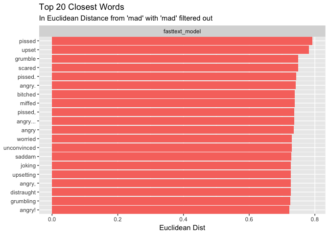
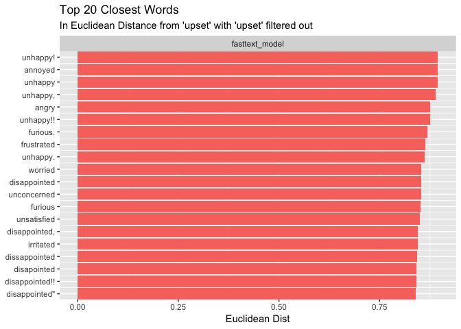
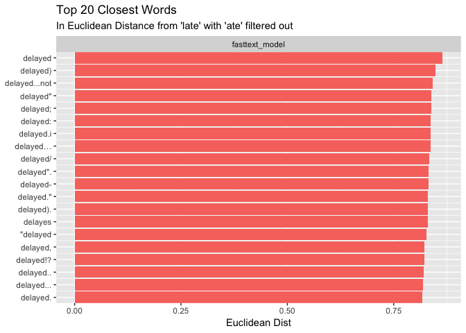
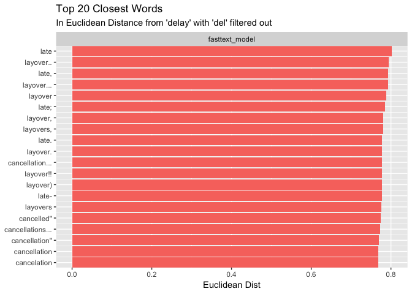
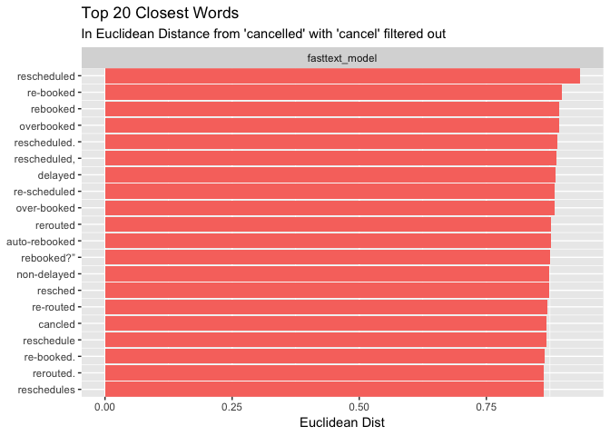
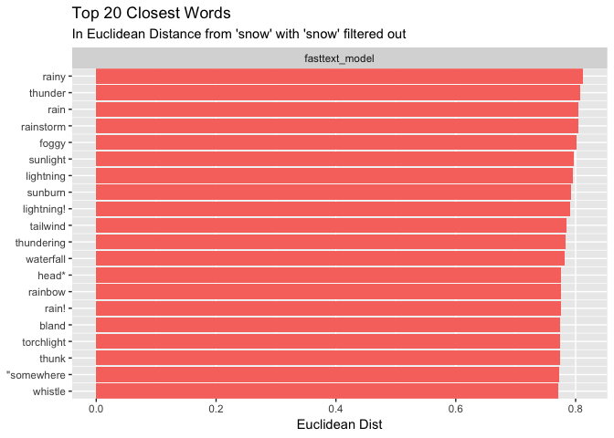
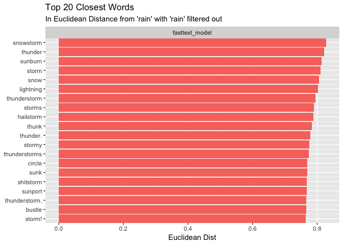
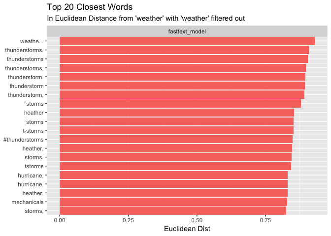
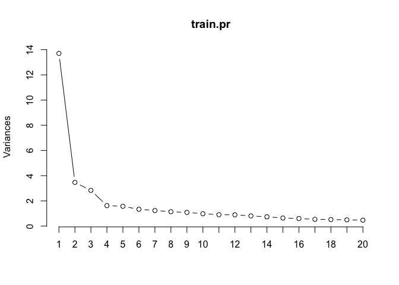

Classifier Construction
================

Overview
========

These are my annotations of the "classifier-construction.R" script written by Adriel.

This file is extremely important because it is where Adriel built the "frankenstein" model.

Here are two important models built by this script: model50-tweet\_sample\_2M\_noRT.dat xgb.modelPC4-xgb\_version.dat

Libraries
=========

``` r
library(tidyverse)
```

    ## ── Attaching packages ───────────────────────────────────────────────────────────────────────────────────────────── tidyverse 1.2.1 ──

    ## ✔ ggplot2 3.1.1       ✔ purrr   0.3.2  
    ## ✔ tibble  2.1.1       ✔ dplyr   0.8.0.1
    ## ✔ tidyr   0.8.3       ✔ stringr 1.4.0  
    ## ✔ readr   1.3.1       ✔ forcats 0.4.0

    ## ── Conflicts ──────────────────────────────────────────────────────────────────────────────────────────────── tidyverse_conflicts() ──
    ## ✖ dplyr::filter() masks stats::filter()
    ## ✖ dplyr::lag()    masks stats::lag()

``` r
library(fastrtext)
library(magrittr) # for assignment operator %<>%  Dallin: I will try to remove the use of %<>% to comply with the tidyverese stylguide.
```

    ## 
    ## Attaching package: 'magrittr'

    ## The following object is masked from 'package:purrr':
    ## 
    ##     set_names

    ## The following object is masked from 'package:tidyr':
    ## 
    ##     extract

``` r
library(plotly)
```

    ## 
    ## Attaching package: 'plotly'

    ## The following object is masked from 'package:ggplot2':
    ## 
    ##     last_plot

    ## The following object is masked from 'package:stats':
    ## 
    ##     filter

    ## The following object is masked from 'package:graphics':
    ## 
    ##     layout

``` r
require(randomForest)
```

    ## Loading required package: randomForest

    ## randomForest 4.6-14

    ## Type rfNews() to see new features/changes/bug fixes.

    ## 
    ## Attaching package: 'randomForest'

    ## The following object is masked from 'package:dplyr':
    ## 
    ##     combine

    ## The following object is masked from 'package:ggplot2':
    ## 
    ##     margin

``` r
library(Matrix)
```

    ## 
    ## Attaching package: 'Matrix'

    ## The following object is masked from 'package:tidyr':
    ## 
    ##     expand

``` r
library(xgboost)
```

    ## 
    ## Attaching package: 'xgboost'

    ## The following object is masked from 'package:plotly':
    ## 
    ##     slice

    ## The following object is masked from 'package:dplyr':
    ## 
    ##     slice

``` r
library(caret)
```

    ## Loading required package: lattice

    ## 
    ## Attaching package: 'caret'

    ## The following object is masked from 'package:purrr':
    ## 
    ##     lift

``` r
library(car)
```

    ## Loading required package: carData

    ## 
    ## Attaching package: 'car'

    ## The following object is masked from 'package:dplyr':
    ## 
    ##     recode

    ## The following object is masked from 'package:purrr':
    ## 
    ##     some

``` r
source("05_define_clustering_functions.R")
```

    ## Welcome! Related Books: `Practical Guide To Cluster Analysis in R` at https://goo.gl/13EFCZ

    ## 
    ## ---------------------
    ## Welcome to dendextend version 1.10.0
    ## Type citation('dendextend') for how to cite the package.
    ## 
    ## Type browseVignettes(package = 'dendextend') for the package vignette.
    ## The github page is: https://github.com/talgalili/dendextend/
    ## 
    ## Suggestions and bug-reports can be submitted at: https://github.com/talgalili/dendextend/issues
    ## Or contact: <tal.galili@gmail.com>
    ## 
    ##  To suppress this message use:  suppressPackageStartupMessages(library(dendextend))
    ## ---------------------

    ## 
    ## Attaching package: 'dendextend'

    ## The following object is masked from 'package:stats':
    ## 
    ##     cutree

``` r
source("06_define_prediction_functions.R")
# source("../complaint-prediction/R/logit_classifier_func.R") This file does not exist
```

``` r
set.seed(123)
```

##### Look at working directory

``` r
getwd()
```

    ## [1] "/Users/dallincardon/Desktop/Research/git/counting-cockroaches/Code/dallin_annotations"

Train and Load the fastText Model
=================================

Unsupervised fastText models produce word vectors. In other words, the create a mathmatical representation of the word. These word vectors will be used later to

``` r
# Fasttext train ----------------------------------------------------------
# train unsupervised fasttext model to learn tweet semantics and word vector representations

# file to read tweets from. Should be a txt file with one tweet per line
file_txt <- here::here("Temporary", "tweet_sample_1hM_noRT.txt")

# new file to write the trained model to
file_model50  <- here::here("Temporary", "model50-tweet_sample_2M_noRT.dat")

# train the unsupervised fasttext model
# Note: I've commented out the training of this model because it has already been trained and the output has been saved to the Temporary folder.
# fastrtext::execute(commands = c("cbow", "-input", file_txt, "-output", file_model50, "-verbose", 1, "-dim", 50))

# load the model object we just trained
fasttext_model <- load_model(file_model50)
```

    ## add .bin extension to the path

FastText Model Evaluation
=========================

This block looks at a handfull of words and creates a visualization to see how well the fasttext model predicts words similar to those provodied (the words defined as nn\_words).

``` r
# Examine the nearest neighbors returned by our trained model. 
# First vector element is the word to look up NN, and the second is a string used to filter the results

nn_words  <- list(c("mad", "mad"),
                  c("sad","sad"),
                  c("upset", "upset"),
                  c("late", "ate"),
                  c("delay", "del"),
                  c("cancelled", "cancel"),
                  c("snow", "snow"),
                  c("rain", "rain"),
                  c("weather", "weather"))

map(nn_words, function(x) model_eval_plot_wrap(x[1], fasttext_model, filter_str = x[2], n = 20))
```

    ## [[1]]



    ## 
    ## [[2]]


    ## 
    ## [[3]]



    ## 
    ## [[4]]



    ## 
    ## [[5]]



    ## 
    ## [[6]]



    ## 
    ## [[7]]



    ## 
    ## [[8]]



    ## 
    ## [[9]]



Create Average word Vectors
===========================

Here, our training dataset is brought in. With the data loaded, we featureize the tweets and create average tweet vectors. The features of the tweets and average vectors are stored inside a list-column to help organize our data well.

``` r
# Predict and average word vectors for tweets -----------------------------

# read in labeled traing data
# train <- read_csv("data/Marketing Research Labeled Tweets All 12-05-18.csv") This was Adriel's code, but I have the data stored somewhere else.

# I believe the file I'm linking to will be similar to the one that Adriel linked imported above (commented out).
train <- read_csv(here::here("Temporary", "Marketing Research Labeled Tweets_ - tweet_sample_5k_Ky-Ch-Ad.csv"))
```

    ## Parsed with column specification:
    ## cols(
    ##   complaint_label = col_double(),
    ##   complaint_category = col_character(),
    ##   tweet_text = col_character()
    ## )

``` r
# Update: I tried this and I think it causes problems in the code block under "# create a list column..." (currently line 69)

# Add extracted text features to the dataset ------------------------------

train <- train %>% 
  mutate(tweetFeatures = map(tweet_text, TweetFeatures)) 


# create a list column that contains all of features output by the fasttext model
train <- train %>%
  mutate(avg_vec_50 = map(tweet_text, VectorizeTweet, model = fasttext_model))
```

    ## Warning: `as_tibble.matrix()` requires a matrix with column names or a `.name_repair` argument. Using compatibility `.name_repair`.
    ## This warning is displayed once per session.

    ## Warning: funs() is soft deprecated as of dplyr 0.8.0
    ## please use list() instead
    ## 
    ## # Before:
    ## funs(name = f(.)
    ## 
    ## # After: 
    ## list(name = ~f(.))
    ## This warning is displayed once per session.

### Analyzing the Outputs of What We Did Above

The two sections below are the outputs of the code we ran above. for the example tweet first tweet, shown below.

``` r
train$tweet_text[[1]]
```

    ## [1] "two airports, one green grass and one sandy connected by a good flight on @emirates http://t.co/igfspndu38"

##### Resulting Tweet Features

This is the output of the tweetFeatures() function. It just makes a small table of data explaining features of each tweet, such as the number of spaces, the number of exclamation points, the number of characters, etc. The data table shown below is the output for just one tweet. This small data table is then stored inside a list-column of the train data.

``` r
train$tweetFeatures[[1]]
```

    ## # A tibble: 1 x 5
    ##   count.char log.mentions log.links count.space count.excla
    ##        <int>        <dbl>     <dbl>       <int>       <int>
    ## 1        106        0.693     0.693          15           0

##### Resulting Tweet Vectors

Similar to the output above, this is the output of the VectorizeTweet() function for just one tweet. If you are familiar with word vectors, you will notice that this small data table looks similar to a single word vector. This vector, however, is a compilation of every word vector from each word in a given tweet. With the example tweet above, the VectorizeTweet() function finds the word vector for the words "two," "airports," "one," "greeen," etc. The VectorizeTweet() function takes the word vector for each word in the tweet and averages each column. In theory, this should provide a mathematical summary for the entire tweet.

``` r
train$avg_vec_50[[1]]
```

    ## # A tibble: 1 x 50
    ##      V1     V2     V3    V4     V5    V6    V7    V8    V9   V10   V11
    ##   <dbl>  <dbl>  <dbl> <dbl>  <dbl> <dbl> <dbl> <dbl> <dbl> <dbl> <dbl>
    ## 1 -1.87 -0.670 -0.529 -2.21 -0.586  1.90  2.06 0.623 -1.49 -2.21  2.71
    ## # … with 39 more variables: V12 <dbl>, V13 <dbl>, V14 <dbl>, V15 <dbl>,
    ## #   V16 <dbl>, V17 <dbl>, V18 <dbl>, V19 <dbl>, V20 <dbl>, V21 <dbl>,
    ## #   V22 <dbl>, V23 <dbl>, V24 <dbl>, V25 <dbl>, V26 <dbl>, V27 <dbl>,
    ## #   V28 <dbl>, V29 <dbl>, V30 <dbl>, V31 <dbl>, V32 <dbl>, V33 <dbl>,
    ## #   V34 <dbl>, V35 <dbl>, V36 <dbl>, V37 <dbl>, V38 <dbl>, V39 <dbl>,
    ## #   V40 <dbl>, V41 <dbl>, V42 <dbl>, V43 <dbl>, V44 <dbl>, V45 <dbl>,
    ## #   V46 <dbl>, V47 <dbl>, V48 <dbl>, V49 <dbl>, V50 <dbl>

PCA Analysis on the fastText Tweet Vectors
==========================================

### Train PCA Model

This block of code trains the PCA model exclusively on the avg\_vec\_50 variable (the average tweet vector for each tweet).

``` r
# select the average vector column and perform a PCA
train.pr <- train %>%
  select(avg_vec_50) %>% 
  unnest(avg_vec_50) %>% 
  as.matrix() %>% 
  prcomp()
```

### Evaluate the PCA Model with 3D Graph

Here, we create a dataframe with the PCA output for each tweet, paired with the tweet labels and tweet text. The data is then plotted with the three PCA variables on the axes, and color mapped to complaint type. With this visualization, we can see that the PCA model groups complaints and non-complaints well.

``` r
# create a dataframe with the pca output to examine the first 3 components

# Dallin: This visualization of the PCA model was commented out because it caused problems with knitting.

# pca_evaluation <- as_data_frame(train.pr$x)
# pca_evaluation$label <- factor(train$complaint_label)
# pca_evaluation$tweet_text <- train$tweet_text
# 
# # evalute the first three components with a 3d plot
# 
# plot_ly(pca_evaluation, x = ~PC1, y = ~PC2, z = ~PC3, color = ~label, colors = c('#BF382A', '#0C4B8E'),
#         hoverinfo = 'text', text = ~tweet_text) %>% 
#   add_markers() %>% 
#   layout(scene = list(xaxis = list(title = 'PC1'),
#                       yaxis = list(title = 'PC2'),
#                       zaxis = list(title = 'PC3')))

# looks good to me. The complaints seperate well.
```

### Scree Plot of Principal Components

PCA models compress multi-dimensional issues into smaller "principal components." They identify trends and relationships in data, and these trends are summarized in "principal components." These principal components are responsible for describing a certain portion of the variance seen in the data.

We are using this scree plot to analyze how many principle components can summarize the variance in our data well. The scree plot shows that with only two principal components, a large portion of the variance in the data can be described, and little of the remaining variance remains.

When using our PCA model to make predictions, we want a model that is as simple as possible while describing the data well. In terms of PCA, this generally means that you want to use only a few principal components to describe the majority of variance in the data. The scree plot shown below helps do this by informing us how many principal components we should use to effectivly describe our training data.

The scree plot shows variances (in other words, variance undescribed by the model) on the y-axis, and principal components on the x-axis. For example, with only one principal component, a large amount of variance remains in the data. With two principal components, however, we see that the amount of undescribed variance drops considerably. The rule of thumb with the scree plot is to identify the "elbow" (where the slope of the line starts to flatten out), and choose a number of principal components based on number of principal components at that point. Using this plot, for example, we will use the first four principal components of the model. Using four principal components will help us achieve a model that is both simple, and accurate. Using more than four principal components will result in significantly diminished returns -- it will slow down our model without providing a significant improvement to our model's predictive ability.

``` r
# make a scree plot of the components
screeplot(train.pr, type = "line", npcs = 20)
```



``` r
# the first component must be the amount of information about a word learned by the fasttext model
# let's go with 15 components with this model.
# Dallin: Do we want to go with 15 components? Not sure why...
```

Project Word Vectors onto PCA
=============================

Here, we run the VectorizeTweet (PCA class) function on each of the tweet vectors. The VectorizeTweet PCA output summarizes the tweet vector in four principal components.

``` r
train <- train %>% 
  mutate(avg_vec_50_PCA = map(avg_vec_50, VectorizeTweet, model = train.pr, component = "PC4"))
```

### Output of VectorizeTweet() Function (PCA Class)

Each principal component can be thought of as a single, compressed dimension. The values shown below represent the magnitude of the tweet along that single dimension. Plotting these values should result in a plot similar to the 3D scatter plot shown above.

``` r
train$avg_vec_50_PCA[[1]]
```

    ## # A tibble: 1 x 4
    ##     PC1   PC2   PC3   PC4
    ##   <dbl> <dbl> <dbl> <dbl>
    ## 1  1.61  2.29  1.56 -1.36

Save the Model Files
====================

Here, we save our PCA model (prcomp4.dat) and our training dataset (train\_data.dat -- a dataset containing tweet text, along with its respecive tweet vector and PCA values).

We then remove these models from the environment and reload them (this has helped ensure that our resulting output is truely independent.)

``` r
save(train.pr, file = here::here("Output", "prcomp4.dat"))
save(train, file = here::here("Output", "train_data.dat"))

rm(list = ls())

load(here::here("Output", "train_data.dat"))
```

Train the XGboost Model
=======================

### Create a Training Index

We need to separate our dataset (train\_data.dat) into training data and test data for our xgboost model. The code below creates a list that randomly selects 80% of our dataset for training, leaving 20% of it for testing.

``` r
trainIndex <- createDataPartition(train$complaint_label, p = .8, 
                                  list = FALSE, 
                                  times = 1)
```

### Group the Testing and Training Datasets

For each dataset (testing and training) we are creating a set of data containing the complaint labels associated with the tweet, as well as set containing the tweet's features, the tweet vector and the PCA output of the model.

``` r
test_data <- train[-trainIndex,]
test_labels <- test_data %>% select(complaint_label) %>% transmute(label = complaint_label)
test_data_vec <- test_data %>%  select(tweetFeatures, avg_vec_50, avg_vec_50_PCA) %>% unnest %>% mutate_all(as.numeric)

train_data <- train[trainIndex,]
train_labels <- train_data %>% select(complaint_label) %>% transmute(label = complaint_label)
train_data_vec <- train_data %>%  select(tweetFeatures, avg_vec_50, avg_vec_50_PCA) %>% unnest %>% mutate_all(as.numeric)
```

### Create Dense Matrices for XGBoost

XGBoost models need matrices as inputs, not dataframes or tibbles. Here, we take our testing and training data, and turn it into a matrix instead. To make it easy to keep track of our matrices, we have stored both the training and test matrices in a single list (called watchlist).

UPDATE: It looks like we don't even use these matrices later on..? Nevermind. dtest1 is needed.

``` r
# I don't think this model is actually necessary
# dtrain <- xgb.DMatrix(sparse.model.matrix(~.-1, train_data_vec), label = as.numeric(train_labels$label))
# dtest  <- xgb.DMatrix(sparse.model.matrix(~.-1, test_data_vec), label = as.numeric(test_labels$label))
dtest1 <- xgb.DMatrix(sparse.model.matrix(~.-1, test_data_vec))
# watchlist <- list(train = dtrain, eval = dtest)
```

### Set the Parameters of the Model and Begin Training

``` r
# All code below is commented out because this code had trouble knitting
# bst <- xgboost(data = sparse.model.matrix(~.-1, train_data_vec), label = as.numeric(train_labels$label), max.depth = 4,
#                eta = 0.2, nthread = 2, nrounds = 100, objective = logregobj, eval_metric = evalerror)
```

Analyze the Model
=================

### Get Predictions from the Model

Here, we let the model make predictions on our test dataset. We then compare the predictions to our actual labels to help us understand accuracy.

``` r
# test_data$prediction <- predict(bst, dtest1)
# 
# predict(bst, dtest1) %>% map_chr(function(x) ifelse(x > 0, "complaint", "non-complaint"))
#   
# 
# test_data <- test_data %>% 
#   mutate(predict_label = case_when(prediction > 0 ~ "Complaint",
#                                    TRUE ~ "Non-complaint"),
#          complaint_label = case_when(complaint_label == 1 ~ "Complaint",
#                                    TRUE ~ "Non-complaint")) %>% 
#   mutate(accuracy = predict_label == complaint_label)
```

### Look at the Confusion Matrix

This Confusion matrix helps us see how many false postives and false negatives we had. For example, there were 85 instances where a tweet was predicted as a complaint, but it was not (false positive), and 38 instances where a complaint was not predicted to be a complaint, when it actually was (false negative). Overall, the model had an 87.59% accuracy, which seems pretty good to me.

``` r
# confusionMatrix(factor(test_data$complaint_label), factor(test_data$predict_label))
```

### Save the Model

``` r
# save(bst, file = here::here("Output", "xgb.modelPC4.dat"))
# xgb.save(bst, here::here("Output", "xgb.modelPC4-xgb_version.dat"))
# save(test_data, file = here::here("Output", "test_data.dat"))
```
