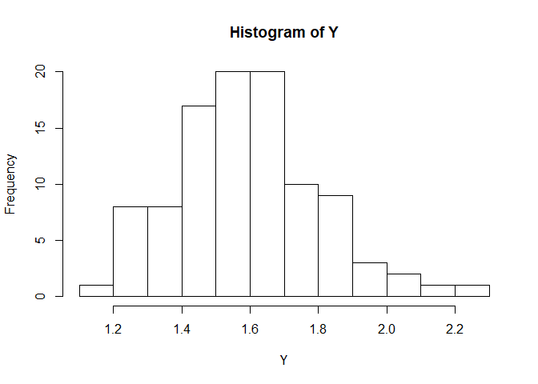
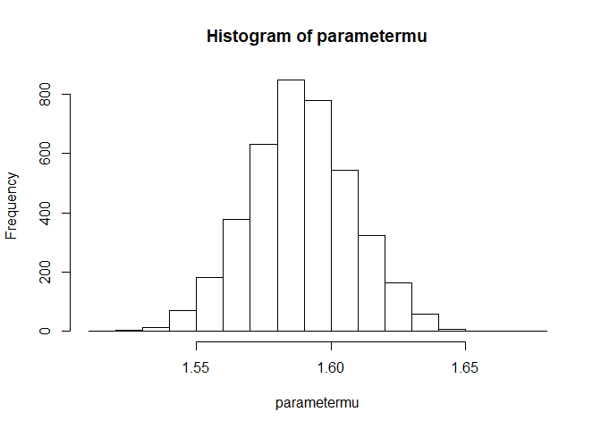

Stan Introduction
================

# The Need for Stan

Part of the difficulty of Bayesian statistics for us is the R is not
equipped to handle some of the necessary procedures. For example,
sampling from a posterior distribution is an essential part of Bayesian
inference, but if we are using MCMC or a variation of it as part of our
sampling (and we likely are) writing the code in R can be long and
comlicated. Even running the code neccessary may take an impractical
amount of time.

Stan is a programming language seperate from R designed to help in
Bayesian analysis. Stan removes the dozens of lines of code that we
would have needed to write, and instead asks for us to fill in three
basics blocks of information: ‘data’, ‘parameters’, and ‘model’.

We’ll explain more about each of these components and show how to use
Stan within Rstudio with the example code below.

``` r
# Run all R code in a new R script file called RStan_introduction
# The package below will install Stan to Rstudio, and you will be able to create Stan files.
install.packages("rstan", repos = "https://cloud.r-project.org/", dependencies = TRUE)
```

    ## Installing package into 'C:/Users/akh/Documents/R/win-library/3.6'
    ## (as 'lib' is unspecified)

    ## package 'rstan' successfully unpacked and MD5 sums checked

    ## Warning: cannot remove prior installation of package 'rstan'

    ## Warning in file.copy(savedcopy, lib, recursive = TRUE): problem copying
    ## C:\Users\akh\Documents\R\win-library\3.6\00LOCK\rstan\libs\x64\rstan.dll
    ## to C:\Users\akh\Documents\R\win-library\3.6\rstan\libs\x64\rstan.dll:
    ## Permission denied

    ## Warning: restored 'rstan'

    ## 
    ## The downloaded binary packages are in
    ##  C:\Users\akh\AppData\Local\Temp\Rtmpwll70d\downloaded_packages

``` r
pkgbuild::has_build_tools(debug = TRUE) 
```

    ## Scanning R CMD config CC...
    ## cc_path:  
    ## '.exe' does not exist
    ## Scanning path...
    ## Scanning registry...
    ## Found C:/Rtools for 3.5 
    ## VERSION.txt
    ## Rtools version 3.5.0.4

    ## [1] TRUE

``` r
#This line should return output 'TRUE'
```

``` r
library(rstan)
```

    ## Loading required package: StanHeaders

    ## Loading required package: ggplot2

    ## rstan (Version 2.19.2, GitRev: 2e1f913d3ca3)

    ## For execution on a local, multicore CPU with excess RAM we recommend calling
    ## options(mc.cores = parallel::detectCores()).
    ## To avoid recompilation of unchanged Stan programs, we recommend calling
    ## rstan_options(auto_write = TRUE)

    ## For improved execution time, we recommend calling
    ## Sys.setenv(LOCAL_CPPFLAGS = '-march=native')
    ## although this causes Stan to throw an error on a few processors.

``` r
#If this is your first Rstan installation, restart R. 
#If the installation has not gone correctly, a more in depth guide can be found at
#https://github.com/stan-dev/rstan/wiki/RStan-Getting-Started
```

Now we should have rstan installed. Restart R\! As with most new
packages, this should get everything we need working.

Go to the file tab in the top left corner of Rstudio. Select new file.
You should now see ‘Stan file’ in this list. Select it, and return here.

If Stan file is not an option, something went wrong in setup. Return to
this website
<https://github.com/stan-dev/rstan/wiki/RStan-Getting-Started> for more
help.

If the Stan file is now open, perfect, save it as my\_stan\_model and
leave it there for now. We need to make some fake data for our Stan
model.

# Create our data

``` r
N = 100
Y = rnorm(N, 1.6, 0.2)
hist(Y)
```

<!-- -->

So we have some very simple data that will work for our stan model. We
have 100 data points, the data is normally distributed around a mean of
1.6, and has a standard deviation of 0.2. From here we will start
building stan in your new stan file.

Clear any default text out of your Stan file and paste the following.

# Build Stan model

Stan files use double slash marks for comments // Lines within blocks
should end with a semi colon ;. After the model block, leave one line
underneath it.

-----

data {

}

parameters {

}

model {

}

-----

These are the blocks I referred to earlier, and are the most used. There
are others you’ll learn about later. Lets start with the first, data.
Pretty straitforward, we need to tell the model what data we’re working
with. Down below you’ll see how we format it.

-----

data {  
int N;  
real Y\[N\];  
}

parameters {

}

model {

}

-----

First we include our sample size. int because we are dealing with
integers, a discrete count. Second, our observations, Y\[N\]. Real
because our data are continuous. N is in brackets to tell stan that we
have an array of data points for N individuals (100 in this case).

-----

data {  
int N;  
real Y\[N\];  
}

parameters {  
real mu;  
real\<lower=0\> sigma;  
}

model {

}

-----

Our model section includes the parameters we are trying to estimate from
our data. In our simple model here, we only are worried about mu and
sigma. Both are continuous, so type real, but we want to make sure the
model knows that sigma cannot be negative. Thus we add in the
\<lower=0\> modifier. That’s it for parameters.

-----

data {  
int N;  
real Y\[N\];  
}

parameters {  
real mu;  
real\<lower=0\> sigma;  
}

model {  
for(i in 1:N)  
Y\[i\] \~ normal(mu, sigma);  
mu \~ normal(1.7, 0.3)  
sigma \~ cauchy(0, 1);  
}

-----

The model block gets a little more complicated, as will parameters and
data in more complicated models that we will see later. For right now,
this will do. We start by defining our likelyhood here, in which we make
a for loop that will run all points of our data Y, assuming a normal
distribution. Then we define our priors for both our parameters, mu and
sigma. In this code, we assume a prior very close to our data, but tweek
the numbers here to see how priors interact with the likelyhood.

# Using our Stan model in R

Lets return to our Rscript.

Since we already have the rstan library loaded, we can run our data
through the stan model and look at some of the important results.

``` r
mymodeldata = list(
  N = 100,
  Y = rnorm(N, 1.6, 0.2)
)
fit = stan(
  file = here::here("Code", "my_stan_model.stan"),
  data = mymodeldata,
  seed = 42
)
```

    ## 
    ## SAMPLING FOR MODEL 'my_stan_model' NOW (CHAIN 1).
    ## Chain 1: 
    ## Chain 1: Gradient evaluation took 0 seconds
    ## Chain 1: 1000 transitions using 10 leapfrog steps per transition would take 0 seconds.
    ## Chain 1: Adjust your expectations accordingly!
    ## Chain 1: 
    ## Chain 1: 
    ## Chain 1: Iteration:    1 / 2000 [  0%]  (Warmup)
    ## Chain 1: Iteration:  200 / 2000 [ 10%]  (Warmup)
    ## Chain 1: Iteration:  400 / 2000 [ 20%]  (Warmup)
    ## Chain 1: Iteration:  600 / 2000 [ 30%]  (Warmup)
    ## Chain 1: Iteration:  800 / 2000 [ 40%]  (Warmup)
    ## Chain 1: Iteration: 1000 / 2000 [ 50%]  (Warmup)
    ## Chain 1: Iteration: 1001 / 2000 [ 50%]  (Sampling)
    ## Chain 1: Iteration: 1200 / 2000 [ 60%]  (Sampling)
    ## Chain 1: Iteration: 1400 / 2000 [ 70%]  (Sampling)
    ## Chain 1: Iteration: 1600 / 2000 [ 80%]  (Sampling)
    ## Chain 1: Iteration: 1800 / 2000 [ 90%]  (Sampling)
    ## Chain 1: Iteration: 2000 / 2000 [100%]  (Sampling)
    ## Chain 1: 
    ## Chain 1:  Elapsed Time: 0.193 seconds (Warm-up)
    ## Chain 1:                0.221 seconds (Sampling)
    ## Chain 1:                0.414 seconds (Total)
    ## Chain 1: 
    ## 
    ## SAMPLING FOR MODEL 'my_stan_model' NOW (CHAIN 2).
    ## Chain 2: 
    ## Chain 2: Gradient evaluation took 0 seconds
    ## Chain 2: 1000 transitions using 10 leapfrog steps per transition would take 0 seconds.
    ## Chain 2: Adjust your expectations accordingly!
    ## Chain 2: 
    ## Chain 2: 
    ## Chain 2: Iteration:    1 / 2000 [  0%]  (Warmup)
    ## Chain 2: Iteration:  200 / 2000 [ 10%]  (Warmup)
    ## Chain 2: Iteration:  400 / 2000 [ 20%]  (Warmup)
    ## Chain 2: Iteration:  600 / 2000 [ 30%]  (Warmup)
    ## Chain 2: Iteration:  800 / 2000 [ 40%]  (Warmup)
    ## Chain 2: Iteration: 1000 / 2000 [ 50%]  (Warmup)
    ## Chain 2: Iteration: 1001 / 2000 [ 50%]  (Sampling)
    ## Chain 2: Iteration: 1200 / 2000 [ 60%]  (Sampling)
    ## Chain 2: Iteration: 1400 / 2000 [ 70%]  (Sampling)
    ## Chain 2: Iteration: 1600 / 2000 [ 80%]  (Sampling)
    ## Chain 2: Iteration: 1800 / 2000 [ 90%]  (Sampling)
    ## Chain 2: Iteration: 2000 / 2000 [100%]  (Sampling)
    ## Chain 2: 
    ## Chain 2:  Elapsed Time: 0.204 seconds (Warm-up)
    ## Chain 2:                0.178 seconds (Sampling)
    ## Chain 2:                0.382 seconds (Total)
    ## Chain 2: 
    ## 
    ## SAMPLING FOR MODEL 'my_stan_model' NOW (CHAIN 3).
    ## Chain 3: 
    ## Chain 3: Gradient evaluation took 0 seconds
    ## Chain 3: 1000 transitions using 10 leapfrog steps per transition would take 0 seconds.
    ## Chain 3: Adjust your expectations accordingly!
    ## Chain 3: 
    ## Chain 3: 
    ## Chain 3: Iteration:    1 / 2000 [  0%]  (Warmup)
    ## Chain 3: Iteration:  200 / 2000 [ 10%]  (Warmup)
    ## Chain 3: Iteration:  400 / 2000 [ 20%]  (Warmup)
    ## Chain 3: Iteration:  600 / 2000 [ 30%]  (Warmup)
    ## Chain 3: Iteration:  800 / 2000 [ 40%]  (Warmup)
    ## Chain 3: Iteration: 1000 / 2000 [ 50%]  (Warmup)
    ## Chain 3: Iteration: 1001 / 2000 [ 50%]  (Sampling)
    ## Chain 3: Iteration: 1200 / 2000 [ 60%]  (Sampling)
    ## Chain 3: Iteration: 1400 / 2000 [ 70%]  (Sampling)
    ## Chain 3: Iteration: 1600 / 2000 [ 80%]  (Sampling)
    ## Chain 3: Iteration: 1800 / 2000 [ 90%]  (Sampling)
    ## Chain 3: Iteration: 2000 / 2000 [100%]  (Sampling)
    ## Chain 3: 
    ## Chain 3:  Elapsed Time: 0.188 seconds (Warm-up)
    ## Chain 3:                0.227 seconds (Sampling)
    ## Chain 3:                0.415 seconds (Total)
    ## Chain 3: 
    ## 
    ## SAMPLING FOR MODEL 'my_stan_model' NOW (CHAIN 4).
    ## Chain 4: 
    ## Chain 4: Gradient evaluation took 0 seconds
    ## Chain 4: 1000 transitions using 10 leapfrog steps per transition would take 0 seconds.
    ## Chain 4: Adjust your expectations accordingly!
    ## Chain 4: 
    ## Chain 4: 
    ## Chain 4: Iteration:    1 / 2000 [  0%]  (Warmup)
    ## Chain 4: Iteration:  200 / 2000 [ 10%]  (Warmup)
    ## Chain 4: Iteration:  400 / 2000 [ 20%]  (Warmup)
    ## Chain 4: Iteration:  600 / 2000 [ 30%]  (Warmup)
    ## Chain 4: Iteration:  800 / 2000 [ 40%]  (Warmup)
    ## Chain 4: Iteration: 1000 / 2000 [ 50%]  (Warmup)
    ## Chain 4: Iteration: 1001 / 2000 [ 50%]  (Sampling)
    ## Chain 4: Iteration: 1200 / 2000 [ 60%]  (Sampling)
    ## Chain 4: Iteration: 1400 / 2000 [ 70%]  (Sampling)
    ## Chain 4: Iteration: 1600 / 2000 [ 80%]  (Sampling)
    ## Chain 4: Iteration: 1800 / 2000 [ 90%]  (Sampling)
    ## Chain 4: Iteration: 2000 / 2000 [100%]  (Sampling)
    ## Chain 4: 
    ## Chain 4:  Elapsed Time: 0.192 seconds (Warm-up)
    ## Chain 4:                0.242 seconds (Sampling)
    ## Chain 4:                0.434 seconds (Total)
    ## Chain 4:

The function stan can be manipulated in greater detail, but the only
details we need to worry about now are correctly calling the stan model,
entering our data as a list, and the seed just to make sure results are
consistent and anyone running the code can know they ran everything
corectly.

The here::here line will be useful as we navigate directories in Github.
For now, assuming that your Rscript and Stan file are in the same
directory or project on your computer, you should only need to correctly
spell the name of your Stan file.

Now the object fit contains the results of running our data through our
model. Let’s check them out.

``` r
print(fit)
```

    ## Inference for Stan model: my_stan_model.
    ## 4 chains, each with iter=2000; warmup=1000; thin=1; 
    ## post-warmup draws per chain=1000, total post-warmup draws=4000.
    ## 
    ##         mean se_mean   sd   2.5%    25%    50%    75%  97.5% n_eff Rhat
    ## mu      1.61    0.00 0.02   1.58   1.60   1.61   1.62   1.64  3479    1
    ## sigma   0.16    0.00 0.01   0.14   0.16   0.16   0.17   0.19  3475    1
    ## lp__  129.64    0.02 1.00 127.04 129.25 129.95 130.34 130.61  1908    1
    ## 
    ## Samples were drawn using NUTS(diag_e) at Fri Aug 16 14:18:31 2019.
    ## For each parameter, n_eff is a crude measure of effective sample size,
    ## and Rhat is the potential scale reduction factor on split chains (at 
    ## convergence, Rhat=1).

Here we can see the estimated means for our parameters and diagnose our
model for issues with convergence. You will learn more abot that later,
but the model seems to have run correctly here. We can also look at the
posterior with the following code.

``` r
parametermu = extract(fit)$mu
hist(parametermu)
```

<!-- -->
Here we have a posterior distribtution for mu. Since our prior and
simulated data were very similar, we see a very tight distribution, but
again, try it with different means for both the sample and the prior,
and see how the data interracts.

# Conclusion

This has been a very simple introdution to help you create a Stan model
and using R to run data through it. Your future Stan models will be a
lot more complex, but this example should help you see how models differ
and the impact new code has going forward.
