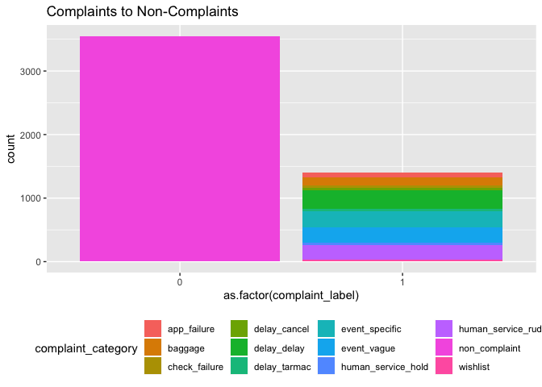
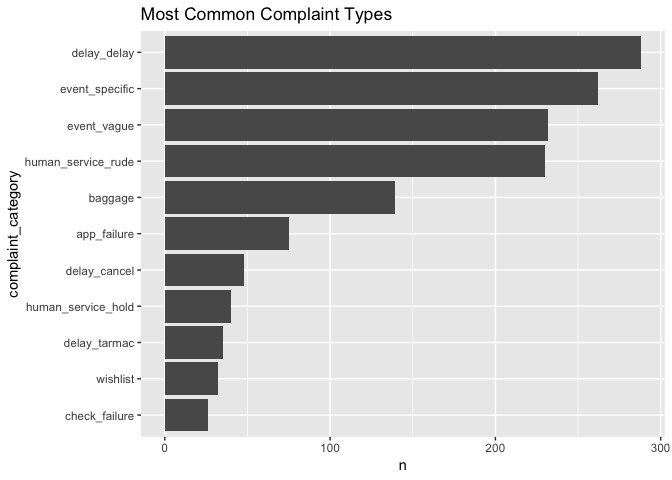
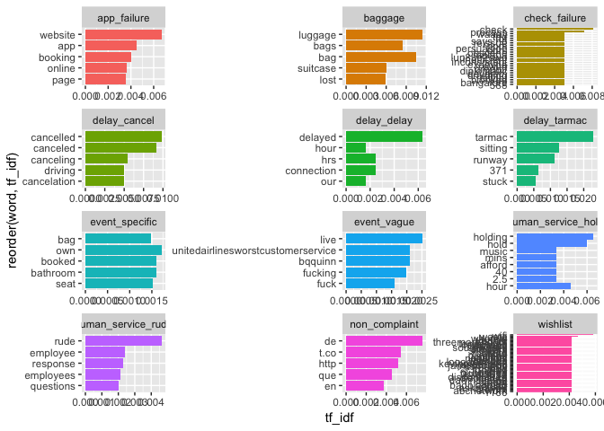
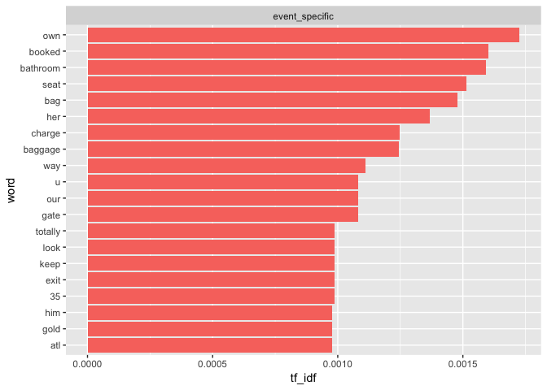
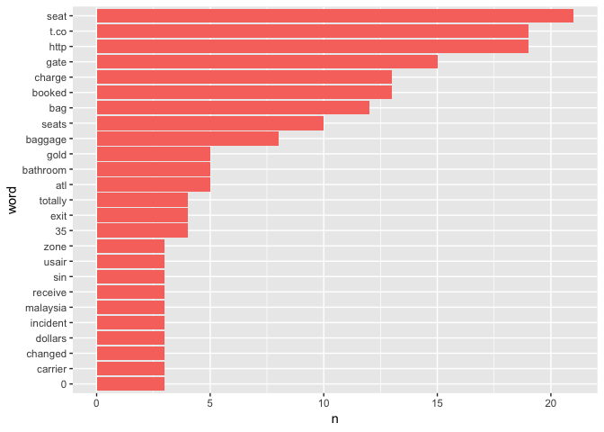
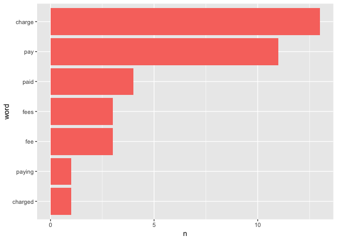
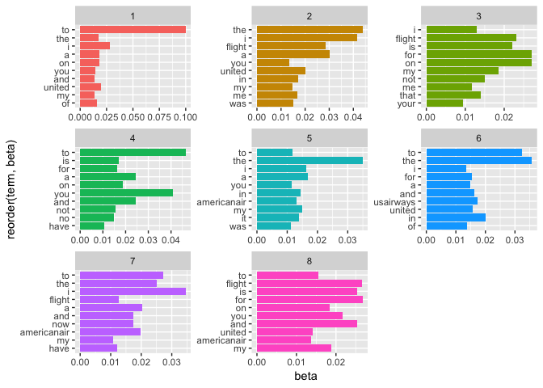

Labeled Tweets
================

Overview
========

Our team created a subset of roguhly 5,000 tweets for testing and training. We created binary labels for complaints and non-complaints, as well as more descriptive labels for each tweet--labels for delays, poor interactions between employees and customers, etc. We did not systematically generate these categories (i.e. we did not run a topic model on our complaints or anything similar). Rather, we simply read the tweets one-by-one and created categories as topics appeared.

In this document, I will analyze the complaint categories we have created, and specifically investigate 1) if we should further granulize our catch-all event\_specific category, and 2) what new categories we should consider creating based on the complaints we see in the event\_specific category.

### Tweet Labels

As background information, here is information regarding the intuition behind our tweet labels:

##### Human\_service\_rude:

-   An employee was cited for rude conduct. (i.e. “@airline Your flight attendants were so rude to me today!”
-   Customer service cited as terrible
-   Repeated calls to amend a problem do not help find a solution/recieves no response.

##### Human\_service\_hold:

-   Customer on hold for a long time

##### Check\_failure:

-   A customer was dissatisfied with their check-in process. (i.e. “Terrible check-in experience today, never flying with @airline again.”)

##### Baggage

-   A customer did not receive their checked baggage when they landed in their destination.
-   Sometimes, a baggage complaint overlapped with a delay complaint. In these scenarios, we labeled it as a baggage complaint.

##### Delay\_delay:

-   A customer’s flight was delayed

##### Delay\_cancel:

-   A flight was cancelled

##### Delay\_tarmac:

-   A customer’s flight landed, but was waiting on the tarmac (possibly worried they won’t make their connecting flight).

##### Event\_vague:

-   Vague complaint, referencing an event that happened, but not specifying details of the situation (i.e. “@airline You suck!”)

##### Event\_specific:

-   Very specific/unique failure (i.e. “The bathroom was broken” or “you won’t let me sit next to my son”)
-   Catch-all complaint for hard-to-classify situations

##### Wishlist

-   Person complains about a feature/service not provided by the airline
-   Person wishes a service were better/higher quality
-   Person wishes a procedure were performed differently

##### App\_failure

-   An airline app did not function properly
-   An airline website/booking program did not function properly

Libraries
=========

``` r
library(tidyverse)
```

    ## ── Attaching packages ──────────────────────────────────────────────────────────────────────────── tidyverse 1.2.1 ──

    ## ✔ ggplot2 3.1.0     ✔ purrr   0.2.5
    ## ✔ tibble  2.0.1     ✔ dplyr   0.7.8
    ## ✔ tidyr   0.8.2     ✔ stringr 1.3.1
    ## ✔ readr   1.3.1     ✔ forcats 0.3.0

    ## ── Conflicts ─────────────────────────────────────────────────────────────────────────────── tidyverse_conflicts() ──
    ## ✖ dplyr::filter() masks stats::filter()
    ## ✖ dplyr::lag()    masks stats::lag()

``` r
library(tidytext)
library(topicmodels)
```

Read in the Labeled Tweets
==========================

``` r
# Note that the labeled tweet data is kept in my Temporary folder in the train_test_data folder
data <- read_csv("../../Temporary/train_test_data/Marketing Research Labeled Tweets_ - tweet_sample_5k_Ky-Ch-Ad.csv")
```

    ## Parsed with column specification:
    ## cols(
    ##   complaint_label = col_double(),
    ##   complaint_category = col_character(),
    ##   tweet_text = col_character()
    ## )

Analyze the Data
================

``` r
data %>% 
  ggplot(aes(as.factor(complaint_label), fill = complaint_category)) +
  geom_bar() +
  labs(
    title = "Complaints to Non-Complaints"
  ) +
  theme(legend.position = "bottom")
```



``` r
data %>% 
  filter(complaint_label == 1) %>% 
  count(complaint_category, sort = TRUE) %>% 
  mutate(complaint_category = reorder(complaint_category, n)) %>% 
  ggplot(aes(complaint_category, n)) +
  geom_col() +
  coord_flip() +
  labs(title = "Most Common Complaint Types")
```



It is concerning to me that the second-largest complaint category is our catch-all "event\_specific" category. This means that of the roughly 1500 complaints we labeled in the 5000 tweets, about 300 (or 20%) of these tweets recieved the ambiguous, catch-all label.

Quick TF-IDF Analysis of the Data
=================================

``` r
# Create data compatible for tf_idf analysis
tf_idf_data <- data %>% 
  unnest_tokens(word, tweet_text) %>% 
  group_by(complaint_category) %>% 
  count(word, sort = TRUE) %>% 
  bind_tf_idf(word, complaint_category, n)

# Visualize the data
tf_idf_data %>% 
  group_by(complaint_category) %>% 
  top_n(5) %>%
  ungroup() %>% 
  ggplot(aes(x = reorder(word, tf_idf), y = tf_idf, fill = complaint_category)) +
  geom_col(show.legend = FALSE) +
  facet_wrap(~ complaint_category, ncol = 3, scales = "free") + 
  coord_flip()
```

    ## Selecting by tf_idf



Although I will admit that this is not a great-looking graphic, it does help us quickly see that our complaint categories do target the right tweets. event\_vague contains vague complaints, containing mostly expletives. delay\_cancel contains "cancel" in the tweet. baggage contains "luggage" "lost" and "suitcase." check\_failure and wishlist seem to be such small categories, that the analysis couldn't seem to identify any themes.

TF-IDF Analysis of event\_specific Label
========================================

This label was our catch-all label for complaints we had difficulty classifying. I'd like to take a better look at it to see if any themes appear. I'm hoping we could find a few themes large enough to merit the creation of a new complaint category. This would reduce the size of our catch-all category, and improve our classifier.

``` r
tf_idf_data %>% 
  filter(complaint_category == "event_specific") %>% 
  mutate(word = reorder(word, tf_idf)) %>% 
  top_n(20) %>%
  ggplot(aes(word, tf_idf, fill = complaint_category)) +
  geom_col(show.legend = FALSE) +
  facet_wrap(~ complaint_category, scales = "free") + 
  coord_flip()
```

    ## Selecting by tf_idf



The word "own" appeared eleven times in all of our tweets and was only associated with event\_specific five times. Additionally, this word appeared in very distinct contexts, such as these phrases: "my own seat", "I own an American Express credit card", "your own flight attendant." It seems that this word would not merit a new complaint category.

The word "booked" appeared 66 times in our dataset, and was associated with event\_specific eleven times. This seems like too small of a category to create a new category.

"Bathroom" appeared six times in our dataset, and therefore seems like too small of a grouping to create a new category.

The word "seat" appeared 130 times in our dataset, and was associate 29 times with our event\_specific label. It could be large enough to merit a new category, if there seems to be a consistent theme. Among these 29 event\_specific label, I think we could categorize about 20 of them into a "seating" category--complaints related to people who did not recieve the seat they wanted, had a broken seat, were unhappy about extra charges for normal seating, wanted to move to a different open seat, or felt the seating was ucomfortable. Another issue that resurfaced several times was related to items lost in seat pockets, but it only appeared three times.

The word "charge" appeared in our dataset 33 times, and was associated with event\_specific thirteen times. Reading through the tweets, it seems that this word appeared when customers were upset with charges that were unexpected, or seemed uneccesarily large. While this word alone may not merit the creation of a new complaint category, other words such as "pay" "paid" and "paying" might appear frequently enough to merit a new theme.

Word Count of event\_specific Category
======================================

Here, I will simply look at wordcounts of the event\_specific category, with stop words filtered out.

``` r
tf_idf_data %>% 
  anti_join(stop_words) %>% 
  filter(complaint_category == "event_specific") %>% 
  mutate(word = reorder(word, n)) %>% 
  top_n(20) %>% 
  ggplot(aes(x = word, y = n, fill = complaint_category)) +
  geom_col(show.legend = FALSE) +
  coord_flip()
```

    ## Joining, by = "word"

    ## Selecting by tf_idf



This graph seems to confirm that "seat" and "charge" appeared frequently in this particular category.

How often do words associated with extra fees and charges appear in the event\_specific category?

``` r
tf_idf_data %>% 
  filter(complaint_category == "event_specific",
         word %in% c("pay", "paid", "paying", "charge", "charged", "fee", "fees")) %>% 
  mutate(word = reorder(word, n)) %>% 
  ggplot(aes(x = word, y = n, fill = complaint_category)) +
  geom_col(show.legend = FALSE) +
  coord_flip()
```



I'll produce the same data, but in a table format.

``` r
tf_idf_data %>% 
  filter(complaint_category == "event_specific",
         word %in% c("pay", "paid", "paying", "charge", "charged", "fee", "fees")) %>% 
  mutate(word = reorder(word, n)) %>% 
  select(word, n)
```

    ## Adding missing grouping variables: `complaint_category`

    ## # A tibble: 7 x 3
    ## # Groups:   complaint_category [1]
    ##   complaint_category word        n
    ##   <chr>              <fct>   <int>
    ## 1 event_specific     charge     13
    ## 2 event_specific     pay        11
    ## 3 event_specific     paid        4
    ## 4 event_specific     fee         3
    ## 5 event_specific     fees        3
    ## 6 event_specific     charged     1
    ## 7 event_specific     paying      1

With this table and bar chart, it seems reasonable to create a new complaint category for "charges" that reflects complaints related to extra/unexpected/large fees the customers complained about, given that about 36 event\_specific complaints were related to charges.

Topic Modeling
==============

Would a topic run model on the complaints reveal topics we overlooked? My only concern with this analysis is that our tweets are very small documents for the model to work with--they might be too small for the LDA model to be effective at detecting topics.

``` r
data_dtm <- data %>% 
  filter(complaint_label == 1) %>% 
  mutate(row = row_number()) %>% 
  select(row, tweet_text) %>% 
  unnest_tokens(word, tweet_text) %>% 
  count(row, word) %>% 
  cast_dtm(row, word, n)

complaint_lda <- LDA(data_dtm, k = 8, control = list(seed = 1234))

complaint_topics <- tidy(complaint_lda, matrix = "beta")

tweet_top_terms <- complaint_topics %>%
  group_by(topic) %>%
  top_n(10, beta) %>%
  ungroup() %>%
  arrange(topic, -beta)

tweet_top_terms %>%
  ggplot(aes(reorder(term, beta), beta, fill = factor(topic))) +
  geom_col(show.legend = FALSE) +
  facet_wrap(~ topic, scales = "free") +
  coord_flip()
```



As expected, I did not find this topic model to be very useful. I imagine that the source of the problem was due to our incredibly short document lenghts (the tweets).
