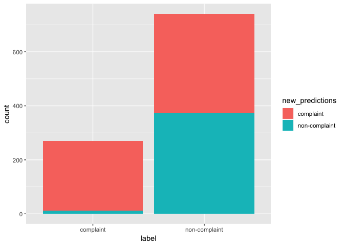

fastText Supervised Classifier
================

`{r include=FALSE} knitr::opts_chunk$set(error = TRUE)`

Overview
========

In this R Markdown, we'll be documenting how we built our model for classifying tweets as "complaints" and "non-complaints." The code is almost entirely derived from the Code/cnn-classifier/R/fasttext\_supervised\_classifier.R script.

Load Packages
=============

``` r
library(fastrtext)
library(tidyverse)
```

    ## ── Attaching packages ────────────────────────────────────────────────────────────────────────────────────────────────────────── tidyverse 1.2.1 ──

    ## ✔ ggplot2 3.1.1       ✔ purrr   0.3.2  
    ## ✔ tibble  2.1.1       ✔ dplyr   0.8.0.1
    ## ✔ tidyr   0.8.3       ✔ stringr 1.4.0  
    ## ✔ readr   1.3.1       ✔ forcats 0.4.0

    ## ── Conflicts ───────────────────────────────────────────────────────────────────────────────────────────────────────────── tidyverse_conflicts() ──
    ## ✖ dplyr::filter() masks stats::filter()
    ## ✖ dplyr::lag()    masks stats::lag()

``` r
set.seed(42)
```

Define Functions
================

No functions have been defined in this file.

About fastText
==============

fastText was designed by Facebook and it allows us to build models for both classification and word embeddings. Classification refers to analyzing a set of text, and labeling it according to the topics it closely relates to. Word embeddings help us predict which words are most closely related to a single word of interest.

fastText boasts that it can perform classification and the creation of word embeddings faster than other tools used for comparable activities (like Word2vec and GloVe) without sacrificing accuracy. This is what drew our team's attention to this method from the beginning.

If you are unfamiliar with Fasttext, we'd reccomend getting to know it better by following along with the tutorials found at <https://fasttext.cc/docs/en/supervised-tutorial.html>. The tutorial run entirely from the terminal (a.k.a. the command line, shell, bash, command prompt), so if you're uncomfortable navigating your computer from the terminal, it would be worthwhile to find some tutorials on navigating directories within your terminal before beginning to learn fastText. If you'd like to learn more about how fastText works, this post found on Medium is also helpful <https://towardsdatascience.com/fasttext-under-the-hood-11efc57b2b3>.

Finally, if you don't conceptually understand word embeddings and classification, we reccomend doing a bit of research to get a better grip on those ideas before proceding.

Execute Code
============

List File Paths of Model and Data
---------------------------------

To build our fasttext classification model, we begin by defining where we want to store our fastText model once we've trained it. In our case, we want to store the model in Output/models and name the model class\_mod\_1.dat. Within R, we'll refer to this file path as model\_path.

As a data input for training our model, we already have two text files: train\_data\_1.txt and test\_data\_1.txt. The file paths to these text files (already built) will be referred to as train\_data and test\_data.

``` r
model_path <- here::here("Output", "models", "class_mod_1.dat")
train_data_path <- here::here("Output", "clean_data", "train_data_1.txt")
test_data_path <- here::here("Output", "clean_data", "test_data_1.txt")
```

Read in the Data
----------------

We have our training and test data kept in one csv file. We'll read it in after we've filtered all short tweets (with greater than five characters). We'll name this object tweet\_data.

``` r
# This code (and all code below) is broken because we don't have access to a tweet_sample_5k_full.csv file.

tweet_data <- read_csv(here::here("Temporary", "Marketing Research Labeled Tweets_ - tweet_sample_5k_Ky-Ch-Ad.csv")) %>%
 filter(nchar(tweet_text) > 5)
```

    ## Parsed with column specification:
    ## cols(
    ##   complaint_label = col_double(),
    ##   complaint_category = col_character(),
    ##   tweet_text = col_character()
    ## )

Format the Training Data
------------------------

For any supervised learning model (such as complaint classification), our training and test datasets need to have data labeled with the "correct" answers. This will allow our model to "learn" the correct answers, and it will hopefully help our model accurately predict correct answers.

For our fastText model, we need to make sure each tweet is preceded by a label (in our case, the labels will be "complaint" and "non-complaint". fastText labels have two underscores before and after the label. For example, our complaint labels need to look like this: \_\_label\_\_complaint. Furthermore, the data we feed into the fastText model needs to be a character vector (like a .txt file), not a dataframe. We'll have to do some formatting before we get to that point.

Now that we have access to the data, we'll edit a variable named "label." Currently the labels are 0 for non-complaints and 1 for complaints. When we're done, we'll replace the 0's and 1's with their respective terms. Additionally, the label and text need to be in the same cell, so we'll make a new variable that concotenates the text and the label toghether.

Finally, we need to randomly and evenly tag our data: half of it will become training, and half of it will become test data.

``` r
test_train_data <- tweet_data %>%
  mutate(label = case_when(complaint_label == 0 ~ "non-complaint", # each line (tweet) is preceded by a label to be predicted
                              complaint_label == 1 ~ "complaint"),
            input_lines = paste(label, tweet_text)) %>%
  group_by(label) %>% # get a representative sample of both complaints and non complaints
  mutate(test_train = c("test", "train")[rbinom(n(), 1, 0.8) + 1]) %>% # assign test train splits
  ungroup()
```

### Create the .txt Files

As mentioned earlier, we need to create a text file of our training and test datasets because the fastText model only takes character vectors as inputs. With our data labeled both for training/test and complaint/non-complaint, we're ready to do this. We will use the write\_lines() function to do this. The train\_data\_path is the file location we specified earlier in this script.

!!!!!!!!!! I'm still not sure how we are using the test\_labels\_without\_prefix. If its not the test data, what is it?

``` r
# write train data
train_data_lines <- test_train_data %>%
  filter(test_train == "train") %>%
  pull(input_lines) %>%
  paste0("__label__", .)

write_lines(train_data_lines, train_data_path)

# write test data
test_data_lines <- test_train_data %>%
  filter(test_train == "test") %>%
  pull(input_lines) %>%
  paste0("__label__", .)

write_lines(test_data_lines, test_data_path)

# create a character vector containing the tweets to test without their labels
test_labels_without_prefix <-
  test_train_data %>%
  filter(test_train == "test") %>%
  pull(label)
```

Train the Model
---------------

The package we are using (fastrtext) uses the execute() function to train the model. This function makes more sense if you've followed the fastText tutorials, but put simply, it concotenates the arguments into a single command which is then run in the terminal.

After we train the model, we'll load the model into our environment.

"supervised" specifies that this is a supervised model (classification, as opposed to creating word vectors). "-input" specifies the file location of the training text files. "-output" specifies the file location where we want to place our model, once it has finished training.

You can find more information about the parameters of the model (such as -dim, -lr, and -epoch) here: <https://fasttext.cc/docs/en/options.html>.

!!!!!! Considering that this is such a large dataset, it might be worthwhile to use -loss hs (hierarchical softmax) to speed up the training. It should not significantly affect accuracy.

``` r
# train model
execute(commands = c("supervised", "-input", train_data_path, "-output", model_path, "-dim", 20, "-lr", 1, "-epoch", 20, "-wordNgrams", 2, "-verbose", 1))
```

    ## 
    Read 0M words
    ## Number of words:  16178
    ## Number of labels: 2
    ## 
    Progress: 100.0% words/sec/thread:  348786 lr:  0.000000 loss:  0.031188 ETA:   0h 0m

``` r
# load model
model <- load_model(model_path)
```

    ## add .bin extension to the path

Review Model:
-------------

We'll want to see how a few of the predictions turned out.

``` r
# prediction are returned as a list with words and probabilities
predictions <- predict(model, sentences = test_data_lines, simplify = TRUE, unlock_empty_predictions = TRUE)

head(predictions, 5)
```

    ##     complaint     complaint     complaint non-complaint     complaint 
    ##     1.0000100     0.9999804     0.6535602     0.8698740     1.0000057

This will help us confirm that our model worked as expected. The predictions are shorter than the test dataset, so I'm not sure what happened. According to some errors I've seen, I think it's because a few tweets use vocabulary that was not included in the training dataset.

``` r
length(predictions)
```

    ## [1] 1012

``` r
length(test_labels_without_prefix)
```

    ## [1] 1018

``` r
length(test_data_lines)
```

    ## [1] 1018

A second attempt to make predictions:

``` r
tested <- test_train_data %>% 
  filter(test_train == "test") %>% 
  mutate(prediction = predict(model, tweet_text, unlock_empty_predictions = TRUE)) %>% 
  unnest(prediction) %>% 
  mutate(rounded_prediction = round(prediction),
         correct            = case_when(complaint_label == rounded_prediction ~ TRUE,
                                        complaint_label != rounded_prediction ~ FALSE))
```

Visualization of Outputs: From this graph, apparently I messed up somewhere in making predictions, because the predictions being made seem to have no correlation with the actual complaint label. It could be that, or the fastText model needs significantly more text to train and be accurate.

``` r
tested %>% 
  ggplot(aes(x = row_number(tweet_text), y = prediction, color = complaint_label, alpha = 0.1)) +
  geom_point()
```



Is the list "predictions" the same as the "prediction" variable in tested?

``` r
are_they_same <- c(tested$prediction[[3]],
                   predictions[[3]],
                   tested$prediction[[300]],
                   predictions[[300]])

(are_they_same)
```

    ## [1] 0.6535602 0.6535602 0.9821092 0.9821092

The predictions are exactly the same from both sets, so I guess the classifier was just bad?

I'll try to use our fasttext model using bash. Navigate to the right directory of the model:

``` bash
cd ../../Output/models/class_mod_1.bin
ls
```

    ## bash: line 0: cd: ../../Output/models/class_mod_1.bin: No such file or directory
    ## 01_test_rds_connection.R
    ## 02_visualize_twitter_data.Rmd
    ## 03_analyze_complaint_categories.Rmd
    ## 04_build_fasttext_supervised_classifier.Rmd
    ## 04_build_fasttext_supervised_classifier.md
    ## 04_build_fasttext_supervised_classifier_files
    ## 05_define_clustering_functions.R
    ## 06_define_prediction_functions.R
    ## 07_build_classifier.Rmd
    ## 07_build_classifier.md
    ## 07_build_classifier_files
    ## 08_define_tweet_complaint_predictor_function.r
    ## 09_classifier_testing.Rmd
    ## 99_batch_classification.Rmd
    ## 99_build_standalone_fasttext_classification_model.Rmd
    ## 99_fasttext_clust_EDA.Rmd
    ## 99_json_parse_upload.Rmd
    ## 99_logit_regression_classifier.Rmd
    ## 99_read_tweets_json.Rmd
    ## 99_tweet_object.Rmd
    ## README.Rmd
    ## README.md

``` bash
./fasttext predict ../../Output/models/class_mod_1.bin - @delta you are the worst airline. Thanks for delaying my flight
```

    ## Error in running command bash

This didn't work

Second attempt to make predictions using bash

``` bash
cd ../../Output/models

./fasttext predict class_mod_1.bin - @delta you are the worst airline. Thanks for delaying my flight
```

    ## Error in running command bash

Third attempt to make predictions using bash.

``` bash
cd ../../../../../../fasttext/fastText-0.2.0
ls
```

    ## CMakeLists.txt
    ## CONTRIBUTING.md
    ## LICENSE
    ## MANIFEST.in
    ## Makefile
    ## README.md
    ## alignment
    ## args.o
    ## classification-example.sh
    ## classification-results.sh
    ## dictionary.o
    ## docs
    ## eval.py
    ## fasttext
    ## fasttext.o
    ## get-wikimedia.sh
    ## matrix.o
    ## meter.o
    ## model.o
    ## pretrained-vectors.md
    ## productquantizer.o
    ## python
    ## qmatrix.o
    ## quantization-example.sh
    ## runtests.py
    ## scripts
    ## setup.cfg
    ## setup.py
    ## src
    ## tests
    ## utils.o
    ## vector.o
    ## website
    ## wikifil.pl
    ## word-vector-example.sh

f\#\# Accuracy Let's look at how accurately the model predicted names

``` r
# Compute accuracy
mean(names(unlist(predictions)) == test_labels_without_prefix, na.rm = TRUE)
```

    ## Warning in names(unlist(predictions)) == test_labels_without_prefix: longer
    ## object length is not a multiple of shorter object length

    ## [1] 0.4626719

Here, we'll look at the hamming loss, and a few of the predictions.

The hamming loss is the number of wrong labels over the total number of labels. Hamming loss is most useful when applied to multi-classifiers because when it is done with binary classifiers (such as ours), it is simply equal to 1 - accuracy.

``` r
# because there is only one category by observation, hamming loss will be the same
get_hamming_loss(as.list(test_labels_without_prefix), predictions)
```

    ## Error: predictions is not a list

``` r
# test predictions
predictions <- predict(model, sentences = test_to_write)
```

    ## Error in object$predict(sentences, k, threshold): object 'test_to_write' not found

``` r
print(head(predictions, 5))
```

    ##     complaint     complaint     complaint non-complaint     complaint 
    ##     1.0000100     0.9999804     0.6535602     0.8698740     1.0000057

``` r
# you can get flat list of results when you are retrieving only one label per observation
print(head(predict(model, sentences = test_to_write, simplify = TRUE)))
```

    ## Error in object$predict(sentences, k, threshold): object 'test_to_write' not found

Analysis
========
