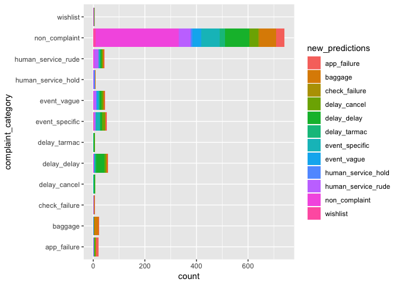

Building a fastText Classifier for Multiple Labels (Supervised)
================

Overview
========

In this document, I create a fastText classification model that predicts complaints by the various complaint categories we created in our test/train dataset. This model is very simple, and uses fastText exclusively for classification.

Load Packages
-------------

``` r
library(fastrtext)
library(tidyverse)
```

    ## ── Attaching packages ──────────────────────────────────────────────────────────────────── tidyverse 1.2.1 ──

    ## ✔ ggplot2 3.1.1       ✔ purrr   0.3.2  
    ## ✔ tibble  2.1.1       ✔ dplyr   0.8.0.1
    ## ✔ tidyr   0.8.3       ✔ stringr 1.4.0  
    ## ✔ readr   1.3.1       ✔ forcats 0.4.0

    ## ── Conflicts ─────────────────────────────────────────────────────────────────────── tidyverse_conflicts() ──
    ## ✖ dplyr::filter() masks stats::filter()
    ## ✖ dplyr::lag()    masks stats::lag()

``` r
set.seed(42)
```

Set the paths to the model, testing, and training data. Once the data and models are created, this is where they will be saved.

``` r
model_path <- here::here("Output", "models", "fasttext_multi_class_model.dat")
train_data_path <- here::here("Output", "clean_data", "rain_multi_data_1.txt")
test_data_path <- here::here("Output", "clean_data", "test_multi_data_1.txt")
```

Read in the Data
----------------

``` r
tweet_data <- read_csv(here::here("Temporary", "Marketing Research Labeled Tweets_ - tweet_sample_5k_Ky-Ch-Ad.csv")) %>%
 filter(nchar(tweet_text) > 5)
```

    ## Parsed with column specification:
    ## cols(
    ##   complaint_label = col_double(),
    ##   complaint_category = col_character(),
    ##   tweet_text = col_character()
    ## )

Partition Data for Testing and Training
---------------------------------------

``` r
test_train_data <- tweet_data %>%
  mutate(input_lines = paste(complaint_category, tweet_text)) %>%
  group_by(complaint_category) %>% # get a representative sample of both complaints and non complaints
  mutate(test_train = c("test", "train")[rbinom(n(), 1, 0.8) + 1]) %>% # assign test train splits
  ungroup()
```

Create .txt Files
-----------------

As input, the fastText model needs to take the testing and training data as .txt files.

``` r
# write train data
train_data_lines <- test_train_data %>%
  filter(test_train == "train") %>%
  pull(input_lines) %>%
  paste0("__label__", .)

write_lines(train_data_lines, train_data_path)

# write test data
test_data_lines <- test_train_data %>%
  filter(test_train == "test") %>%
  pull(input_lines) %>%
  paste0("__label__", .)

write_lines(test_data_lines, test_data_path)

# create a character vector containing the tweets to test without their labels
test_labels_without_prefix <-
  test_train_data %>%
  filter(test_train == "test") %>%
  pull(complaint_category)
```

Train the fastText Classification Model (Supervised, Multiple Categories)
-------------------------------------------------------------------------

``` r
# train model
execute(commands = c("supervised", "-input", train_data_path, "-output", model_path, "-dim", 20, "-lr", 1, "-epoch", 20, "-wordNgrams", 2, "-verbose", 1))
```

    ## 
    Read 0M words
    ## Number of words:  16336
    ## Number of labels: 12
    ## 
    Progress: 100.0% words/sec/thread:  274069 lr:  0.000000 loss:  0.133526 ETA:   0h 0m

``` r
# load model
model <- load_model(model_path)
```

    ## add .bin extension to the path

Review Model
------------

``` r
predictions <- predict(model, sentences = test_data_lines, simplify = TRUE, unlock_empty_predictions = TRUE)

head(predictions, 5)
```

    ## non_complaint non_complaint non_complaint   delay_delay  delay_cancel 
    ##     0.5164096     1.0000100     0.9921728     0.8093554     0.7478749

Below we compare the length of the list of predictions to the length of the testing dataset. Ideally, these should have the same length. This will help us confirm that our model worked as expected.

``` r
length(predictions)
```

    ## [1] 1016

``` r
length(test_labels_without_prefix)
```

    ## [1] 1018

``` r
length(test_data_lines)
```

    ## [1] 1018

Similar to the previous fastText model, it appears the model would not make predictions on a few of the tweets in the testing dataset. This is likely due to the size of our training dataset as well as the variance in vocabulary for tweets.

Below, we merge the predictions with our testing dataset, preparing the data for visualizations.

``` r
new_predictions <- attributes(predictions)$names

tested <- test_train_data %>% 
  filter(test_train == "test") %>% 
  mutate(prediction = predict(model, tweet_text, unlock_empty_predictions = TRUE)) %>% 
  unnest(prediction) %>% 
  mutate(new_predictions = new_predictions,
         correct = case_when(complaint_category == new_predictions ~ TRUE,
                             complaint_category != new_predictions ~ FALSE))
```

Visualize Predictions
---------------------

``` r
tested %>% 
  ggplot(aes(x = complaint_category, fill = new_predictions)) +
  geom_bar() +
  coord_flip()
```



Accuracy
--------

``` r
tested %>% 
  summarise(accuracy = mean(correct))
```

    ## # A tibble: 1 x 1
    ##   accuracy
    ##      <dbl>
    ## 1    0.432

This model does not seem very accurate at all, but it is still better than rolling the dice.
