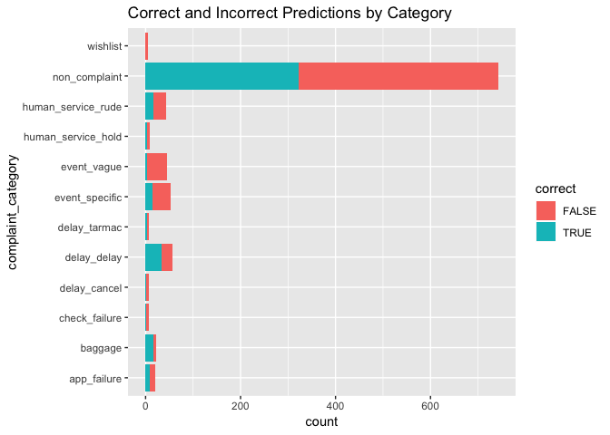
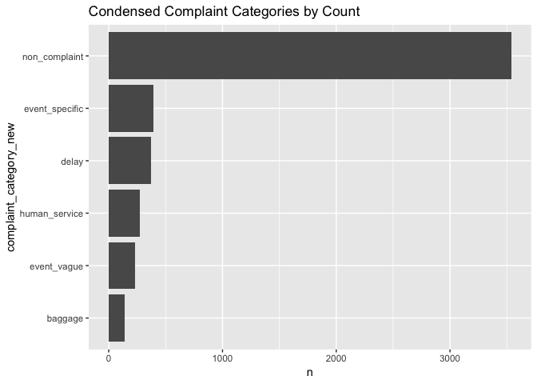
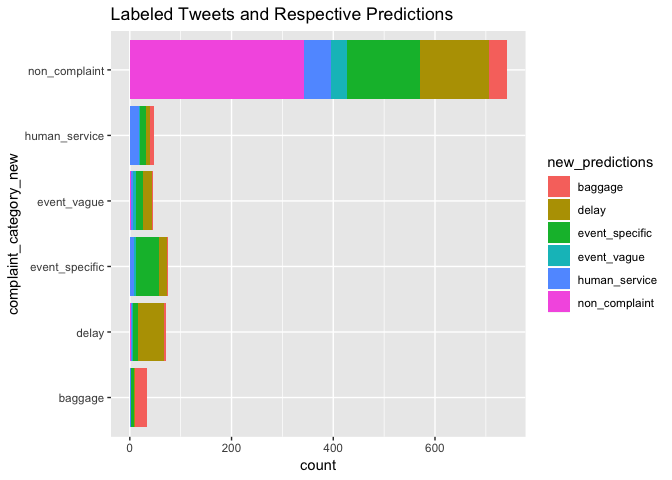
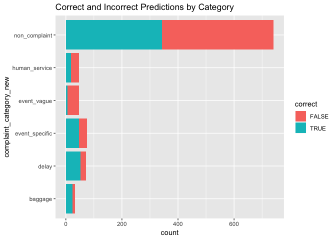

Building a fastText Classifier for Multiple Complaint Categories (Supervised)
================

Overview
========

In this document, I create a fastText classification model that predicts complaints by the various complaint categories we created in our test/train dataset. This model is very simple, and uses fastText exclusively for classification.

Building the First fastText Classifier for Multiple Complaint Categories
========================================================================

Preparation
-----------

In this section, we will load necesary libraries, and prepare our data for training a model by reading it in, partitioning it, and converting the data to necessary .txt files. \#\#\# Libraries

``` r
library(fastrtext)
library(tidyverse)
```

    ## ── Attaching packages ───────────────────────────────────────────────────────────────────── tidyverse 1.2.1 ──

    ## ✔ ggplot2 3.1.1       ✔ purrr   0.3.2  
    ## ✔ tibble  2.1.1       ✔ dplyr   0.8.0.1
    ## ✔ tidyr   0.8.3       ✔ stringr 1.4.0  
    ## ✔ readr   1.3.1       ✔ forcats 0.4.0

    ## ── Conflicts ──────────────────────────────────────────────────────────────────────── tidyverse_conflicts() ──
    ## ✖ dplyr::filter() masks stats::filter()
    ## ✖ dplyr::lag()    masks stats::lag()

``` r
set.seed(42)
```

Here, I set the paths to the model, testing, and training data. Once the data and models are created, this is where they will be saved.

``` r
model_path <- here::here("Output", "models", "fasttext_multi_class_model.dat")
train_data_path <- here::here("Output", "clean_data", "rain_multi_data_1.txt")
test_data_path <- here::here("Output", "clean_data", "test_multi_data_1.txt")
```

### Prepare Data

##### Read in the Data

``` r
tweet_data <- read_csv(here::here("Temporary", "Marketing Research Labeled Tweets_ - tweet_sample_5k_Ky-Ch-Ad.csv")) %>%
 filter(nchar(tweet_text) > 5)
```

    ## Parsed with column specification:
    ## cols(
    ##   complaint_label = col_double(),
    ##   complaint_category = col_character(),
    ##   tweet_text = col_character()
    ## )

##### Partition Data for Testing and Training

``` r
test_train_data <- tweet_data %>%
  mutate(input_lines = paste(complaint_category, tweet_text)) %>%
  group_by(complaint_category) %>% # get a representative sample of both complaints and non complaints
  mutate(test_train = c("test", "train")[rbinom(n(), 1, 0.8) + 1]) %>% # assign test train splits
  ungroup()
```

##### Create .txt Files

As input, the fastText model needs to take the testing and training data as .txt files.

``` r
# write train data
train_data_lines <- test_train_data %>%
  filter(test_train == "train") %>%
  pull(input_lines) %>%
  paste0("__label__", .)

write_lines(train_data_lines, train_data_path)

# write test data
test_data_lines <- test_train_data %>%
  filter(test_train == "test") %>%
  pull(input_lines) %>%
  paste0("__label__", .)

write_lines(test_data_lines, test_data_path)

# create a character vector containing the tweets to test without their labels
test_labels_without_prefix <-
  test_train_data %>%
  filter(test_train == "test") %>%
  pull(complaint_category)
```

Train the fastText Classification Model (Supervised, Multiple Categories)
-------------------------------------------------------------------------

``` r
# train model
execute(commands = c("supervised", "-input", train_data_path, "-output", model_path, "-dim", 20, "-lr", 1, "-epoch", 20, "-wordNgrams", 2, "-verbose", 1))
```

    ## 
    Read 0M words
    ## Number of words:  16336
    ## Number of labels: 12
    ## 
    Progress: 100.0% words/sec/thread:  341536 lr:  0.000000 loss:  0.095327 ETA:   0h 0m

``` r
# load model
model <- load_model(model_path)
```

    ## add .bin extension to the path

Review Model
------------

``` r
predictions <- predict(model, sentences = test_data_lines, simplify = TRUE, unlock_empty_predictions = TRUE)

head(predictions, 5)
```

    ## event_specific  non_complaint  non_complaint    delay_delay   delay_cancel 
    ##      0.4711398      1.0000100      0.9057285      0.7043456      0.7628765

Below we compare the length of the list of predictions to the length of the testing dataset. Ideally, these should have the same length. This will help us confirm that our model worked as expected.

``` r
length(predictions)
```

    ## [1] 1016

``` r
length(test_labels_without_prefix)
```

    ## [1] 1018

``` r
length(test_data_lines)
```

    ## [1] 1018

Similar to the previous fastText model, it appears the model would not make predictions on a few of the tweets in the testing dataset. This is likely due to the size of our training dataset as well as the variance in vocabulary for tweets.

Below, we merge the predictions with our testing dataset, preparing the data for visualizations.

``` r
new_predictions <- attributes(predictions)$names

tested <- test_train_data %>% 
  filter(test_train == "test") %>% 
  mutate(prediction = predict(model, tweet_text, unlock_empty_predictions = TRUE)) %>% 
  unnest(prediction) %>% 
  mutate(new_predictions = new_predictions,
         correct = case_when(complaint_category == new_predictions ~ TRUE,
                             complaint_category != new_predictions ~ FALSE))
```

### Visualize Predictions

``` r
tested %>% 
  ggplot(aes(x = complaint_category, fill = new_predictions)) +
  geom_bar() +
  coord_flip()
```


### Accuracy

The graph above is a little bit busy, so here is one that simplifies predictions into correct and incorrect.

``` r
tested %>% 
  ggplot(aes(x = complaint_category, fill = correct)) +
  geom_bar() +
  coord_flip() +
  labs(title = "Correct and Incorrect Predictions by Category")
```



Here is the measured accuracy of the model.

``` r
tested %>% 
  summarise(accuracy = mean(correct))
```

    ## # A tibble: 1 x 1
    ##   accuracy
    ##      <dbl>
    ## 1    0.420

This model does not seem very accurate at all, but it is still better than rolling the dice.

Building a Second fastText Classification Model with Condensed Complaint Categories
===================================================================================

The classification of the tweets above was extremely poor, and I think it could be due to the size of our training dataset relative to the quantity of categories. I believe that if we shrunk the categories down to about 6 or so, we might have better luck classifying the data.

I will condense the complaint categories into smaller chunks, and hopefully, this will result in better data for training and testing our model.

Preparation
-----------

In this section, we will clean the environment, re-load our test/train data, condense complaint categories, partition the data for testing and training, create a location to save our data and models, and create necessary .txt files for training and testing the model.

### Clean the Environment

To ensure that we are working with data independent from the section above, we will remove all objects in the environment, and re-load the libraries we need.

``` r
rm(list = ls())

library(fastrtext)
library(tidyverse)

set.seed(42)
```

### Prepare Data

#### Load the Training/Test Data

This is our labeled test/train dataset with about 5,000 tweets, binary complaint labels, and categorical complaint labels.

``` r
tweet_data <- read_csv(here::here("Temporary", "Marketing Research Labeled Tweets_ - tweet_sample_5k_Ky-Ch-Ad.csv")) %>%
 filter(nchar(tweet_text) > 5)
```

    ## Parsed with column specification:
    ## cols(
    ##   complaint_label = col_double(),
    ##   complaint_category = col_character(),
    ##   tweet_text = col_character()
    ## )

#### Condense the Complaint Categories

##### View the Complaint Categories

This visualization will help us see how many categories we currently have, and will help us decide which categories to condense.

``` r
tweet_data %>% 
  count(complaint_category, sort = TRUE) %>% 
  mutate(complaint_category = reorder(complaint_category, n)) %>% 
  ggplot(aes(x = complaint_category, n)) +
  geom_col() +
  coord_flip() +
  labs(title = "Complaint Categories by Count")
```


Looking at this chart, it appears that we could condense delay\_ into a single category, and human\_service\_ into a single category. app\_failure, wishlist, and check\_failure could all go into event\_specific. This seems to make the most intuitive sense to me.

##### Perform Condensing on Complaint Categories

``` r
tweet_data <- tweet_data %>% 
  mutate(complaint_category_new = case_when(complaint_category == "non_complaint" ~ "non_complaint", 
                                            complaint_category == "baggage" ~ "baggage",
                                            complaint_category == "event_vague" ~ "event_vague",
                                            str_detect(complaint_category, "delay") == TRUE ~ "delay",
                                            str_detect(complaint_category, "event_specific") == TRUE ~ "event_specific",
                                            str_detect(complaint_category, "app") == TRUE ~ "event_specific",
                                            str_detect(complaint_category, "wish") == TRUE ~ "event_specific",
                                            str_detect(complaint_category, "failure") == TRUE ~ "event_specific",
                                            str_detect(complaint_category, "human_service") == TRUE ~ "human_service"))
```

##### Visualize Condensing of Complaint Categories

``` r
tweet_data %>% 
  count(complaint_category_new, sort = TRUE) %>% 
  mutate(complaint_category_new = reorder(complaint_category_new, n)) %>% 
  ggplot(aes(x = complaint_category_new, n)) +
  geom_col() +
  coord_flip() +
  labs(title = "Condensed Complaint Categories by Count")
```



We've now condensed the complaint categories down to 6 categories. Hopefully, this will help our classifier train well.

#### Partition the Data for the Second Model

Here, we split the data so that 80% of it is dedicated towards training, and 20% is dedicated for testing.

``` r
test_train_data <- tweet_data %>%
  mutate(input_lines = paste(complaint_category_new, tweet_text)) %>%
  group_by(complaint_category_new) %>% # get a representative sample of both complaints and non complaints
  mutate(test_train = c("test", "train")[rbinom(n(), 1, 0.8) + 1]) %>% # assign test train splits
  ungroup()
```

#### Create a Location for Saving the data and Second Model

``` r
model_path_2 <- here::here("Output", "models", "fasttext_multi_class_model_2.dat")
train_data_path_2 <- here::here("Output", "clean_data", "train_multi_data_2.txt")
test_data_path_2 <- here::here("Output", "clean_data", "test_multi_data_2.txt")
```

#### Create .txt Files for the Second Model

As input, the fastText model needs to take the testing and training data as .txt files.

``` r
# write train data
train_data_lines <- test_train_data %>%
  filter(test_train == "train") %>%
  pull(input_lines) %>%
  paste0("__label__", .)

write_lines(train_data_lines, train_data_path_2)

# write test data
test_data_lines <- test_train_data %>%
  filter(test_train == "test") %>%
  pull(input_lines) %>%
  paste0("__label__", .)

write_lines(test_data_lines, test_data_path_2)

# create a character vector containing the tweets to test without their labels
test_labels_without_prefix <-
  test_train_data %>%
  filter(test_train == "test") %>%
  pull(complaint_category_new)
```

Train the Second fastText Classification Model (Supervised, Condensed Categories)
---------------------------------------------------------------------------------

``` r
# train model
execute(commands = c("supervised", "-input", train_data_path_2, "-output", model_path_2, "-dim", 20, "-lr", 1, "-epoch", 20, "-wordNgrams", 2, "-verbose", 1))
```

    ## 
    Read 0M words
    ## Number of words:  16225
    ## Number of labels: 6
    ## 
    Progress: 100.0% words/sec/thread:  360266 lr:  0.000000 loss:  0.115392 ETA:   0h 0m

``` r
# load model
model <- load_model(model_path_2)
```

    ## add .bin extension to the path

Review Second Model
-------------------

``` r
predictions <- predict(model, sentences = test_data_lines, simplify = TRUE, unlock_empty_predictions = TRUE)

head(predictions, 5)
```

    ##  human_service  non_complaint event_specific  human_service  human_service 
    ##      0.8985178      0.9426445      0.4579384      0.5337045      0.4058606

Below we compare the length of the list of predictions to the length of the testing dataset. Ideally, these should have the same length. This will help us confirm that our model worked as expected.

``` r
length(predictions)
```

    ## [1] 1013

``` r
length(test_labels_without_prefix)
```

    ## [1] 1018

``` r
length(test_data_lines)
```

    ## [1] 1018

Similar to the previous fastText model, it appears the model would not make predictions on a few of the tweets in the testing dataset. This is likely due to the size of our training dataset as well as the variance in vocabulary for tweets.

Below, we merge the predictions with our testing dataset, preparing the data for visualizations.

``` r
new_predictions <- attributes(predictions)$names

tested <- test_train_data %>% 
  filter(test_train == "test") %>% 
  mutate(prediction = predict(model, tweet_text, unlock_empty_predictions = TRUE)) %>% 
  unnest(prediction) %>% 
  mutate(new_predictions = new_predictions,
         correct = case_when(complaint_category_new == new_predictions ~ TRUE,
                             complaint_category_new != new_predictions ~ FALSE))
```

### Visualize Predictions of Second Model

``` r
tested %>% 
  ggplot(aes(x = complaint_category_new, fill = new_predictions)) +
  geom_bar() +
  coord_flip() +
  labs(title = "Labeled Tweets and Respective Predictions")
```



### Accuracy of Second Model

If the graph above was too busy, here is another graph that simplifies everything down to correct and incorrect predictions. As indicated, the coral predictions were false, while the turquoise predictions were correct.

``` r
tested %>% 
  ggplot(aes(x = complaint_category_new, fill = correct)) +
  geom_bar() +
  coord_flip() +
  labs(title = "Correct and Incorrect Predictions by Category")
```



``` r
tested %>% 
  summarise(accuracy = mean(correct))
```

    ## # A tibble: 1 x 1
    ##   accuracy
    ##      <dbl>
    ## 1    0.482

Surprisingly to me, this model does not perform much better than the first model in this document, which predicted on twelve different complaint categories.
