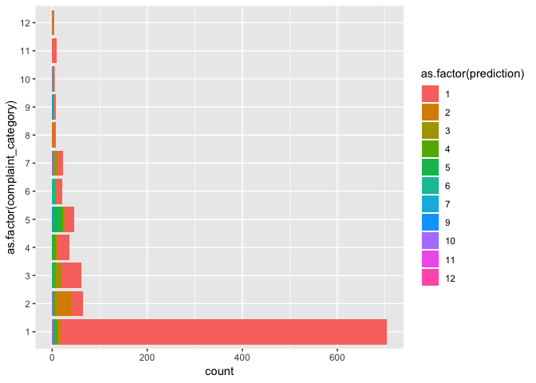
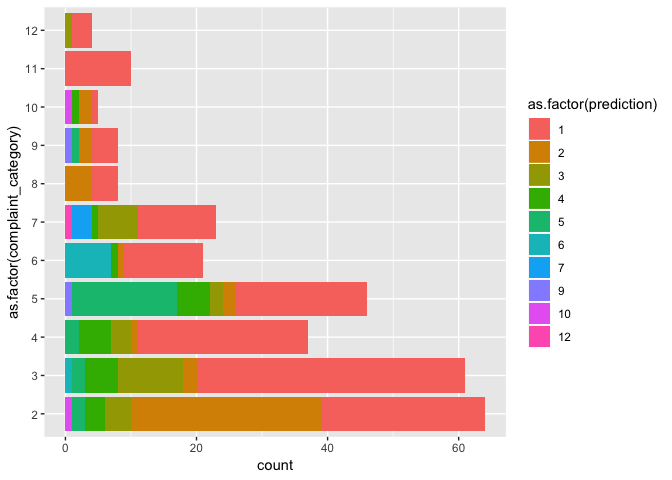

Building a Frankenstien Classification Model for Multiple Complaint Labels
================

Overview
========

In this document, I will try to make a classification model similar to the one in 07\_build\_classifier.Rmd. The difference here will be that I will attempt to build a classification model meant to predict based on a set of many complaint categories.

Libraries and Scripts
=====================

    ## ── Attaching packages ──────────────────────────────────────────────────────────────────── tidyverse 1.2.1 ──

    ## ✔ ggplot2 3.1.1       ✔ purrr   0.3.2  
    ## ✔ tibble  2.1.1       ✔ dplyr   0.8.0.1
    ## ✔ tidyr   0.8.3       ✔ stringr 1.4.0  
    ## ✔ readr   1.3.1       ✔ forcats 0.4.0

    ## ── Conflicts ─────────────────────────────────────────────────────────────────────── tidyverse_conflicts() ──
    ## ✖ dplyr::filter() masks stats::filter()
    ## ✖ dplyr::lag()    masks stats::lag()

    ## 
    ## Attaching package: 'magrittr'

    ## The following object is masked from 'package:purrr':
    ## 
    ##     set_names

    ## The following object is masked from 'package:tidyr':
    ## 
    ##     extract

    ## 
    ## Attaching package: 'plotly'

    ## The following object is masked from 'package:ggplot2':
    ## 
    ##     last_plot

    ## The following object is masked from 'package:stats':
    ## 
    ##     filter

    ## The following object is masked from 'package:graphics':
    ## 
    ##     layout

    ## Loading required package: randomForest

    ## randomForest 4.6-14

    ## Type rfNews() to see new features/changes/bug fixes.

    ## 
    ## Attaching package: 'randomForest'

    ## The following object is masked from 'package:dplyr':
    ## 
    ##     combine

    ## The following object is masked from 'package:ggplot2':
    ## 
    ##     margin

    ## 
    ## Attaching package: 'Matrix'

    ## The following object is masked from 'package:tidyr':
    ## 
    ##     expand

    ## 
    ## Attaching package: 'xgboost'

    ## The following object is masked from 'package:plotly':
    ## 
    ##     slice

    ## The following object is masked from 'package:dplyr':
    ## 
    ##     slice

    ## Loading required package: lattice

    ## 
    ## Attaching package: 'caret'

    ## The following object is masked from 'package:purrr':
    ## 
    ##     lift

    ## Loading required package: carData

    ## 
    ## Attaching package: 'car'

    ## The following object is masked from 'package:dplyr':
    ## 
    ##     recode

    ## The following object is masked from 'package:purrr':
    ## 
    ##     some

    ## Welcome! Related Books: `Practical Guide To Cluster Analysis in R` at https://goo.gl/13EFCZ

    ## 
    ## ---------------------
    ## Welcome to dendextend version 1.10.0
    ## Type citation('dendextend') for how to cite the package.
    ## 
    ## Type browseVignettes(package = 'dendextend') for the package vignette.
    ## The github page is: https://github.com/talgalili/dendextend/
    ## 
    ## Suggestions and bug-reports can be submitted at: https://github.com/talgalili/dendextend/issues
    ## Or contact: <tal.galili@gmail.com>
    ## 
    ##  To suppress this message use:  suppressPackageStartupMessages(library(dendextend))
    ## ---------------------

    ## 
    ## Attaching package: 'dendextend'

    ## The following object is masked from 'package:stats':
    ## 
    ##     cutree

Load the Training Dataset
-------------------------

This dataset was created in file 07\_build\_classifier.Rmd

``` r
load(here::here("Output", "train_data.dat"))
```

Modify the training dataset to make it ready for a multi classification

``` r
train <- train %>% 
  mutate(complaint_category_name = complaint_category) %>% 
  mutate(complaint_category = case_when(complaint_category_name == "non_complaint"         ~ 1,
                                        complaint_category_name == "delay_delay"           ~ 2,
                                        complaint_category_name == "event_specific"        ~ 3,
                                        complaint_category_name == "event_vague"           ~ 4,
                                        complaint_category_name == "human_service_rude"    ~ 5,
                                        complaint_category_name == "baggage"               ~ 6,
                                        complaint_category_name == "app_failure"           ~ 7,
                                        complaint_category_name == "delay_cancel"          ~ 8,
                                        complaint_category_name == "human_service_hold"    ~ 9,
                                        complaint_category_name == "delay_tarmac"          ~ 10,
                                        complaint_category_name == "wishlist"              ~ 11,
                                        complaint_category_name == "check_failure"         ~ 12))
```

I will make sure that the mutated data matches the original data.

``` r
train %>% 
  count(complaint_category_name, complaint_category, sort = TRUE) %>% 
  mutate(complaint_category_name = reorder(complaint_category_name, n))
```

    ## # A tibble: 12 x 3
    ##    complaint_category_name complaint_category     n
    ##    <fct>                                <dbl> <int>
    ##  1 non_complaint                            1  3552
    ##  2 delay_delay                              2   288
    ##  3 event_specific                           3   262
    ##  4 event_vague                              4   232
    ##  5 human_service_rude                       5   230
    ##  6 baggage                                  6   139
    ##  7 app_failure                              7    75
    ##  8 delay_cancel                             8    48
    ##  9 human_service_hold                       9    40
    ## 10 delay_tarmac                            10    35
    ## 11 wishlist                                11    32
    ## 12 check_failure                           12    26

We see that every datapoint has been matched, so we're good!

Partition the Dataset
---------------------

``` r
trainIndex <- createDataPartition(train$complaint_category, p = .8, 
                                  list = FALSE, 
                                  times = 1)

test_data <- train[-trainIndex,]
test_labels <- test_data %>% select(complaint_category) %>% transmute(label = complaint_category)
test_data_vec <- test_data %>%  select(tweetFeatures, avg_vec_50, avg_vec_50_PCA) %>% unnest %>% mutate_all(as.numeric)

train_data <- train[trainIndex,]
train_labels <- train_data %>% select(complaint_category) %>% transmute(label = complaint_category)
train_data_vec <- train_data %>%  select(tweetFeatures, avg_vec_50, avg_vec_50_PCA) %>% unnest %>% mutate_all(as.numeric)
```

Create Dense Matricies for XGBoost
----------------------------------

``` r
dtest1 <- xgb.DMatrix(sparse.model.matrix(~.-1, test_data_vec))
```

Set the Parameters of the Model and Begin Training
--------------------------------------------------

``` r
bst <- xgboost(data = sparse.model.matrix(~.-1, train_data_vec), 
               label = as.factor(train_labels$label),
               max.depth = 4, 
               eta = 0.2, 
               nthread = 2, 
               nrounds = 100, 
               num_class = 13,
               objective = "multi:softmax",
               eval_metric = evalerror)
```

    ## [1]  train-error:0.282258 
    ## [2]  train-error:0.282258 
    ## [3]  train-error:0.282258 
    ## [4]  train-error:0.282258 
    ## [5]  train-error:0.282258 
    ## [6]  train-error:0.282258 
    ## [7]  train-error:0.282258 
    ## [8]  train-error:0.282258 
    ## [9]  train-error:0.282258 
    ## [10] train-error:0.282258 
    ## [11] train-error:0.282258 
    ## [12] train-error:0.282258 
    ## [13] train-error:0.282258 
    ## [14] train-error:0.282258 
    ## [15] train-error:0.282258 
    ## [16] train-error:0.282258 
    ## [17] train-error:0.282258 
    ## [18] train-error:0.282258 
    ## [19] train-error:0.282258 
    ## [20] train-error:0.282258 
    ## [21] train-error:0.282258 
    ## [22] train-error:0.282258 
    ## [23] train-error:0.282258 
    ## [24] train-error:0.282258 
    ## [25] train-error:0.282258 
    ## [26] train-error:0.282258 
    ## [27] train-error:0.282258 
    ## [28] train-error:0.282258 
    ## [29] train-error:0.282258 
    ## [30] train-error:0.282258 
    ## [31] train-error:0.282258 
    ## [32] train-error:0.282258 
    ## [33] train-error:0.282258 
    ## [34] train-error:0.282258 
    ## [35] train-error:0.282258 
    ## [36] train-error:0.282258 
    ## [37] train-error:0.282258 
    ## [38] train-error:0.282258 
    ## [39] train-error:0.282258 
    ## [40] train-error:0.282258 
    ## [41] train-error:0.282258 
    ## [42] train-error:0.282258 
    ## [43] train-error:0.282258 
    ## [44] train-error:0.282258 
    ## [45] train-error:0.282258 
    ## [46] train-error:0.282258 
    ## [47] train-error:0.282258 
    ## [48] train-error:0.282258 
    ## [49] train-error:0.282258 
    ## [50] train-error:0.282258 
    ## [51] train-error:0.282258 
    ## [52] train-error:0.282258 
    ## [53] train-error:0.282258 
    ## [54] train-error:0.282258 
    ## [55] train-error:0.282258 
    ## [56] train-error:0.282258 
    ## [57] train-error:0.282258 
    ## [58] train-error:0.282258 
    ## [59] train-error:0.282258 
    ## [60] train-error:0.282258 
    ## [61] train-error:0.282258 
    ## [62] train-error:0.282258 
    ## [63] train-error:0.282258 
    ## [64] train-error:0.282258 
    ## [65] train-error:0.282258 
    ## [66] train-error:0.282258 
    ## [67] train-error:0.282258 
    ## [68] train-error:0.282258 
    ## [69] train-error:0.282258 
    ## [70] train-error:0.282258 
    ## [71] train-error:0.282258 
    ## [72] train-error:0.282258 
    ## [73] train-error:0.282258 
    ## [74] train-error:0.282258 
    ## [75] train-error:0.282258 
    ## [76] train-error:0.282258 
    ## [77] train-error:0.282258 
    ## [78] train-error:0.282258 
    ## [79] train-error:0.282258 
    ## [80] train-error:0.282258 
    ## [81] train-error:0.282258 
    ## [82] train-error:0.282258 
    ## [83] train-error:0.282258 
    ## [84] train-error:0.282258 
    ## [85] train-error:0.282258 
    ## [86] train-error:0.282258 
    ## [87] train-error:0.282258 
    ## [88] train-error:0.282258 
    ## [89] train-error:0.282258 
    ## [90] train-error:0.282258 
    ## [91] train-error:0.282258 
    ## [92] train-error:0.282258 
    ## [93] train-error:0.282258 
    ## [94] train-error:0.282258 
    ## [95] train-error:0.282258 
    ## [96] train-error:0.282258 
    ## [97] train-error:0.282258 
    ## [98] train-error:0.282258 
    ## [99] train-error:0.282258 
    ## [100]    train-error:0.282258

The train-error does not improve with iterations, which is concerning to me.

\`\# Get Predictions on the Model

``` r
test_data$prediction <- predict(bst, dtest1)

predict(bst, dtest1)
```

    ##   [1]  1  5  3  1  1  2  1  1  1  1  4  1  1  1  1  1  1  1  1  1  1  1  1
    ##  [24]  1  1  1  4  1  1  4  1  1  5  1  1  2  1  1  1  1  1  1  1  1  1  1
    ##  [47]  3  1  1  1  1  1  1  1  1  1  4  1  1  6  6  2  1  1  1  1  1  1  1
    ##  [70]  1  1  1  1  1  9  1  1  1  1  1  1  1  1  1  1  1  1  4  1  1  2  1
    ##  [93]  2  1  1  1  6  1  1  1  1  4  1  4  1  1  1  1  1  1  2  4  1  1  1
    ## [116]  1  1  2  1  2  1  4  1  1  1  1  1  1  1  1  1  1  1  1  1  1  1  5
    ## [139]  1  1  1  2  1  1  1  1  1  1  1  1  1  1  1  1  1  1  1  1  1  1  1
    ## [162]  1  1  1  1  3  1  1  1  1  2  1  1  1  1  1  1  1  1  3  1  1  3  1
    ## [185]  1  1  1  1  1  1  1  1  1  1  1  1  1  1  5  1  1  1  1  1  1  1  1
    ## [208]  1  1  1  1  1  1  1  1  4  1  1  1  1  1  1  1  1  1  1  1  1  1  1
    ## [231]  1  1  1  1  1  1  1  1  1  1  1  1  1  2  3  1  1  1  2  1  1  1  1
    ## [254]  1  1  1  1  5  1  1  2  1  1  1  1  1  1  1  1  1  1  5  5  1  1  1
    ## [277]  2  1  1  1  5  5  1  3  1  2  1  1  1  1  1  1  1  1  1  1  1  1  5
    ## [300]  1  4  1  2  5  1  1  1  1  5  1  1  1  1  1  1  1  1  1  1  1  1  1
    ## [323]  1  1  1  1  2  1  1  1  1  1  1  2  1  1  1  1  1  1  2  1  1  1  1
    ## [346]  1  1  1  1  1  1  1  1  2  1  1  1  1  2  4  1  1  1  1  1  1  1  1
    ## [369]  1  6  1  1  1  1  1  1  1  1  1  1  1  1  1  1  2  1  1  1  1  1  1
    ## [392]  2  3  1  1  2  2  1  1  1  1  1  1  1  1  1  1  1  1  1  1  1  1  1
    ## [415]  3  1  1  1  1  1  1  1  1  1  1  1  1  1  1  1  1  1  1  1  1  1  1
    ## [438]  1  1  1  1  1  1  1 12  1  1  1  1  1  1  1  1  5  1  5  1  1  3  1
    ## [461]  1  1  1  1  1  1  1  1  1  1  1  1  3  1  1  1  1  2  1  1  1  1  2
    ## [484]  1  1  1  1  1  1  1  1  1  1  1  1  1  1  1  1  1  1  1  1  7  3  1
    ## [507]  1  1  1  1  1  1  1  1  1  1  1  1  1  1  2  1  1  1  1  1  1  1  1
    ## [530]  3  1 11  1  1  1  2  1  5  1  1  3  1  1  1  1  1  1  1  1  1  1  1
    ## [553]  1  1  1  1  2  3  1  3  1  1  1  1  1  3  1  1  4  1  1  1  1  1  1
    ## [576]  1  1  1  1  1  1  1  1  4  2  1  5  1  1  2  1  1  1  1  1  1  1  1
    ## [599]  1  1  1  1  1  6  1  1  1  1  1  1  1  1  6  6  1  1  2  1  1  1  1
    ## [622]  1  1  1  1  1  1  1  1  1  1  2  1  1  1  1  1  1  1  1  1  1  5  1
    ## [645]  2  1  1  6  3  1  1  1  3  1  1  1  1  1  1  1  1  1  1  1  1  1  1
    ## [668]  2  1  1  1  1  2  1  1  1  4  1  1  1  1  1  2  5  1  1  1  1  1  1
    ## [691]  1  1  1  1  1  1  1  1  1  1  7  1  1  1  1  1  1  1  3  1  1  1  1
    ## [714]  1  1  1  1  1  3  1  1  1  1  1  1  1  1  1  1  1  4  1  1  1  1  1
    ## [737]  1  1  4  1 10  4  1  2  6  1  1  1  1  9  1  1  1  1  1  1  1  1  1
    ## [760]  1  5  1  1  1  1  1  1  1  3  1  1  4  2  1  1  1  3  1  1  1  1  1
    ## [783]  1  1  1  1  1  1  3  1  1  1  5  1  1  1  1  1  1  1  1 10  1  1  1
    ## [806]  1  1  1  1  1  1  1  1  1  1  1  1  1  1  1  1  1  1  1  1  1  1  1
    ## [829]  1  1  1  1  1  1  1  1  1  1  1  2  2  5  1  1  1  1  1  1  1  5  1
    ## [852]  1  1  1  2  1  1  1  1  1  1  1  1  1  1  1  1  1  1  5  1  5  1  1
    ## [875]  1  1  1  1  3  1  1  4  1  1  1  1  1  1  2  1  1  1  1  1  1  5  1
    ## [898]  3  1  1  2  1  1  1  1  1  1  4  1  1  1  1  1  1  1  1  5  1  1  1
    ## [921]  1  1  1  1  1  1  1  1  1  1  1  1  4  1  1  1  1  1  1  1  1  1  4
    ## [944]  1  1  1  2  1  1  1  1  1  1  6  2  1  1  1  4  1  4  1  1  4  1  1
    ## [967]  1  1  1  7  1  1  1  1  1  1  1  1  1  3  1  1  1  2  1  1  1  1  1
    ## [990]  1  1

!!!!! I messed up on the predictions and will need to come back to this to see how to fix it.

``` r
test_data %>% 
  ggplot(aes(x = as.factor(complaint_category), fill = as.factor(prediction))) +
  geom_bar() +
  coord_flip()
```

 We see that the model isn't especially accurate, but also that for many test labels, the majority of the predicitions (that aren't non complaints) are correct (i.e. 1 matches 1, 2 matches 2, 4 matches 4, etc.). The model could definitely be improved, but it performs better than rolling the dice.

Accuracy
--------

``` r
test_data <- test_data %>% 
  mutate(correct = complaint_category == prediction)

test_data %>% 
  summarise(mean(correct))
```

    ## # A tibble: 1 x 1
    ##   `mean(correct)`
    ##             <dbl>
    ## 1           0.766

The model is 76% accurate, which is suprisingly good! It definitely has room for improvement though. I would guess that the model's ability to correctly estimate the majority of non complaints has helped the model perform well.

How does the model perform when we focus solely on complaints though?

Visualization of complaint categories:

``` r
test_data %>% 
  filter(complaint_category != 1) %>% 
  ggplot(aes(x = as.factor(complaint_category), fill = as.factor(prediction))) +
  geom_bar() +
  coord_flip()
```



Accuracy of non-complaint predictions:

``` r
test_data %>% 
  filter(complaint_category != 1) %>% 
  summarise(mean(correct))
```

    ## # A tibble: 1 x 1
    ##   `mean(correct)`
    ##             <dbl>
    ## 1           0.251

It appears that when predicting non-complaints, the model is only accurate about 25% of the time. This is very poor, but better than rolling the dice.

``` r
confusionMatrix(factor(test_data$complaint_category), factor(test_data$prediction))
```

    ## Error in confusionMatrix.default(factor(test_data$complaint_category), : the data cannot have more levels than the reference
