MRP Case Study
================
McKenna Weech, Adam Hettinger, and Hannah Thompson
1/17/2020

Firms employ a variety of passive listening platforms (e.g., customer
comment cards, help lines, social media) that elicit a variety of
complaints. Since these complaints are self-selected, it isn’t obvious
if complaints are widespread or genuinely indicative of systemic service
failures. In other words, how can can a firm know when complaints can be
ignored and when they need to addressed? This issue is related to a
larger class of problems where the goal is to make inference about the
size of a population from a non-random sample (e.g., the German tank
problem). In this paper, we develop a model that uses a variety of
observed customer complaints on Twitter to make inference about the
severity of service failures.

## Describe the model conceptually

It has been said that if you observe a cockroach on your floor, there
are likely thousands inside the walls of your home. Following this
analogy, our hope is to count the cockroaches we can see and calculate
how many are hiding in the walls.

For the first portion of this case, we will be making a model around
simulated data. Each observation will represent a single tweet, and we
will be scoring them for satisfaction. We will use a multiple hierarchal
linear model to predict satisfaction from the other known variables.
Once we have the model predicting well on our simulated data, we will
fit it to our real data, and from there use our real data satisfaction
scores to measure service or product failure severity.

Along with making a model, we will also be using poststratification to
correct the weights in our simulated sample and real data to more
correctly represent the population. This will be explained in greater
detail as we postratify in this first iteration of the model, so we can
explain and see the benefit of a full multiple regression with
postratification model (MRP).

To begin, we will start by generating our simulated data. It will run
through an initial simple linear model and postratification.

# Iteration 1: Simulation Data and Simple Model

This initial block of code, we will just be loading in the needed
packages and settings to make our sample and model code run.

``` r
library(tidyverse) #Load packages
library(rstan)
library(rstanarm)
library(ggplot2)
library(bayesplot)
theme_set(bayesplot::theme_default())
library(dplyr)
library(tidyr)
library(tidybayes)
options(mc.cores = parallel::detectCores()) # Set Stan to use all availible cores
rstan_options(auto_write = TRUE) # Don't recompile Stan code that hasn't changed
```

For this first iteration of modeling, we will be generating our own
data. We will generate a population, and sample from it in order to
build an MRP model.

We will be modeling our populations `service_failure`. This will
eventually translate into measuring service severity when we apply our
model to our real data. We will be looking at common characteristics
like `gender`, `ethnicity`, `income`, `age`, and `state`.

The following code will make a function `simulate_mrp_data` that will
help us make our simulated data, and sample from it in such a way that
we can use and see the value in postratification.

``` r
simulate_mrp_data <- function(n) {
  J <- c(2, 3, 7, 3, 50) # male or not, eth, age, income level, state
  poststrat <- as.data.frame(array(NA, c(prod(J), length(J)+1))) # Columns of post-strat matrix, plus one for size
  colnames(poststrat) <- c("male", "eth", "age","income", "state",'N')
  count <- 0
  for (i1 in 1:J[1]){
    for (i2 in 1:J[2]){
      for (i3 in 1:J[3]){
        for (i4 in 1:J[4]){
          for (i5 in 1:J[5]){
              count <- count + 1
              # Fill them in so we know what category we are referring to
              poststrat[count, 1:5] <- c(i1-1, i2, i3, i4, i5)
          }
        }
      }
    }
  }
  # Proportion in each sample in the population
  p_male <- c(0.52, 0.48)
  p_eth <- c(0.5, 0.2, 0.3)
  p_age <- c(0.2,.1,0.2,0.2, 0.10, 0.1, 0.1)
  p_income<-c(.50,.35,.15)
  p_state_tmp<-runif(50,10,20)
  p_state<-p_state_tmp/sum(p_state_tmp)
  poststrat$N<-0
  for (j in 1:prod(J)){
    poststrat$N[j] <- round(250e6 * p_male[poststrat[j,1]+1] * p_eth[poststrat[j,2]] *
      p_age[poststrat[j,3]]*p_income[poststrat[j,4]]*p_state[poststrat[j,5]]) #Adjust the N to be the number observed in each category in each group
  }
  # Now let's adjust for the probability of response
  p_response_baseline <- 0.01
  p_response_male <- c(2, 0.8) / 2.8
  p_response_eth <- c(1, 1.2, 2.5) / 4.7
  p_response_age <- c(1, 0.4, 1, 1.5,  3, 5, 7) / 18.9
  p_response_inc <- c(1, 0.9, 0.8) / 2.7
  p_response_state <- rbeta(50, 1, 1)
  p_response_state <- p_response_state / sum(p_response_state)
  p_response <- rep(NA, prod(J))
  for (j in 1:prod(J)) {
    p_response[j] <-
      p_response_baseline * p_response_male[poststrat[j, 1] + 1] *
      p_response_eth[poststrat[j, 2]] * p_response_age[poststrat[j, 3]] *
      p_response_inc[poststrat[j, 4]] * p_response_state[poststrat[j, 5]]
  }
  people <- sample(prod(J), n, replace = TRUE, prob = poststrat$N * p_response)
  ## For respondent i, people[i] is that person's poststrat cell,
  ## some number between 1 and 32
  n_cell <- rep(NA, prod(J))
  for (j in 1:prod(J)) {
    n_cell[j] <- sum(people == j)
  }
  coef_male <- c(0,-0.3)
  coef_eth <- c(0, 0.6, 0.9)
  coef_age <- c(0,-0.2,-0.3, 0.4, 0.5, 0.7, 0.8, 0.9)
  coef_income <- c(0,-0.2, 0.6)
  coef_state <- c(0, round(rnorm(49, 0, 1), 1))
  coef_age_male <- t(cbind(c(0, .1, .23, .3, .43, .5, .6),
                           c(0, -.1, -.23, -.5, -.43, -.5, -.6)))
  true_popn <- data.frame(poststrat[, 1:5], service_failure = rep(NA, prod(J)))
  for (j in 1:prod(J)) {
    true_popn$satisfaction[j] <- plogis(
      coef_male[poststrat[j, 1] + 1] +
        coef_eth[poststrat[j, 2]] + coef_age[poststrat[j, 3]] +
        coef_income[poststrat[j, 4]] + coef_state[poststrat[j, 5]] +
        coef_age_male[poststrat[j, 1] + 1, poststrat[j, 3]]
      )
  }
  #male or not, eth, age, income level, state, city
  y <- rbinom(n, 1, true_popn$satisfaction[people])
  male <- poststrat[people, 1]
  eth <- poststrat[people, 2]
  age <- poststrat[people, 3]
  income <- poststrat[people, 4]
  state <- poststrat[people, 5]
  sample <- data.frame(service_failure = y,
                       male, age, eth, income, state,
                       id = 1:length(people))
  #Make all numeric:
  for (i in 1:ncol(poststrat)) {
    poststrat[, i] <- as.numeric(poststrat[, i])
  }
  for (i in 1:ncol(true_popn)) {
    true_popn[, i] <- as.numeric(true_popn[, i])
  }
  for (i in 1:ncol(sample)) {
    sample[, i] <- as.numeric(sample[, i])
  }
  list(
    sample = sample,
    poststrat = poststrat,
    true_popn = true_popn
  )
}
```

``` r
mrp_sim <- simulate_mrp_data(n=1200)
sample <- mrp_sim[["sample"]]
poststrat <- mrp_sim[["poststrat"]]
true_popn <- mrp_sim[["true_popn"]]
head(sample)
```

    ##   service_failure male age eth income state id
    ## 1               1    0   1   3      2    22  1
    ## 2               1    0   1   1      1     6  2
    ## 3               1    0   3   1      1    50  3
    ## 4               0    0   1   2      1     4  4
    ## 5               1    0   7   1      1    50  5
    ## 6               1    1   5   3      1     4  6

``` r
stan_data <- list( 
  N = nrow(sample), 
  service_failure = sample$service_failure,
  male = sample$male, 
  age = sample$age,
  eth = sample$eth, 
  income = sample$income, 
  state = sample$state)
```

We now have need for a logistic regresson model in order to predict a
binary outcome for ‘service\_failure’ so we will make a hierarchal logit
model

# Hierarchal Logit Model

``` 

data {
  int<lower=2> C; // # of alternatives (choices) in each scenario
  int<lower=1> K; // # of covariates of alternatives
  int<lower=1> R; // # of respondents
  int<lower=1> S; // # of scenarios per respondent
  int<lower=0> G; // # of respondent covariates 
  int<lower=1,upper=C> Y[R, S]; // observed choices
  matrix[C, K] X[R, S]; // matrix of attributes for each obs
  matrix[G, R] Z; // vector of covariates for each respondent
}

parameters {
  matrix[K, R] Beta;
  matrix[K, G] Theta;
  corr_matrix[K] Omega;
  vector<lower=0>[K] tau;
}

transformed parameters {
  cov_matrix[K] Sigma = quad_form_diag(Omega, tau);
}

model {
  //priors
  to_vector(Theta) ~ normal(0, 10);
  tau ~ cauchy(0, 2.5); 
  Omega ~ lkj_corr(2);
  //likelihood
  for (r in 1:R) {
    Beta[,r] ~ multi_normal(Theta*Z[,r], Sigma);    
    for (s in 1:S)
      Y[r,s] ~ categorical_logit(X[r,s]*Beta[,r]);
  }
}
```

``` r
# ========== Load libraries and set options ==========
library(rstan)
library(MASS)
```

    ## 
    ## Attaching package: 'MASS'

    ## The following object is masked from 'package:dplyr':
    ## 
    ##     select

``` r
library(shinystan)
```

    ## Loading required package: shiny

    ## 
    ## This is shinystan version 2.5.0

``` r
# writes a compiled Stan program to the disk to avoid recompiling
rstan_options(auto_write=TRUE) 
# allows Stan chains to run in parallel on multiprocessor machines
options(mc.cores = parallel::detectCores())

# ========== Test Stan with synthetic data ============

# function to generate mnl data
generate_hmnl_data <- function(R=100, S=30, C=3, 
                               Theta=matrix(rep(1, 8), nrow=2), 
                               Sigma=diag(0.1, 4)){
  K <- ncol(Theta)
  G <- nrow(Theta)
  Y <- array(dim=c(R, S))
  X <- array(rnorm(R*S*C*K), dim=c(R, S, C, K)) # normal covariates
  Z <- array(dim=c(G, R))
  Z[1,] <- 1  # intercept
  if (G > 1) {
    Z[2:G,] <- rnorm(R*(G-1)) # normal covariates
  }
  Beta <- array(dim=c(K, R))
  for (r in 1:R) {
    Beta[,r] <- mvrnorm(n=1, mu=Z[,r]%*%Theta, Sigma=Sigma)
    for (s in 1:S)
      Y[r,s] <- sample(x=C, size=1, prob=exp(X[r,s,,]%*%Beta[,r])) # logit formula
   }
  list(R=R, S=S, C=C, K=K, G=G, Y=Y, X=X, Z=Z, 
       beta.true=beta, Theta.true=Theta, Sigma.true=Sigma)
}

d1 <- generate_hmnl_data()
str(d1)
```

    ## List of 11
    ##  $ R         : num 100
    ##  $ S         : num 30
    ##  $ C         : num 3
    ##  $ K         : int 4
    ##  $ G         : int 2
    ##  $ Y         : int [1:100, 1:30] 3 2 1 2 3 3 1 1 3 2 ...
    ##  $ X         : num [1:100, 1:30, 1:3, 1:4] 0.5763 -1.075 -0.0835 1.252 -1.3401 ...
    ##  $ Z         : num [1:2, 1:100] 1 0.953 1 -0.427 1 ...
    ##  $ beta.true :function (a, b)  
    ##  $ Theta.true: num [1:2, 1:4] 1 1 1 1 1 1 1 1
    ##  $ Sigma.true: num [1:4, 1:4] 0.1 0 0 0 0 0.1 0 0 0 0 ...

``` r
test.stan <- stan(file="hmnl.stan", data=d1, iter=1000, chains=4) 
```

    ## Warning: There were 1 divergent transitions after warmup. Increasing adapt_delta above 0.8 may help. See
    ## http://mc-stan.org/misc/warnings.html#divergent-transitions-after-warmup

    ## Warning: There were 2 chains where the estimated Bayesian Fraction of Missing Information was low. See
    ## http://mc-stan.org/misc/warnings.html#bfmi-low

    ## Warning: Examine the pairs() plot to diagnose sampling problems

    ## Warning: The largest R-hat is 1.08, indicating chains have not mixed.
    ## Running the chains for more iterations may help. See
    ## http://mc-stan.org/misc/warnings.html#r-hat

    ## Warning: Bulk Effective Samples Size (ESS) is too low, indicating posterior means and medians may be unreliable.
    ## Running the chains for more iterations may help. See
    ## http://mc-stan.org/misc/warnings.html#bulk-ess

    ## Warning: Tail Effective Samples Size (ESS) is too low, indicating posterior variances and tail quantiles may be unreliable.
    ## Running the chains for more iterations may help. See
    ## http://mc-stan.org/misc/warnings.html#tail-ess

``` r
plot(test.stan, plotfun="trace", pars=("Theta"))
```

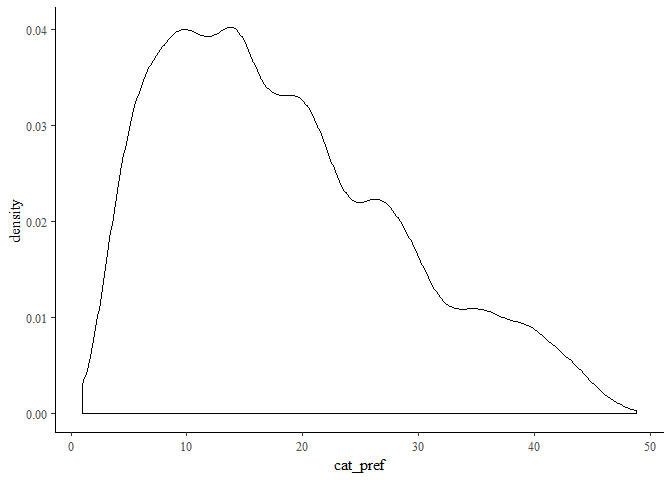<!-- -->

``` r
plot(test.stan, plotfun="trace", pars=c("tau"))
```

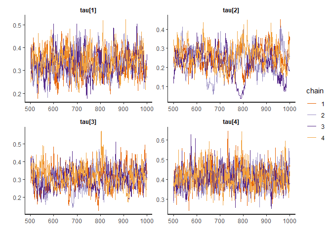<!-- -->

``` r
plot(test.stan, plotfun="trace", pars=("Omega"))
```

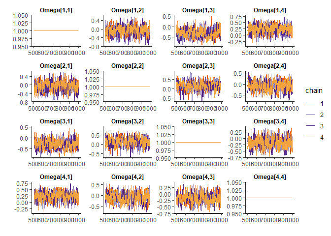<!-- -->

``` r
plot(test.stan, pars=c("Theta", "tau", "Omega"))
```

    ## ci_level: 0.8 (80% intervals)

    ## outer_level: 0.95 (95% intervals)

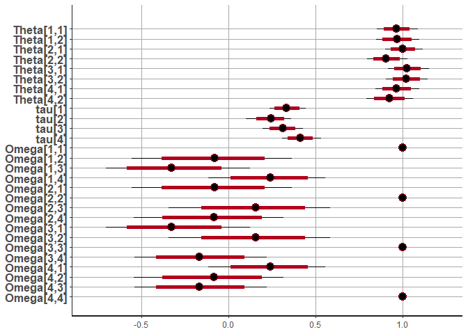<!-- -->

``` r
plot(test.stan, pars=c("Theta", "Sigma"))
```

    ## ci_level: 0.8 (80% intervals)
    ## outer_level: 0.95 (95% intervals)

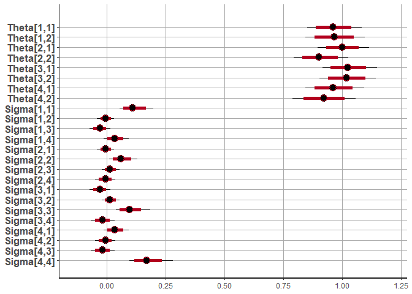<!-- -->

``` r
summary(test.stan, pars=c("Theta"))$summary
```

    ##                 mean     se_mean         sd      2.5%       25%       50%
    ## Theta[1,1] 0.9629698 0.002875448 0.05955605 0.8507329 0.9219044 0.9612296
    ## Theta[1,2] 0.9673308 0.003013740 0.06486272 0.8450679 0.9238905 0.9663683
    ## Theta[2,1] 1.0023688 0.003261588 0.05602616 0.8968564 0.9648805 1.0006838
    ## Theta[2,2] 0.9045681 0.003266831 0.05944162 0.7941164 0.8644534 0.9024472
    ## Theta[3,1] 1.0254553 0.003033153 0.05904749 0.9167296 0.9850172 1.0231509
    ## Theta[3,2] 1.0181555 0.003056349 0.06149806 0.9026531 0.9755016 1.0185617
    ## Theta[4,1] 0.9633443 0.002902529 0.06268858 0.8442079 0.9196305 0.9623439
    ## Theta[4,2] 0.9223520 0.003227350 0.06738485 0.7903198 0.8762556 0.9210351
    ##                  75%    97.5%    n_eff     Rhat
    ## Theta[1,1] 1.0019461 1.084727 428.9836 1.004824
    ## Theta[1,2] 1.0106738 1.096517 463.2109 1.011765
    ## Theta[2,1] 1.0399327 1.116048 295.0689 1.007554
    ## Theta[2,2] 0.9434254 1.026001 331.0762 1.006760
    ## Theta[3,1] 1.0620085 1.148683 378.9782 1.002278
    ## Theta[3,2] 1.0562076 1.144494 404.8713 1.002814
    ## Theta[4,1] 1.0022844 1.094064 466.4700 1.006105
    ## Theta[4,2] 0.9668981 1.056769 435.9457 1.008782

``` r
summary(test.stan, pars=c("tau"))$summary
```

    ##             mean     se_mean         sd       2.5%       25%       50%
    ## tau[1] 0.3318502 0.002957525 0.05528044 0.23369050 0.2923558 0.3289902
    ## tau[2] 0.2404705 0.007769983 0.06510841 0.09714705 0.2006269 0.2440692
    ## tau[3] 0.3080219 0.003935001 0.05893285 0.19594484 0.2671150 0.3090316
    ## tau[4] 0.4102706 0.002333155 0.05638314 0.30793044 0.3704551 0.4088858
    ##              75%     97.5%     n_eff     Rhat
    ## tau[1] 0.3690076 0.4444828 349.37039 1.007781
    ## tau[2] 0.2844135 0.3595287  70.21568 1.082693
    ## tau[3] 0.3447294 0.4281516 224.29785 1.017383
    ## tau[4] 0.4462185 0.5299884 583.99809 1.001141

``` r
summary(test.stan, pars=c("Omega"))$summary
```

    ##                   mean      se_mean           sd       2.5%          25%
    ## Omega[1,1]  1.00000000          NaN 0.000000e+00  1.0000000  1.000000000
    ## Omega[1,2] -0.08151517 1.349290e-02 2.318186e-01 -0.5557097 -0.238291437
    ## Omega[1,3] -0.31903915 1.381917e-02 2.127724e-01 -0.7041629 -0.469925617
    ## Omega[1,4]  0.23849198 7.918159e-03 1.720734e-01 -0.1175846  0.126553643
    ## Omega[2,1] -0.08151517 1.349290e-02 2.318186e-01 -0.5557097 -0.238291437
    ## Omega[2,2]  1.00000000 2.083732e-18 9.307692e-17  1.0000000  1.000000000
    ## Omega[2,3]  0.14464623 1.260253e-02 2.399463e-01 -0.3440220 -0.009570613
    ## Omega[2,4] -0.09057414 1.217583e-02 2.210251e-01 -0.5466938 -0.240206414
    ## Omega[3,1] -0.31903915 1.381917e-02 2.127724e-01 -0.7041629 -0.469925617
    ## Omega[3,2]  0.14464623 1.260253e-02 2.399463e-01 -0.3440220 -0.009570613
    ## Omega[3,3]  1.00000000 2.221016e-18 9.455573e-17  1.0000000  1.000000000
    ## Omega[3,4] -0.16477050 1.032933e-02 1.959765e-01 -0.5391539 -0.302598603
    ## Omega[4,1]  0.23849198 7.918159e-03 1.720734e-01 -0.1175846  0.126553643
    ## Omega[4,2] -0.09057414 1.217583e-02 2.210251e-01 -0.5466938 -0.240206414
    ## Omega[4,3] -0.16477050 1.032933e-02 1.959765e-01 -0.5391539 -0.302598603
    ## Omega[4,4]  1.00000000 2.686475e-18 1.112997e-16  1.0000000  1.000000000
    ##                    50%         75%     97.5%     n_eff     Rhat
    ## Omega[1,1]  1.00000000  1.00000000 1.0000000       NaN      NaN
    ## Omega[1,2] -0.08014324  0.07941233 0.3723051  295.1796 1.005296
    ## Omega[1,3] -0.32822622 -0.17456140 0.1217082  237.0647 1.018427
    ## Omega[1,4]  0.23945227  0.36148974 0.5538474  472.2578 1.002658
    ## Omega[2,1] -0.08014324  0.07941233 0.3723051  295.1796 1.005296
    ## Omega[2,2]  1.00000000  1.00000000 1.0000000 1995.2629 0.997998
    ## Omega[2,3]  0.15295114  0.30652406 0.5843313  362.5039 1.003041
    ## Omega[2,4] -0.08379238  0.06113705 0.3160750  329.5234 1.024312
    ## Omega[3,1] -0.32822622 -0.17456140 0.1217082  237.0647 1.018427
    ## Omega[3,2]  0.15295114  0.30652406 0.5843313  362.5039 1.003041
    ## Omega[3,3]  1.00000000  1.00000000 1.0000000 1812.4753 0.997998
    ## Omega[3,4] -0.16741967 -0.03325101 0.2202761  359.9674 1.008203
    ## Omega[4,1]  0.23945227  0.36148974 0.5538474  472.2578 1.002658
    ## Omega[4,2] -0.08379238  0.06113705 0.3160750  329.5234 1.024312
    ## Omega[4,3] -0.16741967 -0.03325101 0.2202761  359.9674 1.008203
    ## Omega[4,4]  1.00000000  1.00000000 1.0000000 1716.4144 0.997998

``` r
# ========= Read in Chocolate Data and Prep for Stan ==========
rm(list=ls()) # tidy up
choc.df <- read.csv("cbc_chocolate.csv")

# Coding the chocolate data (this ought to be a function)
choc.contrasts <- list(Brand = "contr.sum", Type = "contr.sum")
choc.coded <- model.matrix(~ Brand + Type, data = choc.df, contrasts = choc.contrasts)
choc.coded <- choc.coded[,2:ncol(choc.coded)] # remove intercept
# Fix the bad labels from contr.sum
choc.names <- c("BrandDove", "BrandGhirardelli", "BrandGodiva", "BrandHersheys", 
                "TypeDark", "TypeDarkNuts", "TypeMilk", "TypeMilkNuts")
colnames(choc.coded) <- choc.names
choc.df <- cbind(choc.df, choc.coded)

head(choc.df)
```

    ##   X  Ind Trial Alt    Brand        Type Price Chosen BrandDove BrandGhirardelli
    ## 1 1 2401     1   1     Dove        Milk   0.6      1         1                0
    ## 2 2 2401     1   2   Godiva        Dark   0.7      0         0                0
    ## 3 3 2401     1   3     Dove       White   3.6      0         1                0
    ## 4 4 2401     2   1   Godiva Milk w Nuts   2.7      0         0                0
    ## 5 5 2401     2   2   Godiva        Dark   3.9      1         0                0
    ## 6 6 2401     2   3 Hersheys Milk w Nuts   0.7      0         0                0
    ##   BrandGodiva BrandHersheys TypeDark TypeDarkNuts TypeMilk TypeMilkNuts
    ## 1           0             0        0            0        1            0
    ## 2           1             0        1            0        0            0
    ## 3           0             0       -1           -1       -1           -1
    ## 4           1             0        0            0        0            1
    ## 5           1             0        1            0        0            0
    ## 6           0             1        0            0        0            1

``` r
# Munge into Stan list
R <- length(unique(choc.df$Ind))
S <- length(unique(choc.df$Trial))
C <- max(choc.df$Alt)
K <- 9
Y <- array(dim=c(R, S))
X <- array(rnorm(R*S*C*K), dim=c(R, S, C, K)) 
Z <- array(1, dim=c(1, R)) # intercept only
for (r in 1:R) { # respondents
  for (s in 1:S){ # choice scenarios
    scenario <- choc.df[choc.df$Ind==unique(choc.df$Ind)[r] & 
                        choc.df$Trial==unique(choc.df$Trial)[s], ]
    X[r,s,,] <- data.matrix(scenario[,c(7, 9:16)]) # price and coded brand and type
    Y[r,s] <- scenario$Alt[as.logical(scenario$Chosen)]
  }
}

choc.standata <- list(C=C, K=K, R=R, S=S, G=1, Y=Y, X=X, Z=Z)
str(choc.standata)
```

    ## List of 8
    ##  $ C: int 3
    ##  $ K: num 9
    ##  $ R: int 14
    ##  $ S: int 25
    ##  $ G: num 1
    ##  $ Y: int [1:14, 1:25] 1 2 2 2 3 1 2 2 2 3 ...
    ##  $ X: num [1:14, 1:25, 1:3, 1:9] 0.6 2.2 1.4 3.9 3 3.8 0.6 1.4 2.2 1.8 ...
    ##  $ Z: num [1, 1:14] 1 1 1 1 1 1 1 1 1 1 ...

``` r
rm(Y, X, Z, R, S, r, s, C, K, choc.contrasts, scenario, choc.coded)
```

``` r
# ========== Run Stan and Check Convergence =========
choc.stan <- stan(file="hmnl.stan", data=choc.standata)
```

    ## Warning: There were 365 divergent transitions after warmup. Increasing adapt_delta above 0.8 may help. See
    ## http://mc-stan.org/misc/warnings.html#divergent-transitions-after-warmup

    ## Warning: Examine the pairs() plot to diagnose sampling problems

    ## Warning: The largest R-hat is 1.05, indicating chains have not mixed.
    ## Running the chains for more iterations may help. See
    ## http://mc-stan.org/misc/warnings.html#r-hat

    ## Warning: Bulk Effective Samples Size (ESS) is too low, indicating posterior means and medians may be unreliable.
    ## Running the chains for more iterations may help. See
    ## http://mc-stan.org/misc/warnings.html#bulk-ess

    ## Warning: Tail Effective Samples Size (ESS) is too low, indicating posterior variances and tail quantiles may be unreliable.
    ## Running the chains for more iterations may help. See
    ## http://mc-stan.org/misc/warnings.html#tail-ess

``` r
plot(choc.stan, plotfun="trace", pars=("Theta"))
```

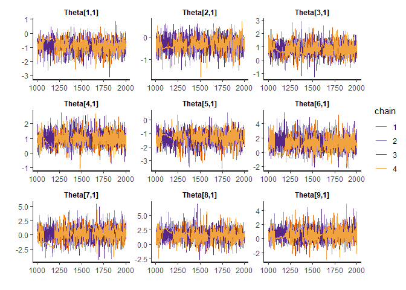<!-- -->

``` r
plot(choc.stan, plotfun="trace", pars=c("tau"))
```

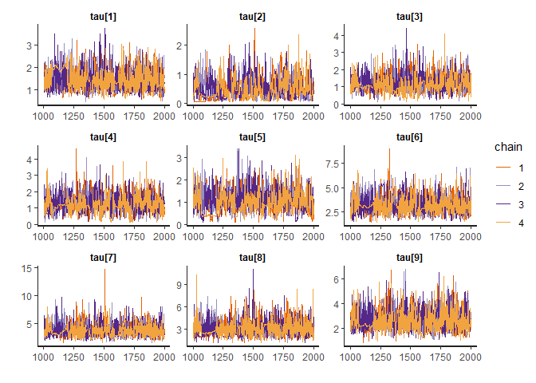<!-- -->

``` r
plot(choc.stan, plotfun="trace", pars=c("Omega[1,2]"))
```

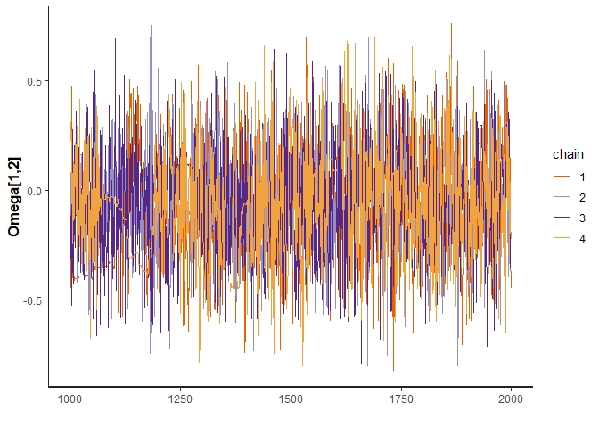<!-- -->

``` r
plot(choc.stan, plotfun="trace", pars=paste("Beta[", 1:9, ",1]", sep="")) # resp 1
```

<!-- -->

``` r
summary(choc.stan)$summary[,c("Rhat", "n_eff")]
```

    ##                 Rhat     n_eff
    ## Beta[1,1]  1.0064602  880.0219
    ## Beta[1,2]  1.0145258  374.6120
    ## Beta[1,3]  1.0052355  511.7324
    ## Beta[1,4]  1.0007870 1336.9477
    ## Beta[1,5]  1.0013598 1960.7045
    ## Beta[1,6]  1.0022012 1583.4439
    ## Beta[1,7]  1.0064843  402.1455
    ## Beta[1,8]  1.0144921  312.7722
    ## Beta[1,9]  1.0140827  222.4750
    ## Beta[1,10] 1.0072165  401.8763
    ## Beta[1,11] 1.0044357  770.9201
    ## Beta[1,12] 1.0219953  243.0552
    ## Beta[1,13] 1.0221774  196.2031
    ## Beta[1,14] 1.0023623  923.6420
    ## Beta[2,1]  1.0031004  947.5055
    ## Beta[2,2]  0.9999916 1612.2657
    ## Beta[2,3]  1.0118918  742.4013
    ## Beta[2,4]  1.0064392  455.3127
    ## Beta[2,5]  1.0026608  696.3201
    ## Beta[2,6]  1.0059310 1193.7445
    ## Beta[2,7]  1.0034135 1667.3205
    ## Beta[2,8]  1.0016556 1783.2159
    ## Beta[2,9]  1.0097090  414.9775
    ## Beta[2,10] 1.0003606 1840.9870
    ## Beta[2,11] 1.0064329  899.4135
    ## Beta[2,12] 1.0104785  594.8638
    ## Beta[2,13] 1.0066876 1442.9655
    ## Beta[2,14] 1.0073309 1409.5707
    ## Beta[3,1]  1.0126273  426.3810
    ## Beta[3,2]  1.0057324  809.8090
    ## Beta[3,3]  1.0144711  215.2807
    ## Beta[3,4]  1.0098147  543.9923
    ## Beta[3,5]  1.0105909  411.7297
    ## Beta[3,6]  1.0127769  361.1509
    ## Beta[3,7]  1.0055878  722.5758
    ## Beta[3,8]  1.0037651  982.4520
    ## Beta[3,9]  1.0032453 1089.2851
    ## Beta[3,10] 1.0152269  313.8925
    ## Beta[3,11] 1.0015794 1620.1404
    ## Beta[3,12] 1.0084144  825.6037
    ## Beta[3,13] 1.0171239  204.5675
    ## Beta[3,14] 1.0070103  437.9981
    ## Beta[4,1]  1.0143398  322.1272
    ## Beta[4,2]  1.0106686  680.5017
    ## Beta[4,3]  1.0073004  525.1937
    ## Beta[4,4]  1.0087286  325.5776
    ## Beta[4,5]  1.0040115 1465.9818
    ## Beta[4,6]  1.0021535 1217.1471
    ## Beta[4,7]  1.0088801  864.1374
    ## Beta[4,8]  1.0065672  895.6636
    ## Beta[4,9]  1.0051678  718.3899
    ## Beta[4,10] 1.0049907  869.2231
    ## Beta[4,11] 1.0042918  847.0266
    ## Beta[4,12] 1.0176882  467.5427
    ## Beta[4,13] 1.0019002 1074.8651
    ## Beta[4,14] 1.0049521  832.3748
    ## Beta[5,1]  1.0034933 1484.1101
    ## Beta[5,2]  1.0177269  341.7404
    ## Beta[5,3]  1.0095443  891.1276
    ## Beta[5,4]  1.0083900  445.5647
    ## Beta[5,5]  1.0023430  962.3374
    ## Beta[5,6]  1.0057249  649.9279
    ## Beta[5,7]  1.0217937  287.8057
    ## Beta[5,8]  1.0020969 1177.8595
    ## Beta[5,9]  0.9995661 1497.3399
    ## Beta[5,10] 1.0039334  948.8647
    ## Beta[5,11] 1.0036966  655.7405
    ## Beta[5,12] 1.0165097  323.1378
    ## Beta[5,13] 1.0127461  620.6869
    ## Beta[5,14] 1.0156909  454.4838
    ## Beta[6,1]  1.0159523  285.9886
    ## Beta[6,2]  1.0170509  363.7403
    ## Beta[6,3]  1.0033225  755.1172
    ## Beta[6,4]  1.0014740  934.0298
    ## Beta[6,5]  1.0044053  727.4194
    ## Beta[6,6]  1.0057652  911.0394
    ## Beta[6,7]  1.0230623  270.7490
    ## Beta[6,8]  1.0133346  325.7776
    ## Beta[6,9]  1.0125606  317.9089
    ## Beta[6,10] 1.0046822  788.8724
    ## Beta[6,11] 1.0118599  550.9449
    ## Beta[6,12] 1.0059229  923.9769
    ## Beta[6,13] 1.0119264  620.8499
    ## Beta[6,14] 1.0189795  195.6099
    ## Beta[7,1]  1.0009965 1624.1635
    ## Beta[7,2]  1.0120138  677.7969
    ## Beta[7,3]  1.0038770  727.6012
    ## Beta[7,4]  1.0009874 1746.2973
    ## Beta[7,5]  1.0018743 1469.5096
    ## Beta[7,6]  1.0114400  488.6096
    ## Beta[7,7]  1.0025855  872.9796
    ## Beta[7,8]  1.0073182  846.5137
    ## Beta[7,9]  1.0083539  682.2333
    ## Beta[7,10] 1.0070577  450.2894
    ## Beta[7,11] 1.0011974 1682.2039
    ## Beta[7,12] 1.0113279  253.1965
    ## Beta[7,13] 1.0125183  469.4163
    ## Beta[7,14] 1.0198197  240.2816
    ## Beta[8,1]  1.0100898  496.2307
    ## Beta[8,2]  1.0090875  933.4755
    ## Beta[8,3]  1.0076008  330.3577
    ## Beta[8,4]  1.0153054  437.3298
    ## Beta[8,5]  1.0027023 1535.2888
    ## Beta[8,6]  1.0087651  443.1728
    ## Beta[8,7]  1.0094804  458.9379
    ## Beta[8,8]  1.0053116  726.3279
    ## Beta[8,9]  1.0094768  678.4684
    ## Beta[8,10] 1.0074306  600.2080
    ## Beta[8,11] 1.0053495 1162.7003
    ## Beta[8,12] 1.0066489  430.5831
    ## Beta[8,13] 1.0056630  629.3839
    ## Beta[8,14] 1.0282966  141.0041
    ## Beta[9,1]  1.0061667 1002.2478
    ## Beta[9,2]  1.0042332 1231.7650
    ## Beta[9,3]  1.0103905  537.6414
    ## Beta[9,4]  1.0328963  175.4227
    ## Beta[9,5]  1.0014773 1711.6873
    ## Beta[9,6]  1.0063419  455.7148
    ## Beta[9,7]  1.0096180  493.6376
    ## Beta[9,8]  1.0140741  288.8235
    ## Beta[9,9]  1.0086953  554.5375
    ## Beta[9,10] 1.0074479  554.5423
    ## Beta[9,11] 1.0065923  991.2672
    ## Beta[9,12] 1.0016753 1601.2816
    ## Beta[9,13] 1.0027203  738.7498
    ## Beta[9,14] 1.0043211 1497.5619
    ## Theta[1,1] 1.0126122  569.0514
    ## Theta[2,1] 1.0041601 1063.6235
    ## Theta[3,1] 1.0104897  487.2147
    ## Theta[4,1] 1.0058643  742.0937
    ## Theta[5,1] 1.0101265  947.4486
    ## Theta[6,1] 1.0064883  402.8845
    ## Theta[7,1] 1.0168432  293.0574
    ## Theta[8,1] 1.0038863 1232.6403
    ## Theta[9,1] 1.0070212 1162.7918
    ## Omega[1,1]       NaN       NaN
    ## Omega[1,2] 1.0066266  981.8429
    ## Omega[1,3] 0.9999218 2701.2322
    ## Omega[1,4] 1.0015944 2244.7473
    ## Omega[1,5] 1.0044427 1324.4723
    ## Omega[1,6] 1.0179721  331.9696
    ## Omega[1,7] 1.0191223  240.8730
    ## Omega[1,8] 1.0029835 1040.6140
    ## Omega[1,9] 1.0040688 1280.2935
    ## Omega[2,1] 1.0066266  981.8429
    ## Omega[2,2] 0.9989995 2410.2709
    ## Omega[2,3] 1.0044818  372.8731
    ## Omega[2,4] 1.0071171  596.0651
    ## Omega[2,5] 1.0140433  509.9939
    ## Omega[2,6] 1.0197320  259.8376
    ## Omega[2,7] 1.0110380  571.4163
    ## Omega[2,8] 1.0152287  329.0106
    ## Omega[2,9] 1.0063247  434.0616
    ## Omega[3,1] 0.9999218 2701.2322
    ## Omega[3,2] 1.0044818  372.8731
    ## Omega[3,3] 0.9989995 1787.5419
    ## Omega[3,4] 1.0018808 1017.0037
    ## Omega[3,5] 1.0031879 1584.9018
    ## Omega[3,6] 1.0105438  367.5603
    ## Omega[3,7] 1.0013122 1896.5230
    ## Omega[3,8] 1.0189253  300.6824
    ## Omega[3,9] 1.0057178 1534.8393
    ## Omega[4,1] 1.0015944 2244.7473
    ## Omega[4,2] 1.0071171  596.0651
    ## Omega[4,3] 1.0018808 1017.0037
    ## Omega[4,4] 0.9989995 3195.8086
    ## Omega[4,5] 1.0125546  573.6664
    ## Omega[4,6] 1.0093154  546.6595
    ## Omega[4,7] 1.0038555 1005.0883
    ## Omega[4,8] 1.0072473  562.2086
    ## Omega[4,9] 1.0202458  196.4273
    ## Omega[5,1] 1.0044427 1324.4723
    ## Omega[5,2] 1.0140433  509.9939
    ## Omega[5,3] 1.0031879 1584.9018
    ## Omega[5,4] 1.0125546  573.6664
    ## Omega[5,5] 0.9989995 1704.4516
    ## Omega[5,6] 1.0145964  429.5920
    ## Omega[5,7] 1.0082633  718.5398
    ## Omega[5,8] 1.0061634  864.2297
    ## Omega[5,9] 1.0107575  436.1549
    ## Omega[6,1] 1.0179721  331.9696
    ## Omega[6,2] 1.0197320  259.8376
    ## Omega[6,3] 1.0105438  367.5603
    ## Omega[6,4] 1.0093154  546.6595
    ## Omega[6,5] 1.0145964  429.5920
    ## Omega[6,6] 0.9989995 1929.9698
    ## Omega[6,7] 1.0043813 1184.2762
    ## Omega[6,8] 1.0040773 1011.4891
    ## Omega[6,9] 1.0050913  634.4419
    ## Omega[7,1] 1.0191223  240.8730
    ## Omega[7,2] 1.0110380  571.4163
    ## Omega[7,3] 1.0013122 1896.5230
    ## Omega[7,4] 1.0038555 1005.0883
    ## Omega[7,5] 1.0082633  718.5398
    ## Omega[7,6] 1.0043813 1184.2762
    ## Omega[7,7] 0.9989995 2221.6321
    ## Omega[7,8] 1.0057441  878.6679
    ## Omega[7,9] 1.0040747 1479.6479
    ## Omega[8,1] 1.0029835 1040.6140
    ## Omega[8,2] 1.0152287  329.0106
    ## Omega[8,3] 1.0189253  300.6824
    ## Omega[8,4] 1.0072473  562.2086
    ## Omega[8,5] 1.0061634  864.2297
    ## Omega[8,6] 1.0040773 1011.4891
    ## Omega[8,7] 1.0057441  878.6679
    ## Omega[8,8] 0.9989995 2844.6106
    ## Omega[8,9] 1.0077214  358.3982
    ## Omega[9,1] 1.0040688 1280.2935
    ## Omega[9,2] 1.0063247  434.0616
    ## Omega[9,3] 1.0057178 1534.8393
    ## Omega[9,4] 1.0202458  196.4273
    ## Omega[9,5] 1.0107575  436.1549
    ## Omega[9,6] 1.0050913  634.4419
    ## Omega[9,7] 1.0040747 1479.6479
    ## Omega[9,8] 1.0077214  358.3982
    ## Omega[9,9] 0.9989995 2204.0185
    ## tau[1]     1.0039634  609.8189
    ## tau[2]     1.0322748  152.0670
    ## tau[3]     1.0167760  418.8858
    ## tau[4]     1.0122594  450.2231
    ## tau[5]     1.0193631  251.7802
    ## tau[6]     1.0085183  557.2375
    ## tau[7]     1.0086034  453.0544
    ## tau[8]     1.0087193  414.3708
    ## tau[9]     1.0093199  516.0892
    ## Sigma[1,1] 1.0031403  670.1144
    ## Sigma[1,2] 0.9998816 2574.8124
    ## Sigma[1,3] 1.0004565 2786.3964
    ## Sigma[1,4] 1.0017253 2087.0006
    ## Sigma[1,5] 1.0060889 1233.6497
    ## Sigma[1,6] 1.0120373  576.6392
    ## Sigma[1,7] 1.0153635  277.5156
    ## Sigma[1,8] 1.0037024 1097.9170
    ## Sigma[1,9] 1.0038815 1304.3977
    ## Sigma[2,1] 0.9998816 2574.8124
    ## Sigma[2,2] 1.0185241  263.8430
    ## Sigma[2,3] 1.0093763  581.7134
    ## Sigma[2,4] 1.0007114 1661.0240
    ## Sigma[2,5] 1.0080425  596.7180
    ## Sigma[2,6] 1.0025467 2470.3727
    ## Sigma[2,7] 1.0039958 2019.3937
    ## Sigma[2,8] 1.0036759 1261.0149
    ## Sigma[2,9] 1.0087895 1050.3675
    ## Sigma[3,1] 1.0004565 2786.3964
    ## Sigma[3,2] 1.0093763  581.7134
    ## Sigma[3,3] 1.0129070  656.0892
    ## Sigma[3,4] 1.0048733 1370.0880
    ## Sigma[3,5] 0.9997576 2675.8789
    ## Sigma[3,6] 1.0021099 1018.5616
    ## Sigma[3,7] 1.0001220 2594.0817
    ## Sigma[3,8] 1.0065971 1140.9093
    ## Sigma[3,9] 1.0025782 1836.8800
    ## Sigma[4,1] 1.0017253 2087.0006
    ## Sigma[4,2] 1.0007114 1661.0240
    ## Sigma[4,3] 1.0048733 1370.0880
    ## Sigma[4,4] 1.0107308  566.7650
    ## Sigma[4,5] 1.0041944 1508.9620
    ## Sigma[4,6] 1.0051868  747.1425
    ## Sigma[4,7] 1.0010454 1984.7166
    ## Sigma[4,8] 1.0027539 1282.3814
    ## Sigma[4,9] 1.0063586  841.8457
    ## Sigma[5,1] 1.0060889 1233.6497
    ## Sigma[5,2] 1.0080425  596.7180
    ## Sigma[5,3] 0.9997576 2675.8789
    ## Sigma[5,4] 1.0041944 1508.9620
    ## Sigma[5,5] 1.0129214  416.9450
    ## Sigma[5,6] 1.0080235  667.0661
    ## Sigma[5,7] 1.0010285 1448.0735
    ## Sigma[5,8] 1.0008024 1661.7902
    ## Sigma[5,9] 1.0031539  703.6208
    ## Sigma[6,1] 1.0120373  576.6392
    ## Sigma[6,2] 1.0025467 2470.3727
    ## Sigma[6,3] 1.0021099 1018.5616
    ## Sigma[6,4] 1.0051868  747.1425
    ## Sigma[6,5] 1.0080235  667.0661
    ## Sigma[6,6] 1.0079799  558.8188
    ## Sigma[6,7] 1.0032915 1703.8557
    ## Sigma[6,8] 1.0006942 1636.9845
    ## Sigma[6,9] 1.0036709  672.3666
    ## Sigma[7,1] 1.0153635  277.5156
    ## Sigma[7,2] 1.0039958 2019.3937
    ## Sigma[7,3] 1.0001220 2594.0817
    ## Sigma[7,4] 1.0010454 1984.7166
    ## Sigma[7,5] 1.0010285 1448.0735
    ## Sigma[7,6] 1.0032915 1703.8557
    ## Sigma[7,7] 1.0077087  506.2036
    ## Sigma[7,8] 1.0003069 1102.7665
    ## Sigma[7,9] 1.0095150  694.3922
    ## Sigma[8,1] 1.0037024 1097.9170
    ## Sigma[8,2] 1.0036759 1261.0149
    ## Sigma[8,3] 1.0065971 1140.9093
    ## Sigma[8,4] 1.0027539 1282.3814
    ## Sigma[8,5] 1.0008024 1661.7902
    ## Sigma[8,6] 1.0006942 1636.9845
    ## Sigma[8,7] 1.0003069 1102.7665
    ## Sigma[8,8] 1.0065270  509.5545
    ## Sigma[8,9] 1.0066310  694.6871
    ## Sigma[9,1] 1.0038815 1304.3977
    ## Sigma[9,2] 1.0087895 1050.3675
    ## Sigma[9,3] 1.0025782 1836.8800
    ## Sigma[9,4] 1.0063586  841.8457
    ## Sigma[9,5] 1.0031539  703.6208
    ## Sigma[9,6] 1.0036709  672.3666
    ## Sigma[9,7] 1.0095150  694.3922
    ## Sigma[9,8] 1.0066310  694.6871
    ## Sigma[9,9] 1.0073401  571.6267
    ## lp__       1.0450469  107.2158

``` r
# Convergence checking gets tedious with a lot of parameters, so automate
check_fit <- function(fit) {
  summ <- summary(fit)$summary
  range_rhat <- range(summ[ , 'Rhat'])
  rhat_ok <- 0.99 <= range_rhat[1] && range_rhat[2] <= 1.1
  range_neff <- range(summ[ , 'n_eff'])
  neff_ok <- range_neff[1] >= 400
  sp <- rstan::get_sampler_params(fit, inc_warmup=FALSE)
  max_divergent <- max(sapply(sp, function(p){ sum(p[ , 'divergent__']) }))
  no_divergent <- max_divergent == 0
  
  list(ok = rhat_ok && neff_ok && no_divergent,
       range_rhat = range_rhat,
       range_neff = range_neff,
       max_divergent = max_divergent)
}

check_fit(choc.stan)
```

    ## $ok
    ## [1] FALSE
    ## 
    ## $range_rhat
    ## [1] NaN NaN
    ## 
    ## $range_neff
    ## [1] NaN NaN
    ## 
    ## $max_divergent
    ## [1] 128

``` r
# ========== Summarize Posterior ==========
choc.names
```

    ## [1] "BrandDove"        "BrandGhirardelli" "BrandGodiva"      "BrandHersheys"   
    ## [5] "TypeDark"         "TypeDarkNuts"     "TypeMilk"         "TypeMilkNuts"

``` r
plot(choc.stan, pars=c("Theta", "tau"))
```

    ## ci_level: 0.8 (80% intervals)

    ## outer_level: 0.95 (95% intervals)

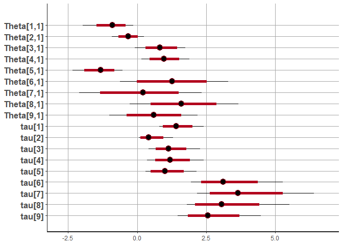<!-- -->

``` r
plot(choc.stan, pars=c("Omega"))
```

    ## ci_level: 0.8 (80% intervals)
    ## outer_level: 0.95 (95% intervals)

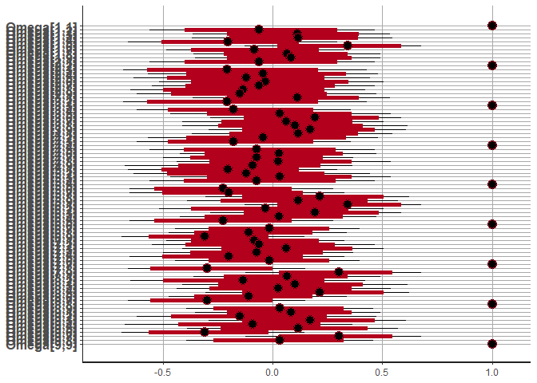<!-- -->

``` r
plot(choc.stan, pars=paste("Beta[", 1:9, ",1]", sep="")) + ggtitle("Respondent 1: Likes Milk Chocolate")
```

    ## ci_level: 0.8 (80% intervals)
    ## outer_level: 0.95 (95% intervals)

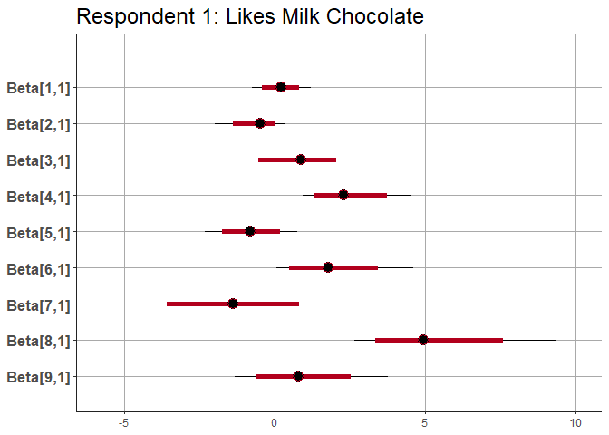<!-- -->

``` r
plot(choc.stan, pars=paste("Beta[", 1:9, ",2]", sep="")) + ggtitle("Respondent 2: Likes Dark Chocolate")
```

    ## ci_level: 0.8 (80% intervals)
    ## outer_level: 0.95 (95% intervals)

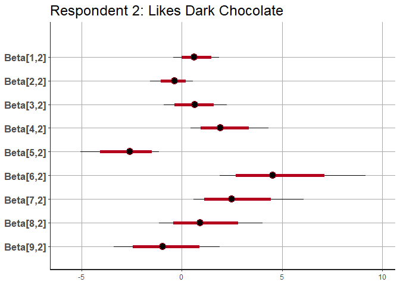<!-- -->

``` r
launch_shinystan(choc.stan)
```

    ## 
    ## Launching ShinyStan interface... for large models this  may take some time.

    ## 
    ## Listening on http://127.0.0.1:3425

``` r
# ========== Simulate Shares from Model =========
# function for computing shares from beta.draws for an hmnl model
shares.hmnl.post <- function(beta.draws, X) # X is attribute matrix for scenario
{
  R <- dim(beta.draws)[3]  # respondents
  D <- dim(beta.draws)[1]  # draws
  shares <- array(NA, dim=c(nrow(X), R, D))
  for (d in 1:D) {
    for (r in 1:R) {
      beta <- beta.draws[d,,r] 
      V <- exp(X %*% beta)  
      shares[,r,d] <- V/sum(V)
    }
  }
  shares
}

choc.standata$X[1,1,,] # note option 2 is dark
```

    ##      [,1] [,2] [,3] [,4] [,5] [,6] [,7] [,8] [,9]
    ## [1,]  0.6    1    0    0    0    0    0    1    0
    ## [2,]  0.7    0    0    1    0    1    0    0    0
    ## [3,]  3.6    1    0    0    0   -1   -1   -1   -1

``` r
shares <- shares.hmnl.post(extract(choc.stan, pars=c("Beta"))$Beta, 
                          choc.standata$X[1,1,,])
str(shares)
```

    ##  num [1:3, 1:14, 1:4000] 0.12948 0.86461 0.00591 0.00831 0.9915 ...

``` r
apply(shares, 1, quantile, probs=c(0.5, 0.025, 0.975))
```

    ##               [,1]         [,2]         [,3]
    ## 50%   3.370820e-01 0.6575942537 6.187002e-05
    ## 2.5%  2.937238e-05 0.0005018253 1.301804e-11
    ## 97.5% 9.991371e-01 0.9998978379 6.544106e-02

``` r
apply(shares, 1:2, quantile, probs=c(0.5, 0.025, 0.975))
```

    ## , , 1
    ## 
    ##             [,1]       [,2]         [,3]
    ## 50%   0.57268909 0.42588589 1.735828e-05
    ## 2.5%  0.08447746 0.04875386 2.100021e-11
    ## 97.5% 0.95117229 0.91540287 7.853185e-03
    ## 
    ## , , 2
    ## 
    ##               [,1]      [,2]         [,3]
    ## 50%   2.407959e-03 0.9968312 5.176211e-06
    ## 2.5%  8.898689e-06 0.8952899 7.027226e-13
    ## 97.5% 9.510418e-02 0.9999863 1.666158e-02
    ## 
    ## , , 3
    ## 
    ##            [,1]         [,2]         [,3]
    ## 50%   0.9449297 0.0549692249 3.285227e-06
    ## 2.5%  0.4005910 0.0006658648 8.164866e-11
    ## 97.5% 0.9993341 0.5994080444 7.074239e-04
    ## 
    ## , , 4
    ## 
    ##             [,1]       [,2]         [,3]
    ## 50%   0.68151728 0.31724282 4.097310e-06
    ## 2.5%  0.07386046 0.00367221 4.885615e-12
    ## 97.5% 0.99629726 0.92613949 8.499530e-03
    ## 
    ## , , 5
    ## 
    ##              [,1]      [,2]         [,3]
    ## 50%   0.088209305 0.9106224 1.552717e-04
    ## 2.5%  0.002138027 0.3028263 5.091981e-07
    ## 97.5% 0.697123588 0.9977904 7.239573e-03
    ## 
    ## , , 6
    ## 
    ##             [,1]         [,2]         [,3]
    ## 50%   0.75839041 0.2333885771 6.745052e-04
    ## 2.5%  0.06605818 0.0007140739 6.351472e-07
    ## 97.5% 0.99928584 0.9319488767 3.662095e-02
    ## 
    ## , , 7
    ## 
    ##               [,1]      [,2]         [,3]
    ## 50%   3.365900e-03 0.9924444 1.657656e-03
    ## 2.5%  3.734211e-06 0.7915600 1.411809e-06
    ## 97.5% 1.148012e-01 0.9999848 1.206812e-01
    ## 
    ## , , 8
    ## 
    ##            [,1]         [,2]         [,3]
    ## 50%   0.9838940 0.0114599398 1.490336e-03
    ## 2.5%  0.7435858 0.0001604247 9.427631e-06
    ## 97.5% 0.9996878 0.2325354927 5.033624e-02
    ## 
    ## , , 9
    ## 
    ##            [,1]         [,2]         [,3]
    ## 50%   0.9915984 8.360446e-03 5.514888e-09
    ## 2.5%  0.4885203 5.899422e-06 1.656688e-15
    ## 97.5% 0.9999941 5.114770e-01 4.981900e-05
    ## 
    ## , , 10
    ## 
    ##               [,1]      [,2]         [,3]
    ## 50%   4.868946e-03 0.9949204 5.430784e-07
    ## 2.5%  1.501499e-05 0.7736457 8.178138e-13
    ## 97.5% 2.243920e-01 0.9999808 2.810778e-03
    ## 
    ## , , 11
    ## 
    ##            [,1]         [,2]         [,3]
    ## 50%   0.9361271 0.0237991818 0.0199084900
    ## 2.5%  0.4508737 0.0001196688 0.0005108979
    ## 97.5% 0.9977859 0.4203021084 0.2980061186
    ## 
    ## , , 12
    ## 
    ##               [,1]      [,2]         [,3]
    ## 50%   3.933391e-04 0.9972589 1.317179e-03
    ## 2.5%  3.391750e-07 0.8385848 2.247169e-06
    ## 97.5% 2.921518e-02 0.9999886 1.405348e-01
    ## 
    ## , , 13
    ## 
    ##              [,1]      [,2]         [,3]
    ## 50%   0.064668773 0.9343363 3.050004e-05
    ## 2.5%  0.001988541 0.3801539 1.118996e-10
    ## 97.5% 0.606116203 0.9979784 1.628265e-02
    ## 
    ## , , 14
    ## 
    ##             [,1]      [,2]         [,3]
    ## 50%   0.26269307 0.7370541 3.626843e-06
    ## 2.5%  0.01235959 0.1998816 3.402970e-09
    ## 97.5% 0.80011635 0.9876400 6.825627e-04
