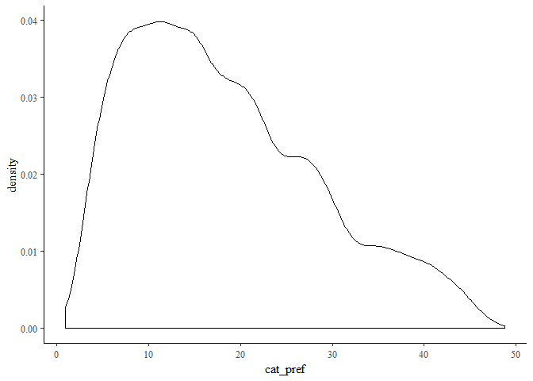

MRP Case Study
================
McKenna Weech, Adam Hettinger, and Hannah Thompson
1/17/2020

Firms employ a variety of passive listening platforms (e.g., customer
comment cards, help lines, social media) that elicit a variety of
complaints. Since these complaints are self-selected, it isn’t obvious
if complaints are widespread or genuinely indicative of systemic service
failures. In other words, how can can a firm know when complaints can be
ignored and when they need to addressed? This issue is related to a
larger class of problems where the goal is to make inference about the
size of a population from a non-random sample (e.g., the German tank
problem). In this paper, we develop a model that uses a variety of
observed customer complaints on Twitter to make inference about the
severity of service failures.

## Describe the model conceptually

It has been said that if you observe a cockroach on your floor, there
are likely thousands inside the walls of your home. Following this
analogy, our hope is to count the cockroaches we can see and calculate
how many are hiding in the walls.

For the first portion of this case, we will be making a model around
simulated data. Each observation will represent a single tweet, and we
will be scoring them for satisfaction. We will use a multiple hierarchal
linear model to predict satisfaction from the other known variables.
Once we have the model predicting well on our simulated data, we will
fit it to our real data, and from there use our real data satisfaction
scores to measure service or product failure severity.

Along with making a model, we will also be using poststratification to
correct the weights in our simulated sample and real data to more
correctly represent the population. This will be explained in greater
detail as we postratify in this first iteration of the model, so we can
explain and see the benefit of a full multiple regression with
postratification model (MRP).

To begin, we will start by generating our simulated data. It will run
through an initial simple linear model and postratification.

# Iteration 1: Simulation Data and Simple Model

This initial block of code, we will just be loading in the needed
packages and settings to make our sample and model code run.

``` r
library(tidyverse) #Load packages
library(rstan)
library(rstanarm)
library(ggplot2)
library(bayesplot)
theme_set(bayesplot::theme_default())
library(dplyr)
library(tidyr)
library(tidybayes)

options(mc.cores = parallel::detectCores()) # Set Stan to use all availible cores
rstan_options(auto_write = TRUE) # Don't recompile Stan code that hasn't changed
```

For this first iteration of modeling, we will be generating our own
data. We will generate a population, and sample from it in order to
build an MRP model.

We will be modeling our populations `satisfaction`. This will eventually
translate into measuring service severity when we apply our model to our
real data. We will be looking at common characteristics like `gender`,
`ethnicity`, `income`, `age`, and `state`.

The following code will make a function `simulate_mrp_data` that will
help us make our simulated data, and sample from it in such a way that
we can use and see the value in postratification.

``` r
simulate_mrp_data <- function(n) {
  J <- c(2, 3, 7, 3, 50) # male or not, eth, age, income level, state
  poststrat <- as.data.frame(array(NA, c(prod(J), length(J)+1))) # Columns of post-strat matrix, plus one for size
  colnames(poststrat) <- c("male", "eth", "age","income", "state",'N')
  count <- 0
  for (i1 in 1:J[1]){
    for (i2 in 1:J[2]){
      for (i3 in 1:J[3]){
        for (i4 in 1:J[4]){
          for (i5 in 1:J[5]){
              count <- count + 1
              # Fill them in so we know what category we are referring to
              poststrat[count, 1:5] <- c(i1-1, i2, i3, i4, i5)
          }
        }
      }
    }
  }
  # Proportion in each sample in the population
  p_male <- c(0.52, 0.48)
  p_eth <- c(0.5, 0.2, 0.3)
  p_age <- c(0.2,.1,0.2,0.2, 0.10, 0.1, 0.1)
  p_income<-c(.50,.35,.15)
  p_state_tmp<-runif(50,10,20)
  p_state<-p_state_tmp/sum(p_state_tmp)
  poststrat$N<-0
  for (j in 1:prod(J)){
    poststrat$N[j] <- round(250e6 * p_male[poststrat[j,1]+1] * p_eth[poststrat[j,2]] *
      p_age[poststrat[j,3]]*p_income[poststrat[j,4]]*p_state[poststrat[j,5]]) #Adjust the N to be the number observed in each category in each group
  }

  # Now let's adjust for the probability of response
  p_response_baseline <- 0.01
  p_response_male <- c(2, 0.8) / 2.8
  p_response_eth <- c(1, 1.2, 2.5) / 4.7
  p_response_age <- c(1, 0.4, 1, 1.5,  3, 5, 7) / 18.9
  p_response_inc <- c(1, 0.9, 0.8) / 2.7
  p_response_state <- rbeta(50, 1, 1)
  p_response_state <- p_response_state / sum(p_response_state)
  p_response <- rep(NA, prod(J))
  for (j in 1:prod(J)) {
    p_response[j] <-
      p_response_baseline * p_response_male[poststrat[j, 1] + 1] *
      p_response_eth[poststrat[j, 2]] * p_response_age[poststrat[j, 3]] *
      p_response_inc[poststrat[j, 4]] * p_response_state[poststrat[j, 5]]
  }
  people <- sample(prod(J), n, replace = TRUE, prob = poststrat$N * p_response)

  ## For respondent i, people[i] is that person's poststrat cell,
  ## some number between 1 and 32
  n_cell <- rep(NA, prod(J))
  for (j in 1:prod(J)) {
    n_cell[j] <- sum(people == j)
  }

  coef_male <- c(0,-0.3)
  coef_eth <- c(0, 0.6, 0.9)
  coef_age <- c(0,-0.2,-0.3, 0.4, 0.5, 0.7, 0.8, 0.9)
  coef_income <- c(0,-0.2, 0.6)
  coef_state <- c(0, round(rnorm(49, 0, 1), 1))
  coef_age_male <- t(cbind(c(0, .1, .23, .3, .43, .5, .6),
                           c(0, -.1, -.23, -.5, -.43, -.5, -.6)))
  true_popn <- data.frame(poststrat[, 1:5], service_failure = rep(NA, prod(J)))
  for (j in 1:prod(J)) {
    true_popn$satisfaction[j] <- plogis(
      coef_male[poststrat[j, 1] + 1] +
        coef_eth[poststrat[j, 2]] + coef_age[poststrat[j, 3]] +
        coef_income[poststrat[j, 4]] + coef_state[poststrat[j, 5]] +
        coef_age_male[poststrat[j, 1] + 1, poststrat[j, 3]]
      )
  }

  #male or not, eth, age, income level, state, city
  y <- rbinom(n, 1, true_popn$satisfaction[people])
  male <- poststrat[people, 1]
  eth <- poststrat[people, 2]
  age <- poststrat[people, 3]
  income <- poststrat[people, 4]
  state <- poststrat[people, 5]

  sample <- data.frame(service_failure = y,
                       male, age, eth, income, state,
                       id = 1:length(people))

  #Make all numeric:
  for (i in 1:ncol(poststrat)) {
    poststrat[, i] <- as.numeric(poststrat[, i])
  }
  for (i in 1:ncol(true_popn)) {
    true_popn[, i] <- as.numeric(true_popn[, i])
  }
  for (i in 1:ncol(sample)) {
    sample[, i] <- as.numeric(sample[, i])
  }
  list(
    sample = sample,
    poststrat = poststrat,
    true_popn = true_popn
  )
}
```

``` r
mrp_sim <- simulate_mrp_data(n=1200)
sample <- mrp_sim[["sample"]]

print(sample)
```

    ##      service_failure male age eth income state   id
    ## 1                  1    0   6   1      1    15    1
    ## 2                  1    0   6   2      1    10    2
    ## 3                  1    0   7   2      2    10    3
    ## 4                  0    0   5   3      2    11    4
    ## 5                  1    0   5   3      2    47    5
    ## 6                  1    0   7   3      2    44    6
    ## 7                  1    0   7   3      2    11    7
    ## 8                  0    1   6   1      1     8    8
    ## 9                  1    0   5   3      2    31    9
    ## 10                 1    1   4   3      3    32   10
    ## 11                 1    1   6   3      1    28   11
    ## 12                 1    0   5   1      1    19   12
    ## 13                 1    0   6   1      1    49   13
    ## 14                 1    0   7   3      3    12   14
    ## 15                 1    1   6   2      1    29   15
    ## 16                 1    0   4   1      1    28   16
    ## 17                 1    0   7   3      2    35   17
    ## 18                 0    0   4   2      1     7   18
    ## 19                 1    0   7   1      3    13   19
    ## 20                 1    0   5   3      3    14   20
    ## 21                 1    0   7   1      3    18   21
    ## 22                 1    0   7   2      3    31   22
    ## 23                 1    0   6   3      1    38   23
    ## 24                 1    1   7   2      1    49   24
    ## 25                 0    1   5   1      1     1   25
    ## 26                 0    0   5   3      1    19   26
    ## 27                 0    0   7   1      2    43   27
    ## 28                 0    1   7   1      1    13   28
    ## 29                 0    0   6   1      1     5   29
    ## 30                 0    0   4   3      2    28   30
    ## 31                 0    1   6   3      1     8   31
    ## 32                 0    0   1   3      2     8   32
    ## 33                 0    0   7   2      1    43   33
    ## 34                 1    0   3   2      1    14   34
    ## 35                 1    0   4   3      1    37   35
    ## 36                 1    0   5   3      3    18   36
    ## 37                 0    1   7   1      2     8   37
    ## 38                 1    0   7   1      1    41   38
    ## 39                 1    0   4   3      2    31   39
    ## 40                 1    1   3   3      1     5   40
    ## 41                 1    0   7   3      2    30   41
    ## 42                 1    1   4   3      3     1   42
    ## 43                 0    1   1   3      2    31   43
    ## 44                 1    0   7   3      1    31   44
    ## 45                 1    1   4   1      2    16   45
    ## 46                 0    0   7   3      1     8   46
    ## 47                 1    0   5   1      3    33   47
    ## 48                 1    0   6   1      1    24   48
    ## 49                 1    0   5   1      1     5   49
    ## 50                 0    0   2   3      3    48   50
    ## 51                 1    0   7   1      1    31   51
    ## 52                 0    0   2   1      2    43   52
    ## 53                 1    1   7   2      1    45   53
    ## 54                 0    1   3   2      1    12   54
    ## 55                 0    0   1   3      2    40   55
    ## 56                 1    1   4   3      3    14   56
    ## 57                 1    0   5   3      1     6   57
    ## 58                 0    0   4   1      1    46   58
    ## 59                 1    0   7   3      1    45   59
    ## 60                 1    0   5   2      2    23   60
    ## 61                 1    1   6   1      1    50   61
    ## 62                 0    0   4   3      3    15   62
    ## 63                 1    0   5   1      1    12   63
    ## 64                 1    0   4   3      1    24   64
    ## 65                 1    0   7   1      3    18   65
    ## 66                 1    1   7   1      3     7   66
    ## 67                 0    0   3   1      2    30   67
    ## 68                 1    0   6   3      1    24   68
    ## 69                 1    0   4   1      3     1   69
    ## 70                 0    1   3   1      1    36   70
    ## 71                 1    0   3   1      3    44   71
    ## 72                 0    0   5   3      1    23   72
    ## 73                 1    1   6   3      3    32   73
    ## 74                 1    1   7   3      1    33   74
    ## 75                 1    0   6   3      1     5   75
    ## 76                 1    0   7   3      1    49   76
    ## 77                 0    0   1   3      2    31   77
    ## 78                 0    0   1   2      3    14   78
    ## 79                 1    0   7   1      2    31   79
    ## 80                 1    0   6   3      1    39   80
    ## 81                 1    1   6   1      1    16   81
    ## 82                 1    0   7   1      1    41   82
    ## 83                 0    0   4   2      1    31   83
    ## 84                 1    1   6   3      3    41   84
    ## 85                 0    0   1   3      2     6   85
    ## 86                 1    1   6   3      1    49   86
    ## 87                 1    1   5   3      1    11   87
    ## 88                 0    0   7   3      1    22   88
    ## 89                 1    0   7   3      1    41   89
    ## 90                 0    0   1   2      2    36   90
    ## 91                 1    0   3   3      3    45   91
    ## 92                 1    0   7   1      1     1   92
    ## 93                 0    0   4   1      1    34   93
    ## 94                 1    1   7   3      2    44   94
    ## 95                 1    0   7   3      1    12   95
    ## 96                 0    1   3   3      1    30   96
    ## 97                 1    0   3   3      2    19   97
    ## 98                 0    0   7   3      2    43   98
    ## 99                 1    1   7   3      2    20   99
    ## 100                1    0   1   3      1    50  100
    ## 101                0    1   4   3      2    15  101
    ## 102                1    0   5   2      1    32  102
    ## 103                1    0   7   2      2    32  103
    ## 104                1    1   4   3      1    14  104
    ## 105                0    0   4   2      2    31  105
    ## 106                1    0   6   2      1    34  106
    ## 107                1    0   2   1      2    16  107
    ## 108                1    0   6   2      1     7  108
    ## 109                1    0   7   3      2     4  109
    ## 110                1    0   4   3      1    38  110
    ## 111                1    0   6   3      3    31  111
    ## 112                0    0   5   3      1    23  112
    ## 113                1    0   7   3      1    34  113
    ## 114                1    0   6   3      2    12  114
    ## 115                0    0   6   1      2    48  115
    ## 116                1    1   7   1      2    45  116
    ## 117                1    0   5   3      2    36  117
    ## 118                1    1   6   3      1    41  118
    ## 119                1    0   7   2      3    33  119
    ## 120                1    0   7   3      1    31  120
    ## 121                1    0   7   1      1    11  121
    ## 122                0    1   7   1      3    13  122
    ## 123                1    0   7   3      3    24  123
    ## 124                1    0   7   3      2    22  124
    ## 125                0    0   6   3      2    34  125
    ## 126                1    0   6   1      1    24  126
    ## 127                1    0   1   3      2    41  127
    ## 128                1    0   7   3      1    47  128
    ## 129                0    0   3   3      2    34  129
    ## 130                1    0   1   3      1    45  130
    ## 131                0    0   3   3      3    38  131
    ## 132                0    1   7   3      2    34  132
    ## 133                0    0   6   3      2     6  133
    ## 134                0    1   6   1      2    36  134
    ## 135                1    0   3   1      1    35  135
    ## 136                1    1   6   3      2    44  136
    ## 137                0    0   6   1      2    11  137
    ## 138                1    1   7   1      1    24  138
    ## 139                1    0   6   1      1    31  139
    ## 140                1    1   6   2      1    32  140
    ## 141                0    0   5   3      1    19  141
    ## 142                0    0   5   1      1    31  142
    ## 143                1    0   7   3      1    23  143
    ## 144                1    0   7   1      2    32  144
    ## 145                0    0   3   1      2    43  145
    ## 146                1    0   5   3      1    34  146
    ## 147                0    0   7   2      3    23  147
    ## 148                1    0   6   3      2    45  148
    ## 149                1    0   3   3      1    16  149
    ## 150                0    0   5   1      1    31  150
    ## 151                1    0   5   3      1    44  151
    ## 152                1    1   7   1      1    18  152
    ## 153                0    1   7   1      3    30  153
    ## 154                1    0   7   3      1    43  154
    ## 155                0    0   1   3      2    12  155
    ## 156                0    0   1   3      1    34  156
    ## 157                0    1   5   3      1    16  157
    ## 158                1    1   4   3      1     7  158
    ## 159                1    1   7   1      1    48  159
    ## 160                1    0   7   3      1    47  160
    ## 161                0    1   7   3      2    19  161
    ## 162                1    1   7   3      1    25  162
    ## 163                1    0   3   3      1    16  163
    ## 164                0    0   4   1      1    12  164
    ## 165                0    1   2   3      2    14  165
    ## 166                1    0   4   3      2    23  166
    ## 167                1    1   7   3      3    33  167
    ## 168                1    0   7   3      1    39  168
    ## 169                1    0   4   3      1    46  169
    ## 170                1    0   1   3      1    31  170
    ## 171                1    1   4   3      1    31  171
    ## 172                1    0   7   3      1    33  172
    ## 173                0    0   4   3      1    14  173
    ## 174                1    0   5   2      1    23  174
    ## 175                1    0   5   2      1    28  175
    ## 176                0    1   5   3      2     5  176
    ## 177                0    1   6   3      1    28  177
    ## 178                1    0   5   3      2    17  178
    ## 179                1    0   5   3      1    50  179
    ## 180                1    0   5   3      2    18  180
    ## 181                1    0   4   3      1    28  181
    ## 182                1    0   6   1      3    11  182
    ## 183                1    0   6   1      1    14  183
    ## 184                1    0   7   1      2     4  184
    ## 185                0    0   6   1      1    16  185
    ## 186                1    0   6   3      3    41  186
    ## 187                1    0   7   2      1    22  187
    ## 188                0    1   4   3      2    23  188
    ## 189                0    0   6   3      1    10  189
    ## 190                0    1   4   2      1    12  190
    ## 191                1    1   7   1      2    31  191
    ## 192                1    0   6   1      1     1  192
    ## 193                1    0   6   3      2     8  193
    ## 194                1    1   4   1      2    19  194
    ## 195                1    0   7   3      1     5  195
    ## 196                1    0   7   1      1     5  196
    ## 197                1    0   1   3      3    16  197
    ## 198                1    0   7   3      2     6  198
    ## 199                1    0   5   3      1    39  199
    ## 200                1    0   5   2      1    14  200
    ## 201                1    0   6   3      1    12  201
    ## 202                1    1   7   3      2    49  202
    ## 203                0    0   1   1      2    50  203
    ## 204                0    0   5   1      1     3  204
    ## 205                1    0   7   1      2    43  205
    ## 206                1    0   7   1      3    23  206
    ## 207                1    0   3   3      2    47  207
    ## 208                1    0   6   3      2    10  208
    ## 209                1    1   6   2      1    49  209
    ## 210                0    1   6   2      1    12  210
    ## 211                1    0   7   2      3    17  211
    ## 212                1    0   4   1      1    22  212
    ## 213                1    0   7   3      1    40  213
    ## 214                1    0   6   3      1    15  214
    ## 215                0    1   4   3      1    28  215
    ## 216                1    1   5   3      1    18  216
    ## 217                1    0   7   3      3    38  217
    ## 218                0    1   5   1      1     4  218
    ## 219                1    1   7   2      2    44  219
    ## 220                1    1   7   3      1    43  220
    ## 221                1    0   5   2      1    26  221
    ## 222                1    1   6   2      1    32  222
    ## 223                1    1   6   3      2    12  223
    ## 224                0    1   7   3      1    10  224
    ## 225                0    0   1   3      2    30  225
    ## 226                0    0   7   3      2    23  226
    ## 227                1    0   5   3      1    43  227
    ## 228                1    0   5   1      1     7  228
    ## 229                0    0   7   2      1    31  229
    ## 230                0    0   4   2      1    38  230
    ## 231                0    0   6   2      2     8  231
    ## 232                1    0   6   3      2     4  232
    ## 233                0    1   5   1      1    30  233
    ## 234                0    1   7   3      1    23  234
    ## 235                1    0   1   2      1    49  235
    ## 236                1    1   7   2      3     8  236
    ## 237                0    1   4   1      1    34  237
    ## 238                0    0   7   3      2    38  238
    ## 239                1    1   7   3      3    12  239
    ## 240                1    0   3   3      1    11  240
    ## 241                1    0   6   2      2    11  241
    ## 242                0    0   1   2      1    34  242
    ## 243                1    0   6   2      1     8  243
    ## 244                1    0   6   3      1    14  244
    ## 245                1    0   7   3      2    11  245
    ## 246                0    0   4   1      2    36  246
    ## 247                1    0   6   1      2     5  247
    ## 248                1    0   7   3      2    12  248
    ## 249                1    0   3   1      1    24  249
    ## 250                1    0   7   3      3     8  250
    ## 251                1    1   1   1      3    50  251
    ## 252                0    1   2   1      1    28  252
    ## 253                0    1   4   3      2    20  253
    ## 254                0    1   7   1      1    30  254
    ## 255                1    0   5   3      1    36  255
    ## 256                0    0   7   2      1    13  256
    ## 257                1    0   5   3      2    10  257
    ## 258                0    0   7   3      3    13  258
    ## 259                1    0   6   1      2    45  259
    ## 260                0    0   3   1      2     8  260
    ## 261                0    1   3   2      3    34  261
    ## 262                1    0   6   3      3    44  262
    ## 263                0    1   4   1      2    23  263
    ## 264                0    0   5   3      1    34  264
    ## 265                1    0   6   1      1    34  265
    ## 266                0    0   3   3      2    48  266
    ## 267                1    0   6   3      1    39  267
    ## 268                1    1   4   2      3     2  268
    ## 269                1    1   6   3      2    41  269
    ## 270                0    0   5   3      2    38  270
    ## 271                0    0   5   2      1    34  271
    ## 272                1    1   7   3      1    33  272
    ## 273                1    1   7   3      1    16  273
    ## 274                0    1   4   3      1    34  274
    ## 275                0    0   3   3      1     8  275
    ## 276                0    0   1   2      1    36  276
    ## 277                0    1   5   3      1    48  277
    ## 278                1    0   7   3      2    13  278
    ## 279                1    1   4   1      1    24  279
    ## 280                1    0   7   1      3    45  280
    ## 281                1    0   1   1      3    39  281
    ## 282                1    0   7   2      1    32  282
    ## 283                1    0   4   3      1    44  283
    ## 284                0    0   3   1      1    34  284
    ## 285                1    0   7   1      2    39  285
    ## 286                1    0   5   3      2    40  286
    ## 287                0    1   7   3      2    35  287
    ## 288                0    0   5   1      2    23  288
    ## 289                0    1   6   1      2    43  289
    ## 290                0    1   4   3      1     1  290
    ## 291                0    0   7   2      3    48  291
    ## 292                1    0   7   2      1    24  292
    ## 293                0    1   7   3      2    12  293
    ## 294                1    0   7   2      2     8  294
    ## 295                1    0   7   3      3    48  295
    ## 296                0    0   6   3      2    35  296
    ## 297                1    1   5   3      1    24  297
    ## 298                0    1   7   1      2     8  298
    ## 299                1    1   7   3      1    16  299
    ## 300                0    0   7   1      1    39  300
    ## 301                1    0   6   3      1    31  301
    ## 302                1    0   2   2      3    44  302
    ## 303                0    0   3   3      3    21  303
    ## 304                1    0   7   1      2    30  304
    ## 305                1    0   4   1      3    12  305
    ## 306                1    0   7   1      1    18  306
    ## 307                0    1   7   3      2    34  307
    ## 308                0    1   6   1      2    22  308
    ## 309                0    0   6   3      1     4  309
    ## 310                1    0   6   3      1    10  310
    ## 311                1    0   6   3      2    38  311
    ## 312                1    0   6   3      3     8  312
    ## 313                1    1   4   2      2    47  313
    ## 314                1    1   6   2      3    49  314
    ## 315                1    1   7   3      3    40  315
    ## 316                0    0   6   1      2    49  316
    ## 317                0    1   2   3      1    28  317
    ## 318                1    0   7   2      1     5  318
    ## 319                1    0   7   3      3    34  319
    ## 320                1    1   5   1      2    16  320
    ## 321                1    0   4   1      2    43  321
    ## 322                0    0   2   1      1    38  322
    ## 323                1    1   4   1      1     8  323
    ## 324                0    1   6   3      1    48  324
    ## 325                1    0   7   2      1     7  325
    ## 326                0    1   5   2      1    50  326
    ## 327                1    0   4   1      2    45  327
    ## 328                1    0   4   2      1    13  328
    ## 329                1    1   5   3      2    13  329
    ## 330                0    0   6   1      1     1  330
    ## 331                1    0   7   1      3    50  331
    ## 332                1    1   7   3      3    14  332
    ## 333                0    0   1   1      1    38  333
    ## 334                1    1   7   1      2     5  334
    ## 335                1    0   6   3      2    34  335
    ## 336                0    0   5   1      2    19  336
    ## 337                1    0   7   3      1    47  337
    ## 338                1    0   6   3      1    18  338
    ## 339                1    0   7   1      1    17  339
    ## 340                0    1   1   3      1    38  340
    ## 341                0    1   6   3      1     6  341
    ## 342                1    0   7   3      2    24  342
    ## 343                0    1   7   1      1    34  343
    ## 344                1    0   7   3      1    44  344
    ## 345                1    0   5   3      2    44  345
    ## 346                1    0   5   3      2    18  346
    ## 347                1    0   5   3      2    28  347
    ## 348                0    0   3   1      2    36  348
    ## 349                0    0   6   2      2    31  349
    ## 350                0    0   4   1      2    50  350
    ## 351                1    0   6   1      2    13  351
    ## 352                1    1   6   2      2    45  352
    ## 353                1    0   7   2      3    50  353
    ## 354                0    1   1   3      2    50  354
    ## 355                0    1   6   3      3    34  355
    ## 356                1    0   7   3      1    41  356
    ## 357                1    0   3   1      2    47  357
    ## 358                1    0   7   3      1    45  358
    ## 359                1    0   6   3      1    25  359
    ## 360                1    0   5   3      2    44  360
    ## 361                1    0   7   1      1    13  361
    ## 362                1    0   7   2      2    15  362
    ## 363                1    1   7   1      1    39  363
    ## 364                1    0   6   3      3    48  364
    ## 365                1    0   5   2      1     4  365
    ## 366                1    1   1   2      1    49  366
    ## 367                1    0   6   3      1    46  367
    ## 368                0    1   4   3      2    40  368
    ## 369                1    0   7   1      2     4  369
    ## 370                0    0   6   3      1    43  370
    ## 371                0    1   7   1      1    16  371
    ## 372                0    0   6   3      1    38  372
    ## 373                1    0   7   3      1    47  373
    ## 374                1    0   5   3      1    30  374
    ## 375                0    0   7   3      3    12  375
    ## 376                1    0   7   3      1    44  376
    ## 377                0    1   6   3      1     8  377
    ## 378                1    1   7   3      2    50  378
    ## 379                1    0   3   3      3    45  379
    ## 380                1    0   7   3      1    17  380
    ## 381                1    0   7   3      1    32  381
    ## 382                1    1   6   3      3    23  382
    ## 383                0    1   7   2      2    13  383
    ## 384                1    0   7   1      2    31  384
    ## 385                1    0   5   3      1    23  385
    ## 386                0    0   4   2      1    44  386
    ## 387                1    0   7   2      2    12  387
    ## 388                1    0   7   1      1    18  388
    ## 389                0    0   6   1      1    12  389
    ## 390                1    0   6   3      3    43  390
    ## 391                0    0   6   1      2    30  391
    ## 392                1    0   5   2      2    13  392
    ## 393                1    0   4   3      1    35  393
    ## 394                1    0   7   3      1    16  394
    ## 395                0    0   6   1      3    35  395
    ## 396                1    0   7   3      2    18  396
    ## 397                0    0   1   3      1    12  397
    ## 398                1    1   5   3      1    15  398
    ## 399                1    0   7   3      1    32  399
    ## 400                1    1   7   2      3    31  400
    ## 401                1    0   7   3      2     5  401
    ## 402                1    0   1   3      1    18  402
    ## 403                1    0   7   3      2    16  403
    ## 404                0    1   4   3      1    23  404
    ## 405                0    1   1   1      1    50  405
    ## 406                1    0   6   3      3    29  406
    ## 407                1    0   6   3      1    32  407
    ## 408                0    1   7   1      2    21  408
    ## 409                0    0   6   1      2    38  409
    ## 410                1    1   6   3      1    12  410
    ## 411                0    0   2   2      1    28  411
    ## 412                0    1   3   3      2    45  412
    ## 413                0    0   1   2      1    23  413
    ## 414                0    0   6   3      1    23  414
    ## 415                1    0   7   1      3     4  415
    ## 416                1    0   6   1      1    11  416
    ## 417                1    0   6   3      1     7  417
    ## 418                0    1   1   1      1    31  418
    ## 419                0    1   5   1      1    48  419
    ## 420                0    1   7   1      2    16  420
    ## 421                1    1   6   1      2    47  421
    ## 422                1    0   7   1      1    50  422
    ## 423                1    0   5   1      2    45  423
    ## 424                1    0   5   3      1    45  424
    ## 425                1    1   4   3      2     4  425
    ## 426                1    0   5   3      1     8  426
    ## 427                1    1   4   3      1    44  427
    ## 428                1    1   7   3      1    35  428
    ## 429                1    1   4   3      1    40  429
    ## 430                0    0   4   3      1     5  430
    ## 431                1    0   6   1      1    46  431
    ## 432                0    0   7   3      2    45  432
    ## 433                1    0   4   3      2    23  433
    ## 434                0    1   3   1      2    18  434
    ## 435                1    0   7   2      1    18  435
    ## 436                0    0   4   2      2    46  436
    ## 437                1    0   7   3      1    19  437
    ## 438                1    0   1   3      1    16  438
    ## 439                1    0   7   3      2    46  439
    ## 440                0    1   7   1      1    46  440
    ## 441                1    1   6   2      2    46  441
    ## 442                1    1   7   3      1    11  442
    ## 443                0    1   4   3      3    36  443
    ## 444                1    0   6   3      1    40  444
    ## 445                1    0   6   3      1    41  445
    ## 446                1    0   7   3      1    26  446
    ## 447                1    0   6   2      1    34  447
    ## 448                1    0   7   1      2    27  448
    ## 449                1    0   1   3      1     4  449
    ## 450                1    0   6   1      1    47  450
    ## 451                0    1   7   2      1    31  451
    ## 452                1    0   3   3      2    38  452
    ## 453                1    0   5   3      1    47  453
    ## 454                0    1   1   1      1    31  454
    ## 455                0    0   6   2      2    48  455
    ## 456                1    0   6   3      1    24  456
    ## 457                1    0   6   3      3    18  457
    ## 458                0    0   6   1      1    30  458
    ## 459                1    0   5   2      1     4  459
    ## 460                0    1   5   3      3    34  460
    ## 461                0    0   6   1      2     8  461
    ## 462                1    0   7   3      2    47  462
    ## 463                1    1   6   3      1     7  463
    ## 464                1    0   7   3      1    41  464
    ## 465                1    0   7   2      3     1  465
    ## 466                0    1   7   1      1    45  466
    ## 467                1    0   7   1      2    36  467
    ## 468                1    0   7   3      1    31  468
    ## 469                1    0   5   3      1    23  469
    ## 470                0    1   6   3      1    45  470
    ## 471                1    0   7   3      1    24  471
    ## 472                1    0   7   3      1    40  472
    ## 473                0    0   3   2      1    23  473
    ## 474                1    0   6   3      1    43  474
    ## 475                1    1   6   1      2    28  475
    ## 476                1    0   7   1      1    28  476
    ## 477                1    0   7   3      1    10  477
    ## 478                0    0   1   1      3    13  478
    ## 479                1    0   1   3      2    45  479
    ## 480                1    0   4   1      1    46  480
    ## 481                1    0   6   1      1    28  481
    ## 482                0    1   4   1      1     6  482
    ## 483                0    1   4   3      1     1  483
    ## 484                1    0   7   3      1    44  484
    ## 485                1    0   6   3      2    32  485
    ## 486                1    0   3   2      2    12  486
    ## 487                1    1   6   1      2     5  487
    ## 488                1    0   7   3      2    25  488
    ## 489                1    0   1   3      2    10  489
    ## 490                1    0   6   1      2     7  490
    ## 491                0    0   3   2      3     1  491
    ## 492                1    1   7   3      1    40  492
    ## 493                1    0   7   3      1    47  493
    ## 494                1    0   6   2      3    44  494
    ## 495                1    0   7   3      1    24  495
    ## 496                1    1   6   3      1    39  496
    ## 497                1    0   7   3      1    43  497
    ## 498                1    0   7   1      1    32  498
    ## 499                1    0   7   3      2     6  499
    ## 500                1    0   6   1      2    47  500
    ## 501                0    1   5   1      2    11  501
    ## 502                0    0   6   1      2    10  502
    ## 503                1    1   5   1      1    28  503
    ## 504                1    0   7   3      1     8  504
    ## 505                1    0   5   3      1    39  505
    ## 506                0    0   7   2      3    50  506
    ## 507                1    0   7   3      1    32  507
    ## 508                1    0   6   3      2    31  508
    ## 509                1    1   3   1      1    30  509
    ## 510                1    0   7   1      1    14  510
    ## 511                1    0   1   3      1     5  511
    ## 512                1    0   7   3      1    50  512
    ## 513                0    0   4   3      2    36  513
    ## 514                0    1   7   3      2     6  514
    ## 515                1    0   6   3      2    28  515
    ## 516                0    0   1   1      2    45  516
    ## 517                1    0   4   1      1    11  517
    ## 518                0    0   5   3      1    15  518
    ## 519                1    1   7   3      3    17  519
    ## 520                0    1   3   3      1    28  520
    ## 521                0    0   1   1      2    46  521
    ## 522                0    0   1   1      1    23  522
    ## 523                1    1   7   3      3    13  523
    ## 524                0    1   4   3      1    12  524
    ## 525                1    0   7   1      1    38  525
    ## 526                1    0   7   1      2    16  526
    ## 527                0    0   7   1      1    22  527
    ## 528                0    1   6   1      1    31  528
    ## 529                0    0   7   3      2    23  529
    ## 530                0    1   5   3      1    50  530
    ## 531                1    0   7   3      2    27  531
    ## 532                1    0   7   2      2    35  532
    ## 533                1    0   7   3      1    28  533
    ## 534                0    0   6   1      1    12  534
    ## 535                1    1   6   1      1    23  535
    ## 536                1    0   6   2      1    50  536
    ## 537                1    0   4   3      3    18  537
    ## 538                0    0   1   3      1     5  538
    ## 539                1    1   7   3      3    50  539
    ## 540                0    0   6   2      3    14  540
    ## 541                1    0   6   3      3    12  541
    ## 542                1    0   7   3      1    23  542
    ## 543                1    0   7   3      1    26  543
    ## 544                1    0   5   3      2    23  544
    ## 545                1    0   5   2      1    49  545
    ## 546                1    1   7   3      1    24  546
    ## 547                1    1   7   1      2    44  547
    ## 548                0    0   3   3      1    38  548
    ## 549                1    0   6   1      2    18  549
    ## 550                0    1   7   1      2     1  550
    ## 551                1    0   7   3      1    44  551
    ## 552                1    0   5   3      2    46  552
    ## 553                1    1   4   3      1    36  553
    ## 554                1    0   4   3      1    49  554
    ## 555                0    0   6   3      3    30  555
    ## 556                1    0   6   3      2    45  556
    ## 557                0    1   6   1      1     8  557
    ## 558                1    0   6   1      2    49  558
    ## 559                1    0   6   3      3    44  559
    ## 560                1    0   7   3      2     7  560
    ## 561                0    0   6   3      2    44  561
    ## 562                0    1   6   3      2    36  562
    ## 563                0    0   1   1      1    44  563
    ## 564                1    1   7   1      3    17  564
    ## 565                1    0   3   3      1    34  565
    ## 566                1    0   7   3      1    15  566
    ## 567                1    0   7   3      2    14  567
    ## 568                1    1   6   2      1     4  568
    ## 569                1    1   6   3      1    46  569
    ## 570                0    0   1   3      3    23  570
    ## 571                1    1   7   2      2    41  571
    ## 572                0    0   4   2      2    50  572
    ## 573                1    0   4   2      2    11  573
    ## 574                1    0   1   3      1    16  574
    ## 575                1    1   7   1      2    31  575
    ## 576                1    1   2   3      1    11  576
    ## 577                1    0   1   1      1    32  577
    ## 578                0    1   1   3      2    36  578
    ## 579                1    0   7   3      3    13  579
    ## 580                1    0   6   2      1    16  580
    ## 581                0    0   3   1      3    23  581
    ## 582                0    0   6   1      1    46  582
    ## 583                1    0   7   3      1    15  583
    ## 584                0    1   6   2      2    45  584
    ## 585                0    1   3   3      1    23  585
    ## 586                1    1   6   3      2    31  586
    ## 587                1    1   5   3      1    24  587
    ## 588                1    0   7   1      2    46  588
    ## 589                1    1   6   1      1    45  589
    ## 590                1    0   7   1      2    43  590
    ## 591                1    0   6   3      2    50  591
    ## 592                0    1   4   3      3    31  592
    ## 593                1    0   1   3      1    22  593
    ## 594                0    0   6   1      1    18  594
    ## 595                0    0   6   1      1    43  595
    ## 596                0    0   4   1      1    44  596
    ## 597                1    1   7   1      3    19  597
    ## 598                0    0   6   1      3    14  598
    ## 599                1    0   7   3      2     5  599
    ## 600                1    0   7   3      2     5  600
    ## 601                1    1   5   1      3    33  601
    ## 602                1    0   7   2      1    18  602
    ## 603                1    0   7   3      1    39  603
    ## 604                1    0   7   3      1    13  604
    ## 605                1    1   7   2      2    18  605
    ## 606                0    1   7   2      2    34  606
    ## 607                1    0   7   3      2     7  607
    ## 608                1    0   3   2      1    44  608
    ## 609                1    0   6   3      1     5  609
    ## 610                1    0   7   1      1    44  610
    ## 611                1    0   4   1      1    12  611
    ## 612                1    0   5   3      1    18  612
    ## 613                0    0   5   3      2    30  613
    ## 614                1    0   6   1      1    50  614
    ## 615                1    0   5   1      3    24  615
    ## 616                1    0   6   2      1    28  616
    ## 617                1    0   7   3      1    32  617
    ## 618                0    0   4   3      2    27  618
    ## 619                0    1   1   2      1    15  619
    ## 620                0    0   1   1      1    45  620
    ## 621                1    0   6   3      1    45  621
    ## 622                1    0   7   3      1    43  622
    ## 623                1    0   3   1      2     5  623
    ## 624                1    1   7   1      1    28  624
    ## 625                0    0   7   3      2    12  625
    ## 626                0    0   3   3      2    28  626
    ## 627                1    0   6   2      2    11  627
    ## 628                1    0   6   2      2    16  628
    ## 629                0    0   7   3      2    13  629
    ## 630                1    0   5   1      1    10  630
    ## 631                1    0   7   3      3    28  631
    ## 632                1    0   6   1      3    18  632
    ## 633                1    0   5   1      2    28  633
    ## 634                0    0   1   3      2    10  634
    ## 635                1    0   6   1      2    28  635
    ## 636                1    1   6   2      1    13  636
    ## 637                1    0   6   1      2    32  637
    ## 638                1    0   7   2      1    15  638
    ## 639                0    0   3   2      2    43  639
    ## 640                1    0   7   1      2    16  640
    ## 641                0    0   1   1      1    14  641
    ## 642                0    0   1   3      1    12  642
    ## 643                1    0   4   3      1    50  643
    ## 644                0    1   6   3      3    12  644
    ## 645                0    1   1   3      3    11  645
    ## 646                0    1   7   1      2    45  646
    ## 647                1    0   6   3      1    35  647
    ## 648                1    0   7   3      2     6  648
    ## 649                0    1   3   1      1    42  649
    ## 650                0    1   5   2      2    31  650
    ## 651                0    0   2   1      1    22  651
    ## 652                0    0   7   1      2    12  652
    ## 653                1    0   7   1      2    39  653
    ## 654                1    1   4   3      1    14  654
    ## 655                0    1   5   2      2    44  655
    ## 656                1    0   4   3      2    13  656
    ## 657                1    0   3   3      1    28  657
    ## 658                1    0   1   3      2    48  658
    ## 659                1    0   4   3      1    32  659
    ## 660                1    0   6   2      2    10  660
    ## 661                1    0   7   1      2    19  661
    ## 662                0    0   4   1      1    30  662
    ## 663                1    0   4   3      1    19  663
    ## 664                0    1   7   1      2    19  664
    ## 665                0    0   4   1      2    23  665
    ## 666                1    1   7   3      1    47  666
    ## 667                0    0   5   2      1    23  667
    ## 668                1    0   4   1      1     6  668
    ## 669                0    0   1   1      2     7  669
    ## 670                1    0   3   2      1    14  670
    ## 671                0    1   6   3      1     8  671
    ## 672                0    0   4   1      1    38  672
    ## 673                1    0   4   1      2    12  673
    ## 674                1    0   6   3      2    29  674
    ## 675                1    0   7   1      1    31  675
    ## 676                1    0   4   1      2    40  676
    ## 677                1    0   4   3      1    29  677
    ## 678                0    1   7   3      3    12  678
    ## 679                1    0   5   3      1    18  679
    ## 680                1    1   7   3      3    24  680
    ## 681                0    0   2   1      1    38  681
    ## 682                0    0   3   3      2    41  682
    ## 683                1    0   5   1      2    50  683
    ## 684                1    0   7   3      2    32  684
    ## 685                1    0   3   2      1    25  685
    ## 686                1    0   4   3      2    38  686
    ## 687                1    0   5   3      1    33  687
    ## 688                0    1   4   2      1    35  688
    ## 689                1    0   3   3      3    16  689
    ## 690                1    0   5   3      1    47  690
    ## 691                0    0   3   1      3    31  691
    ## 692                0    1   7   1      2    50  692
    ## 693                1    0   7   2      1    40  693
    ## 694                1    0   7   3      3    18  694
    ## 695                1    0   7   1      2     8  695
    ## 696                1    0   7   1      1    18  696
    ## 697                1    0   7   1      1    18  697
    ## 698                1    0   5   1      2    39  698
    ## 699                1    0   7   3      1     5  699
    ## 700                1    0   7   2      1    24  700
    ## 701                1    0   6   3      1    13  701
    ## 702                1    0   7   1      3    47  702
    ## 703                1    0   6   2      1    43  703
    ## 704                1    0   3   2      2    28  704
    ## 705                1    0   3   3      1    12  705
    ## 706                0    0   6   3      2     4  706
    ## 707                1    0   4   1      1    22  707
    ## 708                1    0   7   1      2     5  708
    ## 709                1    0   4   1      1    45  709
    ## 710                1    1   7   3      2    30  710
    ## 711                0    0   5   1      1    19  711
    ## 712                1    0   4   3      1    45  712
    ## 713                0    1   4   3      1    23  713
    ## 714                0    1   2   1      1     7  714
    ## 715                1    0   1   1      2     4  715
    ## 716                1    0   4   3      2     1  716
    ## 717                1    0   6   3      1     8  717
    ## 718                1    0   6   1      2    14  718
    ## 719                1    0   5   1      1    19  719
    ## 720                1    0   7   1      1    34  720
    ## 721                1    0   3   3      1    36  721
    ## 722                1    0   7   3      1    10  722
    ## 723                1    0   7   3      2    10  723
    ## 724                0    1   6   1      2    28  724
    ## 725                1    0   5   3      2    23  725
    ## 726                1    0   1   1      3    44  726
    ## 727                1    0   7   1      3    34  727
    ## 728                1    0   7   3      1    18  728
    ## 729                0    1   6   2      1     8  729
    ## 730                1    1   5   3      1    50  730
    ## 731                0    0   5   3      1     4  731
    ## 732                0    0   1   1      3    14  732
    ## 733                0    1   6   1      2    38  733
    ## 734                1    0   7   2      1    48  734
    ## 735                1    1   7   1      1    42  735
    ## 736                1    0   7   3      3    43  736
    ## 737                0    0   3   3      1    28  737
    ## 738                0    0   5   1      1    35  738
    ## 739                1    1   5   2      3    41  739
    ## 740                0    1   7   3      2    36  740
    ## 741                1    0   5   3      2    45  741
    ## 742                1    1   4   3      1    41  742
    ## 743                1    0   6   1      2    48  743
    ## 744                0    1   1   3      1     7  744
    ## 745                0    0   1   1      2    25  745
    ## 746                1    0   5   2      1     4  746
    ## 747                1    1   3   1      2    24  747
    ## 748                1    0   7   3      1     5  748
    ## 749                0    1   7   1      2    18  749
    ## 750                1    0   5   3      1    28  750
    ## 751                1    1   7   1      1    47  751
    ## 752                1    0   1   1      1     7  752
    ## 753                0    0   6   3      2    23  753
    ## 754                0    1   4   1      2     6  754
    ## 755                1    1   6   2      1    40  755
    ## 756                0    1   7   3      1    23  756
    ## 757                0    0   1   3      2     6  757
    ## 758                1    0   7   1      1    50  758
    ## 759                1    1   7   3      1     8  759
    ## 760                1    1   1   2      1    18  760
    ## 761                0    0   4   1      1    50  761
    ## 762                0    0   6   2      2     2  762
    ## 763                0    0   7   3      3    23  763
    ## 764                1    0   6   3      1    46  764
    ## 765                1    1   7   3      1     5  765
    ## 766                1    0   7   3      1     7  766
    ## 767                1    0   7   3      1    31  767
    ## 768                0    0   1   3      2    12  768
    ## 769                1    0   3   3      1    43  769
    ## 770                0    1   5   3      1    43  770
    ## 771                0    0   7   1      1    21  771
    ## 772                1    0   4   3      1    28  772
    ## 773                1    0   6   2      1    25  773
    ## 774                1    0   5   3      2     4  774
    ## 775                1    0   7   3      1    42  775
    ## 776                1    0   5   1      3    12  776
    ## 777                1    1   4   3      2     8  777
    ## 778                0    1   1   1      1    46  778
    ## 779                0    1   3   1      1    39  779
    ## 780                1    0   7   3      1     5  780
    ## 781                0    1   7   2      2    19  781
    ## 782                1    1   7   3      2     3  782
    ## 783                0    0   6   1      2    11  783
    ## 784                1    0   7   3      1    23  784
    ## 785                0    1   1   3      1    12  785
    ## 786                1    0   4   1      1     7  786
    ## 787                0    1   3   1      3     4  787
    ## 788                0    1   4   3      1    36  788
    ## 789                0    1   4   1      1    11  789
    ## 790                1    0   7   3      2    31  790
    ## 791                1    0   6   2      1    33  791
    ## 792                0    0   5   1      2     8  792
    ## 793                1    0   3   3      1    18  793
    ## 794                1    0   3   3      1    47  794
    ## 795                0    0   6   2      1    30  795
    ## 796                0    0   7   1      2    34  796
    ## 797                1    0   7   3      1    14  797
    ## 798                1    0   1   3      1    33  798
    ## 799                0    0   1   1      2     8  799
    ## 800                1    0   1   1      1    45  800
    ## 801                1    0   6   1      1    31  801
    ## 802                1    0   1   3      2    23  802
    ## 803                1    0   7   2      3    38  803
    ## 804                1    1   6   3      2     8  804
    ## 805                0    0   6   2      2    29  805
    ## 806                1    0   7   3      1    31  806
    ## 807                1    0   4   3      1    32  807
    ## 808                1    1   7   2      1    10  808
    ## 809                1    0   7   1      2     8  809
    ## 810                1    0   6   1      1    33  810
    ## 811                1    0   6   3      1    23  811
    ## 812                1    1   3   3      2    32  812
    ## 813                1    0   7   1      1     7  813
    ## 814                0    0   1   1      1    38  814
    ## 815                0    0   1   3      1    31  815
    ## 816                1    0   6   3      1    41  816
    ## 817                0    0   7   3      1    34  817
    ## 818                0    1   6   1      1    23  818
    ## 819                1    0   4   3      2    45  819
    ## 820                1    0   7   1      2    33  820
    ## 821                1    0   5   3      2    10  821
    ## 822                1    0   5   1      1    22  822
    ## 823                1    0   6   2      3    47  823
    ## 824                1    0   3   3      1    45  824
    ## 825                1    0   6   3      2    35  825
    ## 826                0    1   7   3      2    11  826
    ## 827                0    0   1   2      2    15  827
    ## 828                1    0   7   3      2    19  828
    ## 829                0    0   1   1      1     6  829
    ## 830                0    0   3   1      2    14  830
    ## 831                1    0   7   1      3    44  831
    ## 832                0    1   6   1      1    19  832
    ## 833                0    1   6   1      1    38  833
    ## 834                0    1   5   1      2    36  834
    ## 835                0    0   6   1      1    34  835
    ## 836                1    1   4   1      1    24  836
    ## 837                0    1   3   1      2    50  837
    ## 838                0    0   3   3      1    43  838
    ## 839                1    0   5   2      1    43  839
    ## 840                1    0   1   1      1    14  840
    ## 841                1    0   7   2      1     1  841
    ## 842                0    0   4   3      1     1  842
    ## 843                1    0   7   3      3    41  843
    ## 844                0    1   1   3      1    50  844
    ## 845                1    1   7   3      1    27  845
    ## 846                1    0   6   3      1    15  846
    ## 847                1    0   7   3      1     6  847
    ## 848                0    0   5   3      3    10  848
    ## 849                1    0   7   3      3    31  849
    ## 850                1    0   3   3      2    18  850
    ## 851                1    0   3   3      1    46  851
    ## 852                1    1   7   1      1    45  852
    ## 853                0    0   4   2      1    31  853
    ## 854                0    1   3   1      3    19  854
    ## 855                1    0   7   3      2    13  855
    ## 856                0    0   4   1      1    36  856
    ## 857                1    0   6   1      2     9  857
    ## 858                1    1   2   2      2    47  858
    ## 859                1    0   5   3      2    18  859
    ## 860                1    0   2   3      1    18  860
    ## 861                0    0   3   3      1    34  861
    ## 862                1    0   4   2      2    20  862
    ## 863                0    0   6   3      1    11  863
    ## 864                1    0   6   2      1    44  864
    ## 865                1    0   4   1      2    32  865
    ## 866                1    0   6   3      1    47  866
    ## 867                1    0   1   3      3     7  867
    ## 868                0    0   5   3      1    31  868
    ## 869                0    0   7   3      1    38  869
    ## 870                0    1   6   2      2     7  870
    ## 871                1    0   3   2      1    49  871
    ## 872                0    1   7   2      1    12  872
    ## 873                1    1   7   1      1    18  873
    ## 874                0    0   3   1      2    36  874
    ## 875                1    1   6   1      3    34  875
    ## 876                1    0   5   3      1    43  876
    ## 877                1    0   7   3      3    10  877
    ## 878                1    0   4   3      1     2  878
    ## 879                1    0   7   3      2    43  879
    ## 880                1    0   6   3      1    24  880
    ## 881                1    0   6   3      2    15  881
    ## 882                1    1   1   3      1    31  882
    ## 883                1    1   7   1      3    50  883
    ## 884                0    1   7   1      3    31  884
    ## 885                1    0   7   3      1    47  885
    ## 886                1    0   6   3      1    41  886
    ## 887                1    0   7   3      2     4  887
    ## 888                0    1   7   3      1    45  888
    ## 889                1    0   5   3      1    18  889
    ## 890                1    0   4   1      2    45  890
    ## 891                0    0   5   3      2    13  891
    ## 892                0    0   4   3      2     4  892
    ## 893                1    0   6   3      1    49  893
    ## 894                0    1   5   1      2    47  894
    ## 895                0    0   1   1      2    19  895
    ## 896                1    0   4   3      2    22  896
    ## 897                1    0   1   3      3    50  897
    ## 898                1    0   5   3      1    29  898
    ## 899                0    1   2   1      1    19  899
    ## 900                0    0   6   3      2    12  900
    ## 901                0    0   4   1      1    31  901
    ## 902                1    0   7   3      2    35  902
    ## 903                1    0   4   1      3    44  903
    ## 904                0    0   4   1      1     4  904
    ## 905                0    1   7   2      1    44  905
    ## 906                0    1   4   1      1    11  906
    ## 907                0    0   1   1      1    30  907
    ## 908                1    0   7   3      3    27  908
    ## 909                1    0   6   2      2    30  909
    ## 910                1    0   2   2      2    45  910
    ## 911                1    0   7   1      1    35  911
    ## 912                1    0   6   3      1    18  912
    ## 913                1    0   1   1      2     1  913
    ## 914                1    0   6   1      3    30  914
    ## 915                1    1   7   3      2    44  915
    ## 916                1    0   6   2      3    22  916
    ## 917                1    0   5   3      3    13  917
    ## 918                0    0   4   1      3    14  918
    ## 919                0    1   6   1      3    12  919
    ## 920                1    0   4   1      3    49  920
    ## 921                1    0   4   3      1     4  921
    ## 922                1    0   1   3      2    45  922
    ## 923                1    1   7   3      3     8  923
    ## 924                0    0   7   1      2    13  924
    ## 925                0    1   3   3      1    23  925
    ## 926                1    0   6   1      1    31  926
    ## 927                0    1   7   3      1    14  927
    ## 928                0    0   3   3      2    34  928
    ## 929                0    1   5   3      1    23  929
    ## 930                1    0   6   3      1    19  930
    ## 931                1    0   4   3      1    46  931
    ## 932                0    1   7   1      2    27  932
    ## 933                1    1   6   3      3    46  933
    ## 934                1    0   7   1      3    47  934
    ## 935                1    0   6   1      1    10  935
    ## 936                0    0   5   1      2    50  936
    ## 937                1    0   5   3      1    47  937
    ## 938                0    0   7   3      3    46  938
    ## 939                0    1   6   1      2    44  939
    ## 940                1    0   5   3      1    27  940
    ## 941                0    0   4   1      1     8  941
    ## 942                1    0   4   1      2     7  942
    ## 943                0    1   7   3      1     7  943
    ## 944                0    0   3   1      1     4  944
    ## 945                1    0   4   1      2    40  945
    ## 946                0    1   5   1      1    35  946
    ## 947                0    1   4   1      3    10  947
    ## 948                0    0   7   1      1    13  948
    ## 949                1    0   7   3      1    11  949
    ## 950                0    0   6   3      1    31  950
    ## 951                1    0   3   3      3    12  951
    ## 952                1    0   7   3      1    47  952
    ## 953                1    0   7   2      1    46  953
    ## 954                0    0   5   3      2    15  954
    ## 955                1    0   4   2      2    45  955
    ## 956                1    0   6   2      2    10  956
    ## 957                0    1   7   3      3    45  957
    ## 958                1    0   6   1      1    44  958
    ## 959                0    1   7   3      1     6  959
    ## 960                1    1   6   3      2    28  960
    ## 961                0    0   6   3      2    48  961
    ## 962                1    1   7   3      1    33  962
    ## 963                1    0   6   2      1    43  963
    ## 964                0    1   7   3      2    48  964
    ## 965                0    0   3   3      1    48  965
    ## 966                1    0   7   3      3    18  966
    ## 967                1    0   1   2      1    14  967
    ## 968                1    0   6   1      2     5  968
    ## 969                1    1   4   2      2     7  969
    ## 970                0    0   7   1      2    12  970
    ## 971                1    1   5   3      1    46  971
    ## 972                1    0   7   2      2    47  972
    ## 973                1    0   4   3      3    24  973
    ## 974                1    0   7   3      2    11  974
    ## 975                1    0   7   3      3    48  975
    ## 976                0    0   4   1      3    44  976
    ## 977                1    1   6   3      2    24  977
    ## 978                0    0   3   1      2    38  978
    ## 979                0    0   7   3      1    44  979
    ## 980                1    1   3   3      2    47  980
    ## 981                0    0   1   3      1    44  981
    ## 982                1    0   7   3      2    48  982
    ## 983                0    1   7   2      1    10  983
    ## 984                0    0   7   1      2    38  984
    ## 985                1    0   6   1      1    12  985
    ## 986                1    0   3   3      3    47  986
    ## 987                1    0   7   3      3    14  987
    ## 988                0    0   3   1      1    23  988
    ## 989                1    0   3   2      3    18  989
    ## 990                1    0   6   1      2    11  990
    ## 991                1    0   2   3      1    39  991
    ## 992                0    0   5   3      2    12  992
    ## 993                0    0   1   1      1    23  993
    ## 994                0    0   7   1      2    11  994
    ## 995                1    0   5   3      2    41  995
    ## 996                0    0   7   1      2    23  996
    ## 997                0    0   4   1      2    50  997
    ## 998                0    0   5   1      1     8  998
    ## 999                1    0   5   1      1    44  999
    ## 1000               0    0   6   3      1    13 1000
    ## 1001               1    0   4   2      2    49 1001
    ## 1002               1    1   7   2      1    35 1002
    ## 1003               1    0   7   2      2    13 1003
    ## 1004               1    0   7   3      2    38 1004
    ## 1005               0    1   4   3      1    25 1005
    ## 1006               0    0   6   1      2    41 1006
    ## 1007               0    0   6   3      2    38 1007
    ## 1008               1    0   4   3      3    10 1008
    ## 1009               1    0   4   1      1     5 1009
    ## 1010               0    0   6   2      1    23 1010
    ## 1011               1    0   7   3      1    38 1011
    ## 1012               1    0   7   1      3    32 1012
    ## 1013               0    1   6   2      1    23 1013
    ## 1014               1    0   2   3      1    45 1014
    ## 1015               0    1   1   1      1    32 1015
    ## 1016               1    0   5   3      2    13 1016
    ## 1017               1    1   3   3      1    47 1017
    ## 1018               0    0   6   1      1    50 1018
    ## 1019               1    0   7   3      2    32 1019
    ## 1020               1    0   3   3      2    19 1020
    ## 1021               1    0   7   2      2    17 1021
    ## 1022               1    0   7   3      2     5 1022
    ## 1023               0    0   5   3      1    12 1023
    ## 1024               1    0   7   2      1    41 1024
    ## 1025               1    1   7   1      2     7 1025
    ## 1026               0    1   7   1      2    44 1026
    ## 1027               0    1   3   1      1    50 1027
    ## 1028               1    0   2   3      1    40 1028
    ## 1029               0    1   6   1      1    28 1029
    ## 1030               1    0   6   1      3    20 1030
    ## 1031               1    0   7   3      1    18 1031
    ## 1032               0    1   3   1      1    45 1032
    ## 1033               1    0   7   3      1    50 1033
    ## 1034               1    0   5   3      1    16 1034
    ## 1035               1    1   7   3      2    44 1035
    ## 1036               0    1   5   3      1    30 1036
    ## 1037               0    0   1   3      3     6 1037
    ## 1038               0    1   6   1      2    44 1038
    ## 1039               1    0   7   3      2    15 1039
    ## 1040               1    1   7   3      2    30 1040
    ## 1041               1    0   3   2      3     5 1041
    ## 1042               1    0   6   3      1    38 1042
    ## 1043               0    0   6   1      1    34 1043
    ## 1044               1    0   6   1      1    45 1044
    ## 1045               1    0   5   3      3     6 1045
    ## 1046               0    0   1   3      2    16 1046
    ## 1047               1    0   3   3      1    18 1047
    ## 1048               1    0   7   3      2     8 1048
    ## 1049               1    1   6   3      2    12 1049
    ## 1050               1    0   7   1      2    34 1050
    ## 1051               1    0   7   3      1    32 1051
    ## 1052               0    0   5   2      1     4 1052
    ## 1053               1    0   6   2      2    15 1053
    ## 1054               0    1   7   3      2    30 1054
    ## 1055               1    1   5   1      2    47 1055
    ## 1056               1    0   6   3      2    46 1056
    ## 1057               1    0   5   3      1    46 1057
    ## 1058               1    1   4   1      2    31 1058
    ## 1059               0    0   6   1      2    38 1059
    ## 1060               0    1   7   1      1    28 1060
    ## 1061               1    0   7   2      2    38 1061
    ## 1062               1    0   7   2      1    31 1062
    ## 1063               1    0   6   1      1     5 1063
    ## 1064               1    0   3   1      1    18 1064
    ## 1065               1    0   1   3      3    45 1065
    ## 1066               0    0   5   3      1    12 1066
    ## 1067               0    0   4   2      1    50 1067
    ## 1068               1    0   7   3      1    47 1068
    ## 1069               1    1   6   2      1    45 1069
    ## 1070               1    0   7   1      2    27 1070
    ## 1071               0    0   6   1      2    38 1071
    ## 1072               1    1   3   2      1    18 1072
    ## 1073               1    0   7   3      3     5 1073
    ## 1074               1    1   4   1      1    47 1074
    ## 1075               0    0   6   1      2    50 1075
    ## 1076               0    0   5   1      1    31 1076
    ## 1077               1    0   6   3      2     5 1077
    ## 1078               0    1   4   1      1    35 1078
    ## 1079               1    1   7   1      2    13 1079
    ## 1080               1    0   7   3      2     7 1080
    ## 1081               1    0   5   3      3     6 1081
    ## 1082               1    0   3   2      1    44 1082
    ## 1083               1    1   1   2      2    30 1083
    ## 1084               1    0   4   2      3     8 1084
    ## 1085               1    0   7   1      2    18 1085
    ## 1086               1    0   5   3      2    13 1086
    ## 1087               1    0   7   3      1    38 1087
    ## 1088               1    0   6   1      2    11 1088
    ## 1089               1    0   7   3      1    31 1089
    ## 1090               0    0   1   3      2    19 1090
    ## 1091               1    0   1   3      2    44 1091
    ## 1092               0    0   5   3      1    38 1092
    ## 1093               0    0   4   2      2     5 1093
    ## 1094               0    0   5   1      1    44 1094
    ## 1095               1    0   6   2      1    44 1095
    ## 1096               0    0   3   3      1     8 1096
    ## 1097               1    0   7   1      3     7 1097
    ## 1098               1    0   7   2      3     7 1098
    ## 1099               1    0   7   3      1    15 1099
    ## 1100               1    0   7   3      1    11 1100
    ## 1101               0    0   7   3      1    14 1101
    ## 1102               1    0   4   1      1     9 1102
    ## 1103               1    1   6   1      1    16 1103
    ## 1104               1    1   7   1      1    47 1104
    ## 1105               1    0   7   3      3    41 1105
    ## 1106               1    0   6   1      1    45 1106
    ## 1107               1    1   6   1      1    14 1107
    ## 1108               1    0   3   2      2    38 1108
    ## 1109               0    0   4   1      2    36 1109
    ## 1110               0    1   7   1      1    44 1110
    ## 1111               1    1   7   3      1    46 1111
    ## 1112               1    0   7   2      2    35 1112
    ## 1113               1    0   7   1      1    16 1113
    ## 1114               0    0   6   1      1    48 1114
    ## 1115               1    0   4   3      1    45 1115
    ## 1116               1    0   6   1      3    26 1116
    ## 1117               0    0   4   1      1     1 1117
    ## 1118               1    0   4   3      2    16 1118
    ## 1119               1    0   7   1      2     6 1119
    ## 1120               0    1   7   1      2    49 1120
    ## 1121               0    0   6   3      1    12 1121
    ## 1122               1    0   6   1      1     1 1122
    ## 1123               1    0   7   1      1     5 1123
    ## 1124               1    0   1   3      3     5 1124
    ## 1125               1    0   7   1      1     7 1125
    ## 1126               1    0   6   2      2    47 1126
    ## 1127               1    1   5   3      3    12 1127
    ## 1128               1    0   5   3      1     5 1128
    ## 1129               1    1   6   1      1    11 1129
    ## 1130               0    1   5   3      1    38 1130
    ## 1131               1    0   5   2      1    31 1131
    ## 1132               1    0   3   2      2     7 1132
    ## 1133               0    1   7   3      2    11 1133
    ## 1134               0    1   4   3      1    12 1134
    ## 1135               1    0   7   2      2     5 1135
    ## 1136               0    0   4   3      2    28 1136
    ## 1137               1    1   4   1      3    13 1137
    ## 1138               1    1   4   3      1    44 1138
    ## 1139               1    0   3   3      2    17 1139
    ## 1140               1    0   7   2      2     5 1140
    ## 1141               1    0   5   2      2    16 1141
    ## 1142               1    0   4   3      1    50 1142
    ## 1143               0    1   7   3      2    34 1143
    ## 1144               0    1   6   2      2    50 1144
    ## 1145               1    0   6   3      3    45 1145
    ## 1146               1    0   4   2      2    41 1146
    ## 1147               1    1   7   1      2    18 1147
    ## 1148               0    0   2   1      1    13 1148
    ## 1149               1    0   1   3      2    50 1149
    ## 1150               0    1   7   3      1    35 1150
    ## 1151               1    1   7   3      1    16 1151
    ## 1152               1    0   5   3      2    32 1152
    ## 1153               0    1   7   1      2    23 1153
    ## 1154               1    1   6   1      1     6 1154
    ## 1155               0    0   6   3      2    30 1155
    ## 1156               1    1   3   3      1    25 1156
    ## 1157               1    0   4   3      2     1 1157
    ## 1158               1    1   7   3      1    47 1158
    ## 1159               1    0   6   3      2    45 1159
    ## 1160               1    0   7   1      1    50 1160
    ## 1161               0    0   5   2      1    36 1161
    ## 1162               0    0   6   2      1    34 1162
    ## 1163               0    0   7   2      2    11 1163
    ## 1164               1    1   7   1      2    33 1164
    ## 1165               1    0   7   3      1    35 1165
    ## 1166               1    1   4   3      1    32 1166
    ## 1167               1    0   6   1      1    24 1167
    ## 1168               1    0   4   1      1    12 1168
    ## 1169               1    0   6   3      2    24 1169
    ## 1170               0    0   3   3      1    44 1170
    ## 1171               0    1   4   1      1     8 1171
    ## 1172               1    0   6   3      1    11 1172
    ## 1173               1    0   7   3      2     4 1173
    ## 1174               0    1   6   3      2    36 1174
    ## 1175               1    0   1   3      2    42 1175
    ## 1176               1    0   6   3      2    46 1176
    ## 1177               1    1   5   3      2    23 1177
    ## 1178               1    1   7   3      3    11 1178
    ## 1179               1    0   7   1      3    50 1179
    ## 1180               1    0   5   1      3    47 1180
    ## 1181               0    1   4   3      1    28 1181
    ## 1182               0    0   3   3      1    30 1182
    ## 1183               1    0   7   3      3     4 1183
    ## 1184               1    0   6   3      3    23 1184
    ## 1185               0    1   4   3      1    30 1185
    ## 1186               0    1   4   3      1    15 1186
    ## 1187               0    1   3   2      2    45 1187
    ## 1188               1    0   7   1      1    18 1188
    ## 1189               1    0   7   1      2    39 1189
    ## 1190               1    0   5   3      1    42 1190
    ## 1191               1    0   7   1      3    24 1191
    ## 1192               1    1   7   1      1     5 1192
    ## 1193               1    0   7   1      2    40 1193
    ## 1194               0    1   6   1      2    46 1194
    ## 1195               0    0   1   1      2    10 1195
    ## 1196               1    1   6   2      2     5 1196
    ## 1197               1    0   7   2      3    41 1197
    ## 1198               1    0   7   3      2    30 1198
    ## 1199               1    0   5   3      2    30 1199
    ## 1200               1    0   6   1      1    38 1200

Now that we have our simulated data, we now need our hierarchal stan
model.

``` 

// Index values, observations, and covariates.
data {
  int<lower = 1> N;                      // Number of observations.
  int<lower = 1> K;                      // Number of groups.
  int<lower = 1> I;                      // Number of observation-level covariates.
  
  real satisfaction[N];                        // Vector of observations.
  int<lower = 1, upper = K> male[N];        // Vector of group assignments.
  int eth[N];                               // Vector of ethnicity covariates.
  int age[N];                               // Vector of age covariates.
  int income[N];                          // Vector of income covariates.
  int state[N];                          // Vector of state covariates.
  
  real gamma_mean;                       // Mean for the hyperprior on gamma.
  real<lower = 0> gamma_var;             // Variance for the hyperprior on gamma.
  real<lower = 0> tau_min;               // Minimum for the hyperprior on tau.
  real<lower = 0> tau_max;               // Maximum for the hyperprior on tau.
  real<lower = 0> sigma_min;             // Minimum for the hyperprior on tau.
  real<lower = 0> sigma_max;             // Maximum for the hyperprior on tau.
}

// Parameters and hyperparameters.
parameters {
  matrix[K, (I - 1)] alpha;              // Matrix of observation-level brand coefficients.
  vector[K] beta;                        // Vector of observation-level price coefficients.
  real gamma;                            // Mean of the population model.
  real<lower=0> tau;                     // Variance of the population model.
  real<lower=0> sigma;                   // Variance of the observation model.
}

// Hierarchical regression.
model {
  // Declare mu for use in the linear model.
  vector[N] mu;
  
  // Hyperpriors and prior.
  gamma ~ normal(gamma_mean, gamma_var);
  tau ~ uniform(tau_min, tau_max);
  sigma ~ uniform(sigma_min, sigma_max);

  // Population model and likelihood.
  for (k in 1:K) {
    alpha[k,] ~ normal(gamma, tau);
    beta[k] ~ normal(gamma, tau);
  }
  for (n in 1:N) {
    mu[n] = alpha[male[n], eth[n]] + beta[male[n]] * age[n] + beta[male[n]] * 
    income[n] + beta[male[n]] * state[n];
  }
  cat_pref ~ normal(mu, sigma);
}

// Generate predictions using the posterior.
generated quantities {
  vector[N] mu_pc;                       // Declare mu for predicted linear model.
  real cat_pref_pc[N];                     // Vector of predicted observations.

  // Generate posterior prediction distribution.
  for (n in 1:N) {
    mu_pc[n] = alpha[male[n], eth[n]] + beta[male[n]] * age[n] + beta[male[n]] * 
    income[n] + beta[male[n]] * state[n];
    cat_pref_pc[n] = normal_rng(mu_pc[n], sigma);
  }
}
```

As we will also need to do some prior and posterior checks, and for that
we will need the generative model.

``` 

// Index values, observations, covariates, and hyperior values.
data {
  int<lower = 1> N;                      // Number of observations.
  int<lower = 1> K;                      // Number of groups.
  int<lower = 1> I;                      // Number of observation-level covariates.
  
  int<lower = 1, upper = K> male[N];        // Vector of group assignments.
  int eth[N];                               // Vector of ethnicity covariates.
  int age[N];                               // Vector of age covariates.
  int income[N];                          // Vector of income covariates.
  int state[N];                          // Vector of state covariates.
  
  real gamma_mean;                       // Mean for the hyperprior on gamma.
  real<lower = 0> gamma_var;             // Variance for the hyperprior on gamma.
  real<lower = 0> tau_min;               // Minimum for the hyperprior on tau.
  real<lower = 0> tau_max;               // Maximum for the hyperprior on tau.
  real<lower = 0> sigma_min;             // Minimum for the hyperprior on tau.
  real<lower = 0> sigma_max;             // Maximum for the hyperprior on tau.
}

// Generate data according to the hierarchical regression.
generated quantities {
  matrix[K, (I - 1)] alpha;              // Matrix of observation-level brand coefficients.
  vector[K] beta;                        // Vector of observation-level price coefficients.
  real gamma;                            // Mean of the population model.
  real<lower=0> tau;                     // Variance of the population model.
  real<lower=0> sigma;                   // Variance of the observation model.
  
  vector[N] mu;                          // Declare mu for linear model.
  real cat_pref[N];                        // Vector of observations.

  gamma = normal_rng(gamma_mean, gamma_var);
  tau = uniform_rng(tau_min, tau_max);
  sigma = uniform_rng(sigma_min, sigma_max);

  // Draw parameter values and generate data.
  for (k in 1:K) {
    for (i in 1:(I - 1)) {
      alpha[k, i] = normal_rng(gamma, tau);
    }
    beta[k] = normal_rng(gamma, tau);
  }
  for (n in 1:N) {
    mu[n] = alpha[male[n], eth[n]] + beta[male[n]] * age[n] + beta[male[n]] * 
    income[n] + beta[male[n]] * state[n];
    cat_pref[n] = normal_rng(mu[n], sigma);
  }
}
```

``` r
sim_values <- list(
  N = 6300,                                       # Number of observations.
  K = 2,                                         # Number of groups.
  I = 65,                                         # Number of observation-level covariates.
  
  male = sample(2, 6300, replace = TRUE),            # Vector of group assignments.
  eth = sample(3, 6300, replace = TRUE),       # Vector of brands covariates.
  age = sample(7, 6300, replace = TRUE),        # Vector of price covariates.
  income = sample(3, 6300, replace = TRUE),
  state = sample(50, 6300, replace = TRUE),
  
  gamma_mean = 0.5,                              # Mean for the hyperprior on gamma.
  gamma_var = 0.2,                               # Variance for the hyperprior on gamma.
  tau_min = 0,                                   # Minimum for the hyperprior on tau.
  tau_max = .1,                                   # Maximum for the hyperprior on tau.
  sigma_min = 0,                                 # Minimum for the hyperprior on tau.
  sigma_max = .1                                  # Maximum for the hyperprior on tau.
)
# Generate data.
sim_data <- stan(
  file = here::here("Code/mrp/generate_data.stan"),
  data = sim_values,
  iter = 10,
  chains = 1,
  seed = 42,
  algorithm = "Fixed_param"
)
```

    ## recompiling to avoid crashing R session

    ## 
    ## SAMPLING FOR MODEL 'generate_data' NOW (CHAIN 1).
    ## Chain 1: Iteration: 1 / 10 [ 10%]  (Sampling)
    ## Chain 1: Iteration: 2 / 10 [ 20%]  (Sampling)
    ## Chain 1: Iteration: 3 / 10 [ 30%]  (Sampling)
    ## Chain 1: Iteration: 4 / 10 [ 40%]  (Sampling)
    ## Chain 1: Iteration: 5 / 10 [ 50%]  (Sampling)
    ## Chain 1: Iteration: 6 / 10 [ 60%]  (Sampling)
    ## Chain 1: Iteration: 7 / 10 [ 70%]  (Sampling)
    ## Chain 1: Iteration: 8 / 10 [ 80%]  (Sampling)
    ## Chain 1: Iteration: 9 / 10 [ 90%]  (Sampling)
    ## Chain 1: Iteration: 10 / 10 [100%]  (Sampling)
    ## Chain 1: 
    ## Chain 1:  Elapsed Time: 0 seconds (Warm-up)
    ## Chain 1:                0.014095 seconds (Sampling)
    ## Chain 1:                0.014095 seconds (Total)
    ## Chain 1:

``` r
# Extract the simulated data.
prior_pc <- tibble(
  cat_pref = as.vector(extract(sim_data)$cat_pref)
)
# Plot the prior predictive distribution.
prior_pc %>% 
  ggplot(aes(x = cat_pref)) +
  geom_density()
```

<!-- -->

``` r
# # Specify data.
# data <- list(
#   N = nrow(true_popn),                     # Number of observations.
#   K = 2,                    # Number of groups.
#   I = 65,                                # Number of observation-level covariates.
#   
#   cat_pref = true_popn$cat_pref,               # Vector of observations.
#   male = as.numeric(as.factor(true_popn$male)),            # Vector of group assignments.
#   eth = true_popn$eth,       # Vector of brands covariates.
#   age = true_popn$age,        # Vector of price covariates.
#   income = true_popn$income,
#   state = true_popn$state,
#   
#   gamma_mean = 0.5,                                # Mean for the hyperprior on gamma.
#   gamma_var = .2,                                 # Variance for the hyperprior on gamma.
#   tau_min = 0,                                   # Minimum for the hyperprior on tau.
#   tau_max = 1,                                   # Maximum for the hyperprior on tau.
#   sigma_min = 0,                                 # Minimum for the hyperprior on tau.
#   sigma_max = 1                                 # Maximum for the hyperprior on tau.
# )
# # Calibrate the model.
# model03 <- stan(
#   file = here::here("Code/mrp/hierarchical_model.stan"),
#   data = data,
#   control = list(adapt_delta = 0.99),
#   seed = 42
# )
```

``` r
# Posterior predictive check.
# post_pc03 <- tibble(
#   # Extract the posterior predicted values.
#   intent = as.vector(extract(model03)$cat_pref_pc)
# )
# # Plot the posterior predictive distribution.
# ggplot(post_pc03, aes(x = intent)) +
#   geom_histogram() +
#   xlim(1, 10) 
# ggplot(purchase_intent, aes(x = intent)) +
#   geom_histogram() +
#   xlim(1, 10) 
```

``` r
# model03 %>%
#   gather_draws(alpha[n, i]) %>%
#   unite(.variable, .variable, n, i) %>%
#   ggplot(aes(x = .value, y = .variable)) +
#   geom_halfeyeh(.width = .95) +
#   facet_wrap(
#     ~ .variable,
#     nrow = data$K,
#     ncol = (data$I - 1),
#     scales = "free"
#   )
```

``` r
# Plot the betas.
# model03 %>%
#   gather_draws(beta[i]) %>%
#   unite(.variable, .variable, i) %>%
#   ggplot(aes(x = .value, y = .variable)) +
#   geom_halfeyeh(.width = .95) +
#   facet_wrap(
#     ~ .variable,
#     nrow = data$K,
#     ncol = 1,
#     scales = "free"
#   )
```

### Postratification

Note: for now I have set these chuncks to eval = false because we don t
have a poststrat\_prob yet so it freaks out

For the postratification portion we take the estimate that we get from
the model times poststrat\(/N / sum(postsrat\)N)

``` r
poststrat_prob <- posterior_prob %*% poststrat$N / sum(poststrat$N)
model_popn_pref <- c(mean = mean(poststrat_prob), sd = sd(poststrat_prob))
round(model_popn_pref, 3)
```

Because we are using simulated data we can see how our poststratified
predictions compare to the true population

``` r
sample_popn_pref <- mean(sample$satisfaction)
round(sample_popn_pref, 3)

compare2 <- compare2 +
  geom_hline(yintercept = model_popn_pref[1], colour = '#2ca25f', size = 1) +
  geom_text(aes(x = 5.2, y = model_popn_pref[1] + .025), label = "MRP", colour = '#2ca25f')
bayesplot_grid(compare, compare2,
               grid_args = list(nrow = 1, widths = c(8, 1)))
```
