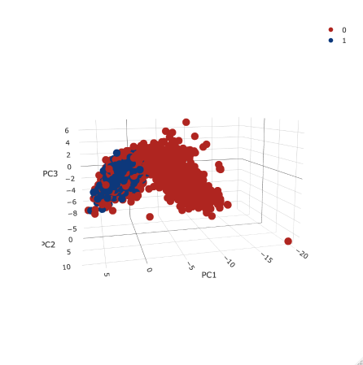

```{r setup, include = FALSE}
knitr::opts_chunk$set(error = TRUE)
```

``` {r include = FALSE}
library(tidyverse)
library(caret)
library(xgboost)
library(Matrix)

train <- read_csv(here::here("Temporary", "Marketing Research Labeled Tweets_ - tweet_sample_5k_Ky-Ch-Ad.csv"))
```
# The Classification Model
In order to successfuly use twitter data to assess service failures, we need the ability to simply classify tweets as complaints and non-complaints. If our team can accurately classify a tweet, we will be capable of tackling the greater issue of judging how serious the complaint is, and deciding whether or not a company needs to take action.

While many available methods can aid us in this task, our team has identified three tools to help us perform our classification: principal component analysis (PCA), fastText, and XGBoost. Using these three tools, we've created a "frankenstein model" that incorporates all three tools listed above. The model has been tested and trained on `r nrow(train) # the number of tweets in our training dataset` tweets labeled 0 for "non-complaint" and 1 for "complaint." We partitioned the data so that about 80% was used for training, and 20% for testing.

To use our model, we began by feeding a set of tweets into a fastText word representations model (unsupervised). This model allowed us to use the words of a tweet to create a quantitative summary of each tweet. We took the fastText model output and sent it through a PCA model. The output of the PCA model (unsupervised) was then fed into an XGBoost model (supervised). The XGBoost model compared the output of the PCA and fastText models, observed a few other details (data we called "tweet features"), and then used its training to predict whether the tweet was a complaint or non-complaint. 

Because our model uses three distinct modeling techniques, I will refer to each of these modeling techniques as "sub-models."

In our repository, you will also find that we train and test a fastText classification model. fastText provides two methods for analyzing text data: creating word embeddings (using an unsupervised approach) and classifying text (using a supervised approach). This second model relies on the latter method to create a standalone model. This model is simply another attempt to create a classification model, and can be thought of as a baseline comparison to the frankenstien model. In our analysis, it appeared that the frankenstien model outperformed this fastText classification model.

# The fastText and PCA Sub-Models
In this section, we explain how we used both fastText and PCA unsupervised models to provide a numerical summary of each tweet. This numerical summary was used as input to the XGBoost model.

## Intro to fastText Unsupervised Models for Word Embeddings

The fastText sub-model, trained on the tweet text from over a million tweets, learned the associations of words by analyzing how frequently pairs of words appear near each other. After running this analysis, the model can produce a word vector for any word -- even words it has not seen before. 

What are these word vectors? They represent a mathematical definition of a word. Via a method that is beyond the level of depth we'd like to explain in this paper, the output of this model (a vector containing 50 numbers for each word queried) represents the associations one word has with all other words used in a corpus. We trained our model to produce word vectors of length 50, but this was simply a parameter we found most effective for our purposes (we explored this in the code fasttext_clust_EDA.R). It is important to note that this model never "saw" our training labels (i.e. it was unsupervised), and could not predict complaints and non-complaints. Rather, it processed the textual data to provide a quantitative input for our principal component analysis.

An important aspect of these word vectors is that they function well with addition and subtraction. For example, with word vectors, king - man + woman = queen. This detail is very useful to us, because it means that we can average the vectors for each word in a tweet and end up with a summary of a tweet in a single vector. To perform this, we created a function that averaged word vectors, named "VectorizeTweet( )." The function takes a single tweet, breaks its text down into a dataframe of each word used in the tweet, fetches the word vector for each word in the dataframe, and then averages each column of the vectors. This vectorized tweet summary became the numerical input for our PC analysis. The result of the VectorizeTweet( ) function is shown below, where each line corresponds to a single tweet.

```{r echo = FALSE}
load(file = "../Output/train.Rdata")

train %>%
  select(avg_vec_50) %>% 
  unnest()
```


## Intro to PCA
The idea behind PCA is that a complex multi-dimensional problem can be boiled down to a single-dimensional problem. For example, let's say you had a model that tried to predict a student's grade on a test by looking at how many hours the student studied, how many lectures the student attended, how many hours of sleep the student got, what cereal the student eats for breakfast, and how many siblings a student has. While all of these factors could arguably have an affect on the student's test grade, I would expect the "hours studied" and "lectures attended" variables to have the strongest correlation to their grade. A PCA model would notice the most important variables of a model, and simplify the model to focus on just two "principle components" (note that it still incorporates the other variables in the model, but these variables have been "simplified" or "compressed"). 

With a PCA model, similar results will cluster together, and clusterings can help with classification. With our student example, we would expect to see "A" students cluster together, "B" students to cluster together, etc. While this example might seem like a simple explanation, PCA analysis can be very useful when large amounts of data are available, but you do not know which variables are most important in making predictions. In our scenario, PCA was useful because we had a lot of data that was meaningful, but difficult to interpret (the vectorized tweets). During training, our PCA model analyzed the fifty variables of the vectorized tweets, and detected patterns and relationships. The model described these pattterns and relationships as functions that take in several datapoints, and return a single datapoint that summarizes all input datapoints. These functions are what we refer to as principle components. The list of principle component functions (PC1, PC2, PC3...) are prioritized so that the first principle component describes the most variation in the data, the second component describes the next largest trend in variation, and so on. When all of the principle components are combined, nearly all of the variation in the data can be explained (this is visualized in the elbow plot below).

In reality, these principle components are purely mathematical and can't be interpreted; however, we can make a simplified explanation of these components that can help us better understand them. For the purpose of explaining PCA in an easy-to-understand, we can imagine that the first principle component describes a trend that explains a large number of tweet complaints (like a positive or negative sentiment score), and that the second principle component describes another large characteristic that makes a tweet a complaint (such as the inclusion of words like "delay," "poor," and "terrible").

## Details of the Use of PCA in Our Model
Ultimately, we used PCA because we wanted to take our text data and process it in a way it could become quantitative data, believing that this would be a better format as an input for our XGBoost model. We trained our PCA model on two sets of data: the vectorized tweet variables (using the fastText unsupervised model) and "tweet features." The tweet features have not been mentioned until now, but it was simply a set of data that included the number of exclamation points, words, and spaces used in a tweet. We created a function called "TweetFeatures( )" which collected this data.

It is important to note that the PCA model was not capable of predicting complaints vs non-complaints, and never "saw" training labels when we trained it (it was unsupervised). Rather, it processed the textual data to provide quantitative data that grouped complaints and non-complaints fairly well, despite being "unaware" of the labels.

After running the PC Analysis, we were able to see a clustering of complaints and non-complaints, without worrying about which features or variables of a tweet are best for classification (visualized below).

### Analysis of Principal Components
Once we trained our PCA model, we were interested in seeing if it could reasonably separate complaints from non-complaints despite the absence of labeled data. We did this by creating a 3D visualization of the first three principal components, coloring the tweets by their complaint/non-complaint labels, and found that the complaints and non-complaints grouped well.



After seeing that our PCA model helped group complaints and non-complaints well, we wondered how many of those principle component variables we should include as input to the XGBoost model. To do this, we used a scree plot. The scree plot shows variances undescribed by the model on the y-axis, and principal components on the x-axis. For example, with only one principal component, a large amount of variance remains in the data. With two principal components, however, we see that the amount of undescribed variance drops considerably. The rule of thumb with the scree plot is to identify the "elbow" (where the slope of the line starts to flatten out), and choose a number of principal components based on number of principal components at that point. Using this plot we determined that we would use the first four principal components of the model. Using four principal components helped us achieve a model that is both simple, and accurate. Using more than four principal components would result in significantly diminished returns -- it would slow down our model without providing a significant improvement to our model's predictive ability. 


Once we saw that we should use four principal components, we used the model to find the values for the four principal components for each tweet. This provided another numerical input we used in our next model, the XGboost model. The results are shown below.

```{r echo = FALSE}
train %>% 
  select(avg_vec_50_PCA) %>% 
  unnest()
```


## Useful Resources for PCA:
Quick Explanation of PCA: https://www.youtube.com/watch?v=HMOI_lkzW08
Slightly Deeper Explanation of PCA: https://www.youtube.com/watch?v=_UVHneBUBW0

# The XGBoost Sub-Model

## Intro to XGBoost
XGBoost is a tool that uses gradient-boosted trees for classification. A basic understanding of decision trees and random forests is crucial to understanding gradient-boosting as well as the XGBoost package. If any of these terms seem unfamiliar, I'd recommend that you look at the links I've posted below.

##### Decision Trees:
Decision trees are models that use a series of binary (yes/no) questions to classify something based on the answers to those binary questions. A decision tree can be randomly generated to model the data. This means that you could have an infinite number of trees that model the same data.

Simple Decision Tree Example:
Is it snowing? If so, it is a good day to ski. If not, it is not a good day to ski.

##### Random Forests:
A single decision tree is not very effective for modeling--singe decision tree models have been known to overfit the data, and therefore innaccurately classify data. However, it should be noted that decision trees are more accurate at classification than a random guess, and this can make them very useful. 

Random forests are models that take advantaged of the fact that a decision tree can still provide a better estimate than a random guess, despite a single tree's inaccuracy. Random forests use hundreds of decision trees (each tree randomly generated to model the same data of interest), and classify data based on the consensus of the outputs these trees.

##### Gradient Boosting:
Gradient Boosting builds on the foundation of random forests by optimizing the model. A gradient boosted random forest systematically analyzes the individual trees of a forest that perform poorly, and focuses on cleaning and improving those trees. With many iterations, a boosted model should improve significantly as it gets trained. XGBoost, the package we use for gradient boosting, is simply one popular tool of many for boosted trees.

## Our Use of the XGBoost Model
At this point, we had three sets of quantitative data on our tweets as inputs for our XGboost model: averaged tweet vectors, PCA outputs for four principal components, and a set of tweet features. I haven't mentioned the tweet features yet, but it was a simple step we took to gather crude data on the tweet. We created a function that calculated various details on a tweet, such as the number of spaces, the number of characters, and the number of exclamation points used in a tweet. After we ran this function on each tweet, the data was stored in a list-column called tweetFeatures.

We partitioned our dataset of 5,000 tweets (now processed to include tweet features, a tweet vector, and four principal component values) so that 80% was designated for training, and 20% was designated for testing. We then transformed our tibble of data into a dense matrix (the format required for XGBoost). We trained the XGBoost model, allowed the model to make predictions on our test dataset, and then compared the resulting predictions against our testing dataset's labels using a confusion matrix. We found our XGBoost model to be 87.59% accurate, with 85 false positives, and 38 false negatives. A visualization and confusion matrix output are shown below.


```{r include = FALSE}
source(here::here("Code", "dallin_annotations", "06_define_prediction_functions.R"))
      
load(here::here("Output", "train_data.dat"))

trainIndex <- createDataPartition(train$complaint_label, p = .8, 
                                  list = FALSE, 
                                  times = 1)

test_data <- train[-trainIndex,]
test_labels <- test_data %>% select(complaint_label) %>% transmute(label = complaint_label)
test_data_vec <- test_data %>%  select(tweetFeatures, avg_vec_50, avg_vec_50_PCA) %>% unnest %>% mutate_all(as.numeric)

train_data <- train[trainIndex,]
train_labels <- train_data %>% select(complaint_label) %>% transmute(label = complaint_label)
train_data_vec <- train_data %>%  select(tweetFeatures, avg_vec_50, avg_vec_50_PCA) %>% unnest %>% mutate_all(as.numeric)

dtest1 <- xgb.DMatrix(sparse.model.matrix(~.-1, test_data_vec))

bst <- xgboost(data = sparse.model.matrix(~.-1, train_data_vec), label = as.numeric(train_labels$label), max.depth = 4,
               eta = 0.2, nthread = 2, nrounds = 100, objective = logregobj, eval_metric = evalerror)

test_data$prediction <- predict(bst, dtest1)

predict(bst, dtest1) %>% map_chr(function(x) ifelse(x > 0, "complaint", "non-complaint"))

test_data <- test_data %>%
  mutate(predict_label = case_when(prediction > 0 ~ "Complaint",
                                   TRUE ~ "Non-complaint"),
         complaint_label = case_when(complaint_label == 1 ~ "Complaint",
                                   TRUE ~ "Non-complaint")) %>%

    mutate(accuracy = predict_label == complaint_label)
```

Confusion matrix output:
```{r}
confusionMatrix(factor(test_data$complaint_label), factor(test_data$predict_label))
```

## Useful Resources for XGBoost:
When I was first learning about XGBoost, I found these youtube videos to be helpful in explaining the very basic concepts behind boosted trees. Hopefully, they can help you too if you're struggling to follow along. 

XGBoost Documentation: https://xgboost.readthedocs.io/en/latest/R-package/xgboostPresentation.html
Decision Trees: https://www.youtube.com/watch?v=7VeUPuFGJHk
Random Forests: https://www.youtube.com/watch?v=J4Wdy0Wc_xQ
More Random Forests: https://www.youtube.com/watch?v=nyxTdL_4Q-Q
Cross Validation: https://www.youtube.com/watch?v=TIgfjmp-4BA
Boostrap Aggregating (Bagging): https://www.youtube.com/watch?v=2Mg8QD0F1dQ
MIT lecture on Boosting: https://www.youtube.com/watch?v=UHBmv7qCey4

# The fastText Classification Model
## Overview
In this section, we will document how we built our model for classifying tweets as "complaints" and "non-complaints." The code is almost entirely derived from the Code/cnn-classifier/R/fasttext_supervised_classifier.R script. 

The supervised model built in this script is not used in the "frankenstien model." Instead, it is a standalone classification model. This is a way for us to compare the frankenstien model's performance to a "baseline."

# Load Packages
```{r echo = FALSE}
library(fastrtext)
library(tidyverse)

set.seed(42)
```

## About fastText
fastText was designed by Facebook and it allows us to build models for both classification and word embeddings. Classification refers to analyzing a set of text, and labeling it according to the topics it closely relates to. Word embeddings help us predict which words are most closely related to a single word of interest. 

fastText boasts that it can perform classification and the creation of word embeddings faster than other tools used for comparable activities (like Word2vec and GloVe) without sacrificing accuracy. This is what drew our team's attention to this method from the beginning.

If you are unfamiliar with Fasttext, we'd reccomend getting to know it better by following along with the tutorials found at https://fasttext.cc/docs/en/supervised-tutorial.html. The tutorial run entirely from the terminal (a.k.a. the command line, shell, bash, command prompt), so if you're uncomfortable navigating your computer from the terminal, it would be worthwhile to find some tutorials on navigating directories within your terminal before beginning to learn fastText. If you'd like to learn more about how fastText works, this post found on Medium is also helpful https://towardsdatascience.com/fasttext-under-the-hood-11efc57b2b3.

Finally, if you don't conceptually understand word embeddings and classification, we reccomend doing a bit of research to get a better grip on those ideas before proceding. 

## Execute Code

### List File Paths of Model and Data
To build our fasttext classification model, we begin by defining where we want to store our fastText model once we've trained it. In our case, we want to store the model in Output/models and name the model class_mod_1.dat. Within R, we'll refer to this file path as model_path. 

As a data input for training our model, we already have two text files: train_data_1.txt and test_data_1.txt. The file paths to these text files (already built) will be referred to as train_data and test_data.


```{r}
model_path <- here::here("Output", "models", "class_mod_1.dat")
train_data_path <- here::here("Output", "clean_data", "train_data_1.txt")
test_data_path <- here::here("Output", "clean_data", "test_data_1.txt")
```

### Read in the Data
We have our training and test data kept in one csv file. We'll read it in after we've filtered all short tweets (with greater than five characters). We'll name this object tweet_data.
```{r}
# This code (and all code below) is broken because we don't have access to a tweet_sample_5k_full.csv file.

tweet_data <- read_csv(here::here("Temporary", "Marketing Research Labeled Tweets_ - tweet_sample_5k_Ky-Ch-Ad.csv")) %>%
 filter(nchar(tweet_text) > 5)
```

### Format the Training Data
For any supervised learning model (such as complaint classification), our training and test datasets need to have data labeled with the "correct" answers. This will allow our model to "learn" the correct answers, and it will hopefully help our model accurately predict correct answers. 

For our fastText model, we need to make sure each tweet is preceded by a label (in our case, the labels will be "complaint" and "non-complaint". fastText labels have two underscores before and after the label. For example, our complaint labels need to look like this: __label__complaint. Furthermore, the data we feed into the fastText model needs to be a character vector (like a .txt file), not a dataframe. We'll have to do some formatting before we get to that point.

Now that we have access to the data, we'll edit a variable named "label." Currently the labels are 0 for non-complaints and 1 for complaints. When we're done, we'll replace the 0's and 1's with their respective terms. Additionally, the label and text need to be in the same cell, so we'll make a new variable that concotenates the text and the label toghether. 

Finally, we need to randomly and evenly tag our data: half of it will become training, and half of it will become test data.

```{r}
test_train_data <- tweet_data %>%
  mutate(label = case_when(complaint_label == 0 ~ "non-complaint", # each line (tweet) is preceded by a label to be predicted
                              complaint_label == 1 ~ "complaint"),
            input_lines = paste(label, tweet_text)) %>%
  group_by(label) %>% # get a representative sample of both complaints and non complaints
  mutate(test_train = c("test", "train")[rbinom(n(), 1, 0.8) + 1]) %>% # assign test train splits
  ungroup()
```

#### Create the .txt Files
As mentioned earlier, we need to create a text file of our training and test datasets because the fastText model only takes character vectors as inputs. With our data labeled both for training/test and complaint/non-complaint, we're ready to do this. We will use the write_lines() function to do this. The train_data_path is the file location we specified earlier in this script. 

```{r}
# write train data
train_data_lines <- test_train_data %>%
  filter(test_train == "train") %>%
  pull(input_lines) %>%
  paste0("__label__", .)

write_lines(train_data_lines, train_data_path)

# write test data
test_data_lines <- test_train_data %>%
  filter(test_train == "test") %>%
  pull(input_lines) %>%
  paste0("__label__", .)

write_lines(test_data_lines, test_data_path)

# create a character vector containing the tweets to test without their labels
test_labels_without_prefix <-
  test_train_data %>%
  filter(test_train == "test") %>%
  pull(label)
```

### Train the Model
The package we are using (fastrtext) uses the execute() function to train the model. This function makes more sense if you've followed the fastText tutorials, but put simply, it concotenates the arguments into a single command which is then run in the terminal. 

After we train the model, we'll load the model into our environment.

"supervised" specifies that this is a supervised model (classification, as opposed to creating word vectors). 
"-input" specifies the file location of the training text files.
"-output" specifies the file location where we want to place our model, once it has finished training.

You can find more information about the parameters of the model (such as -dim, -lr, and -epoch) here: https://fasttext.cc/docs/en/options.html.

```{r}
# train model
execute(commands = c("supervised", "-input", train_data_path, "-output", model_path, "-dim", 20, "-lr", 1, "-epoch", 20, "-wordNgrams", 2, "-verbose", 1))

# load model
model <- load_model(model_path)
```

### Review Model:
We'll want to see how a few of the predictions turned out. 
```{r}
# prediction are returned as a list with words and probabilities
predictions <- predict(model, sentences = test_data_lines, simplify = TRUE, unlock_empty_predictions = TRUE)

head(predictions, 5)
```

Below we compare the length of the list of predictions to the length of the testing dataset. Ideally, these should have the same length. This will help us confirm that our model worked as expected.

```{r}
length(predictions)
length(test_labels_without_prefix)
length(test_data_lines)
```

Unexpectedly, the predictions are shorter than the test dataset, so I'm not sure what happened. According to some errors I've seen, I think it's because a few tweets use vocabulary that was not included in the training dataset.

Below, we merge the predictions with our testing dataset, preparing the data for visualizations.
```{r}
new_predictions <- attributes(predictions)$names

tested <- test_train_data %>% 
  filter(test_train == "test") %>% 
  mutate(prediction = predict(model, tweet_text, unlock_empty_predictions = TRUE)) %>% 
  unnest(prediction) %>% 
  mutate(new_predictions = new_predictions,
         correct = case_when(label == new_predictions ~ TRUE,
                             label != new_predictions ~ FALSE))
```


Visualization of Outputs:
Below, we have a bar graph of our testing data and the model's predictions. The columns represent the labels from our testing dataset. The fill is the model's predictions. We see that the model seems to make a lot of false positives, but provides almost no false negatives. 
```{r}
tested %>% 
  ggplot(aes(x = label, fill = new_predictions)) +
  geom_bar()
```

### Accuracy

```{r}
tested %>% 
  summarise(accuracy = mean(correct))
```
It looks like this model is about 60% accurate. This isn't great, but it's better than flipping a coin. Perhaps the model will perform significantly better with a larger dataset for training and testing.

```{r error = TRUE}
# Compute accuracy
mean(names(unlist(predictions)) == test_labels_without_prefix, na.rm = TRUE)
```

Here, we'll look at the hamming loss, and a few of the predictions.

The hamming loss is the number of wrong labels over the total number of labels. Hamming loss is most useful when applied to multi-classifiers because when it is done with binary classifiers (such as ours), it is simply equal to 1 - accuracy.
```{r error = TRUE}
# because there is only one category by observation, hamming loss will be the same
get_hamming_loss(as.list(test_labels_without_prefix), predictions)

# test predictions
predictions <- predict(model, sentences = test_to_write)
print(head(predictions, 5))

# you can get flat list of results when you are retrieving only one label per observation
print(head(predict(model, sentences = test_to_write, simplify = TRUE)))
```

