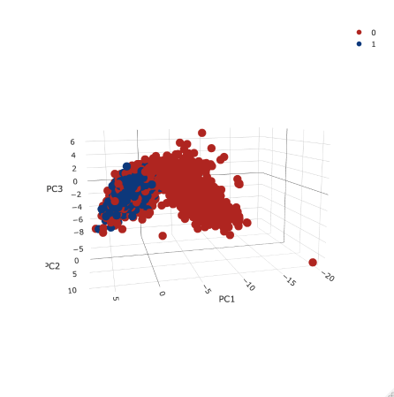

Classifier Explanation
================

The Classification Model
========================

A key component to successfuly using twitter data to assess service failures is the ability to classify tweets as complaints and non-complaints. If our team can accurately classify a tweet, we will be capable of tackling the greater issue of judging how serious the complaint is, and whether or not a company needs to take action.

While many methods available can aid us in this task, our team has identified three tools to help us perform our classification: Principal Component Analysis (PCA), FastText, and XGBoost. Using these three tools, we've created a "frankenstein model" that incorporates all three tools listed above. The model has been tested and trained on 4959 tweets labeled 0 for "non-complaint" and 1 for "complaint." We partitioned the data so that about 80% was used for training, and 20% for testing.

To use our model, we fed a set of tweets into a PCA model and a FastText classification model. The output of these two models is then fed into our XGBoost model, which makes a binary prediction for the tweet as a complaint or non-complaint. I believe that the idea behind this "frankenstein model" is to use the perspectives of various styles of models to gain an accurate consensus on the data -- somewhat similar to the concept behind random forests.

Because our model uses three distinct modeling techniques, I will refer to each of these modeling techniques as "sub-models."

The fastText Sub-Model
======================

Overview
--------

In this section, we'll document how we built our model for classifying tweets as "complaints" and "non-complaints." The code is almost entirely derived from the Code/cnn-classifier/R/fasttext\_supervised\_classifier.R script.

Load Packages
-------------

``` r
# library(fastrtext)
# library(tidyverse)
```

Define Functions
----------------

No functions have been defined in this file.

About fastText
--------------

fastText was designed by Facebook and it allows us to build models for both classification and word embeddings. Classification refers to analyzing a set of text, and labeling it according to the topics it closely relates to. Word embeddings help us predict which words are most closely related to a single word of interest.

fastText boasts that it can perform classification and the creation of word embeddings faster than other tools used for comparable activities (like Word2vec and GloVe) without sacrificing accuracy. This is what drew our team's attention to this method from the beginning.

If you are unfamiliar with Fasttext, we'd reccomend getting to know it better by following along with the tutorials found at <https://fasttext.cc/docs/en/supervised-tutorial.html>. The tutorial run entirely from the terminal (a.k.a. the command line, shell, bash, command prompt), so if you're uncomfortable navigating your computer from the terminal, it would be worthwhile to find some tutorials on navigating directories within your terminal before beginning to learn fastText. If you'd like to learn more about how fastText works, this post found on Medium is also helpful <https://towardsdatascience.com/fasttext-under-the-hood-11efc57b2b3>.

Finally, if you don't conceptually understand word embeddings and classification, we reccomend doing a bit of research to get a better grip on those ideas before proceding.

Execute Code
------------

### List File Paths of Model and Data

To build our fasttext classification model, we begin by defining where we want to store our fastText model once we've trained it. In our case, we want to store the model in Output/models and name the model class\_mod\_1.dat. Within R, we'll refer to this file path as file\_model.

As a data input for training our model, we already have two text files: train\_data\_1.txt and test\_data\_1.txt. The file paths to these text files (already built) will be referred to as train\_data and test\_data.

``` r
# file_model <- "Output/models/class_mod_1.dat"
# train_data_path <- "Output/clean_data/train_data_1.txt"
# test_data_path <- "Output/clean_data/test_data_1.txt"
```

### Read in the Data

We have our training and test data kept in one csv file. We'll read it in after we've filtered all short tweets (with greater than five characters). We'll name this object tweet\_data.

``` r
# This code (and all code below) is broken because we don't have access to a tweet_sample_5k_full.csv file. 

# tweet_data <- read_csv("data/Marketing Research Labeled Tweets_ - tweet_sample_5k_FULL.csv") %>%  
#  filter(nchar(tweet_text) > 5)
```

### Format the Training Data

For any supervised learning model (such as complaint classification), our training and test datasets need to have data labeled with the "correct" answers. This will allow our model to "learn" the correct answers, and it will hopefully help our model accurately predict correct answers.

For our fastText model, we need to make sure each tweet is preceded by a label (in our case, the labels will be "complaint" and "non-complaint". fastText labels have two underscores before and after the label. For example, our complaint labels need to look like this: \_\_label\_\_complaint. Furthermore, the data we feed into the fastText model needs to be a character vector (like a .txt file), not a dataframe. We'll have to do some formatting before we get to that point.

Now that we have access to the data, we'll edit a variable named "label." Currently the labels are 0 for non-complaints and 1 for complaints. When we're done, we'll replace the 0's and 1's with their respective terms. Additionally, the label and text need to be in the same cell, so we'll make a new variable that concotenates the text and the label toghether.

Finally, we need to randomly and evenly tag our data: half of it will become training, and half of it will become test data.

``` r
# test_train_data <- 
#   tweet_data %>% 
#   mutate(label = case_when(label == 0 ~ "non-complaint", # each line (tweet) is preceded by a label to be predicted
#                               label == 1 ~ "complaint"),
#             input_lines = paste(label, tweet_text)) %>% 
#   group_by(label) %>% # get a representative sample of both complaints and non complaints
#   mutate(test_train = c("test", "train")[rbinom(n(), 1, 0.8) + 1]) %>% # assign test train splits
#   ungroup()
```

#### Create the .txt Files

As mentioned earlier, we need to create a text file of our training and test datasets because the fastText model only takes character vectors as inputs. With our data labeled both for training/test and complaint/non-complaint, we're ready to do this. We will use the write\_lines() function to do this. The train\_data\_path is the file location we specified earlier in this script.

!!!!!!!!!! I'm still not sure how we are using the test\_labels\_without\_prefix. If its not the test data, what is it?

``` r
# write train data
# train_data_lines <- 
#   test_train_data %>% 
#   filter(test_train == "train") %>% 
#   pull(input_lines) %>% 
#   paste0("__label__", .)
# 
# write_lines(train_data_lines, train_data_path)
# 
# # write test data
# test_data_lines <- 
#   test_train_data %>% 
#   filter(test_train == "test") %>% 
#   pull(input_lines) %>% 
#   paste0("__label__", .)
# 
# write_lines(test_data_lines, test_data_path)

# create a character vector containing the tweets to test without their labels
# test_labels_without_prefix <- 
#   test_train_data %>% 
#   filter(test_train == "test") %>% 
#   pull(label)
```

### Train the Model

The package we are using (fastrtext) uses the execute() function to train the model. This function makes more sense if you've followed the fastText tutorials, but put simply, it concotenates the arguments into a single command which is then run in the terminal.

After we train the model, we'll load the model into our environment.

"supervised" specifies that this is a supervised model (classification, as opposed to creating word vectors). "-input" specifies the file location of the training text files. "-output" specifies the file location where we want to place our model, once it has finished training.

You can find more information about the parameters of the model (such as -dim, -lr, and -epoch) here: <https://fasttext.cc/docs/en/options.html>.

!!!!!! Considering that this is such a large dataset, it might be worthwhile to use -loss hs (hierarchical softmax) to speed up the training. It should not significantly affect accuracy.

``` r
# train model
# execute(commands = c("supervised", "-input", train_data_path, "-output", file_model, "-dim", 20, "-lr", 1, "-epoch", 20, "-wordNgrams", 2, "-verbose", 1))
# 
# # load model
# model <- load_model(file_model)
```

### Review Model:

We'll want to see how a few of the predictions turned out.

``` r
# prediction are returned as a list with words and probabilities
# predictions <- predict(model, sentences = test_data_lines, simplify = TRUE, unlock_empty_predictions = TRUE)
# head(predictions, 5)
```

This will help us confirm that our model worked as expected.

``` r
# length(predictions)
# length(test_labels_without_prefix)
# length(test_data_lines)
```

### Accuracy

Let's look at how accurately the model predicted names

``` r
# # Compute accuracy
# mean(names(unlist(predictions)) == test_labels_without_prefix, na.rm = TRUE)
```

Here, we'll look at the hamming loss, and a few of the predictions.

The hamming loss is the number of wrong labels over the total number of labels. Hamming loss is most useful when applied to multi-classifiers because when it is done with binary classifiers (such as ours), it is simply equal to 1 - accuracy.

``` r
# # because there is only one category by observation, hamming loss will be the same
# get_hamming_loss(as.list(test_labels_without_prefix), predictions)
# 
# # test predictions
# predictions <- predict(model, sentences = test_to_write)
# print(head(predictions, 5))
# 
# # you can get flat list of results when you are retrieving only one label per observation
# print(head(predict(model, sentences = test_to_write, simplify = TRUE)))
```

Analysis
--------

The PCA Sub-Model
=================

Intro to PCA
------------

The idea behind PCA is that a complex multi-dimensional problem can be boiled down to a single-dimensional problem. For example, let's say you had a model that tried to predict a student's grade on a test by looking at how many hours the student studied, how many lectures the student attended, how many hours of sleep they got, what cereal they eat for breakfast, and how many siblings they have. While all of these factors could arguably have an affect on the student's test grade, I would expect the "hours studied" and "lectures attended" variables to have the strongest correlation to test. A PCA model would notice the most important variables of a model, and simplify the model to focus on just two "principle components" (note that it still incorporates the other variables in the model, but these variables have been "simplified" or "compressed")

With a PCA model, similar results will cluster together, and clusterings can help with classification. With our student example, we would see "A" students cluster together, "B" students to cluster together, etc. While this example might seem like a simple explanation, PCA analysis can be very useful when large amounts of data are available, but you don't know which variables are most important in your classification.

For our purposes, we should be able to use PCA analysis by taking large ammounts of data we collect on tweets (their features, their average word vector, etc.) and see a clustering of complaints and non-complaints, without worrying about which features or variables of a tweet are best for classification.

Details of the Use of PCA in Our Model
--------------------------------------

We wanted to incorporate a PC analysis in our model, hoping that the perspective of a unique model type would aid our model's accuracy. As input, the PCA model needs numerical data, so we needed to convert our character data (tweet text) into numerical data. To do this, we used a fastText model again. Unlike the fastText model above, however, we decided to use an unsupervised fastText model for producing word vectors.

Ultimately, we used PCA because we wanted to take our text data and process it in a way it could become quantitative data, believing that this would be a better format as an input for our XGBoost model. It is important to note that the PCA model was not capable of predicting complaints vs non-complaints, and never "saw" training labels when we trained it (it was unsupervised). Rather, it processed the textual data to provide quantitative data that grouped complaints and non-complaints fairly well, despite being unaware of the labels.

### Using a fastText Unsupervised Model for Word Vectors

This model, trained on the tweet text from our training dataset of nearly 5,000 tweets, learns the associations of words by analyzing how frequently pairs of words appear near each other. After running this analysis, the model can produce a word vector for any word -- even words it hadn't seen before.

What are these word vectors? They represent a mathematical definition of a word. Via a method that is beyond the level of depth we'd like to explain in this paper, the output of this model (a vector containing 50 numbers for each word queried) is a representation of the associations one word has with all other words used in a corpus. Our model was specifically trained to produce word vectors of length 50, but this was simply a parameter we found to be most effective for our purposes (we explored this in the code fasttext\_clust\_EDA.R). Similar to the PCA model, it is important to note that this model that never "saw" our training labels (i.e. it was unsupervised), and was never capable of predicting complaints and non-complaints. Rather, it processed the textual data to provide a quantitative input for our principal component analysis.

These word vectors also function well with additions and subtractions. For example, with word vectors, king - man + woman = queen. This fact is very useful to us, because it means that if we average the vectors for each word in a tweet, we should end up with a summary of a tweet in a single vector. We created a function that averaged word vectors, named "VectorizeTweet()." The function takes a single tweet, breaks its text down into a dataframe of each word used in the tweet, fetches the word vector for each word in the dataframe, and then averages each column of the vectors. This vectorized tweet summary became the numerical input for our PC analysis.

### Analysis of Principal Components

Once we had a list-column of average tweet vectors (avg\_vec\_50), we analyzed its principal components. We started with a 3D visualization of the first three principal components, coloring the tweets by their complaint/non-complaint labels, and found that the complaints and non-complaints grouped well.



We also looked at a scree plot and found that four principal components would be effective enough to describe the variance in our data well.


Once we saw that we should use four principal components, we then trained the PCA model using our dataset of about 5,000 tweets, and used the model to find the values for the four principal components for eqch tweet. This provided another numerical input we used in our next model, the XGboost model.

Useful Resources for PCA:
-------------------------

Quick Explanation of PCA: <https://www.youtube.com/watch?v=HMOI_lkzW08> Slightly Deeper Explanation of PCA: <https://www.youtube.com/watch?v=_UVHneBUBW0>

The XGBoost Sub-Model
=====================

Intro to XGBoost
----------------

XGBoost is a tool that uses gradient-boosted trees for classification. A basic understanding of decision trees and random forests is crucial to understanding gradient-boosting as well as the XGBoost package. If any of these terms seem unfamiliar, I'd recommend that you look at the links I've posted below.

##### Decision Trees:

Decision trees are models that use a series of binary (yes/no) questions to classify something based on the answers to those binary questions. A decision tree can be randomly generated to model the data. This means that you could have an infinite number of trees that model the same data.

Simple Decision Tree Example: Is it snowing? If so, it is a good day to ski. If not, it is not a good day to ski.

##### Random Forests:

A single decision tree is not very effective for modeling--singe decision tree models have been known to overfit the data, and therefore innaccurately classify data. However, it should be noted that decision trees are more accurate at classification than a random guess, and this can make them very useful.

Random forests are models that take advantaged of the fact that a decision tree can still provide a better estimate than a random guess, despite a single tree's inaccuracy. Random forests use hundreds of decision trees (each tree randomly generated to model the same data of interest), and classify data based on the consensus of the outputs these trees.

##### Gradient Boosting:

Gradient Boosting builds on the foundation of random forests by optimizing the model. A gradient boosted random forest systematically analyzes the individual trees of a forest that perform poorly, and focuses on cleaning and improving those trees. With many iterations, a boosted model should improve significantly as it gets trained. XGBoost, the package we use for gradient boosting, is simply one popular tool of many for boosted trees.

Our Use of the XGBoost Model
----------------------------

At this point, we had three sets of quantitative data on our tweets as inputs for our XGboost model: averaged tweet vectors, PCA outputs for four principal components, and a set of tweet features. I haven't mentioned the tweet features yet, but it was a simple step we took to gather crude data on the tweet. We created a function that calculated various details on a tweet, such as the number of spaces, the number of characters, and the number of exclamation points used in a tweet. After we ran this function on each tweet, the data was stored in a list-column called tweetFeatures.

We partitioned our dataset of 5,000 tweets (now processed to include tweet features, a tweet vector, and four principal component values) so that 80% was designated for training, and 20% was designated for testing. We then transformed our tibble of data into a dense matrix (the format required for XGBoost). We trained the XGBoost model, allowed the model to make predictions on our test dataset, and then compared the resulting predictions against our testing dataset's labels using a confusion matrix. We found our XGBoost model to be 87.59% accurate, with 85 false positives, and 38 false negatives.

Confusion matrix output:

``` r
confusionMatrix(factor(test_data$complaint_label), factor(test_data$predict_label))
```

    ## Confusion Matrix and Statistics
    ## 
    ##                Reference
    ## Prediction      Complaint Non-complaint
    ##   Complaint           221            67
    ##   Non-complaint        49           654
    ##                                           
    ##                Accuracy : 0.8829          
    ##                  95% CI : (0.8613, 0.9023)
    ##     No Information Rate : 0.7275          
    ##     P-Value [Acc > NIR] : <2e-16          
    ##                                           
    ##                   Kappa : 0.7108          
    ##                                           
    ##  Mcnemar's Test P-Value : 0.1145          
    ##                                           
    ##             Sensitivity : 0.8185          
    ##             Specificity : 0.9071          
    ##          Pos Pred Value : 0.7674          
    ##          Neg Pred Value : 0.9303          
    ##              Prevalence : 0.2725          
    ##          Detection Rate : 0.2230          
    ##    Detection Prevalence : 0.2906          
    ##       Balanced Accuracy : 0.8628          
    ##                                           
    ##        'Positive' Class : Complaint       
    ## 

Useful Resources for XGBoost:
-----------------------------

When I was first learning about XGBoost, I found these youtube videos to be helpful in explaining the very basic concepts behind boosted trees. Hopefully, they can help you too if you're struggling to follow along.

Decision Trees: <https://www.youtube.com/watch?v=7VeUPuFGJHk> Random Forests: <https://www.youtube.com/watch?v=J4Wdy0Wc_xQ> More Random Forests: <https://www.youtube.com/watch?v=nyxTdL_4Q-Q> Cross Validation: <https://www.youtube.com/watch?v=TIgfjmp-4BA> Boostrap Aggregating (Bagging): <https://www.youtube.com/watch?v=2Mg8QD0F1dQ> MIT lecture on Boosting: <https://www.youtube.com/watch?v=UHBmv7qCey4>
